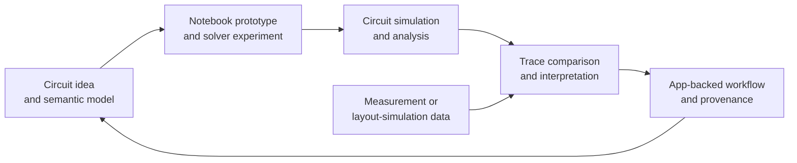
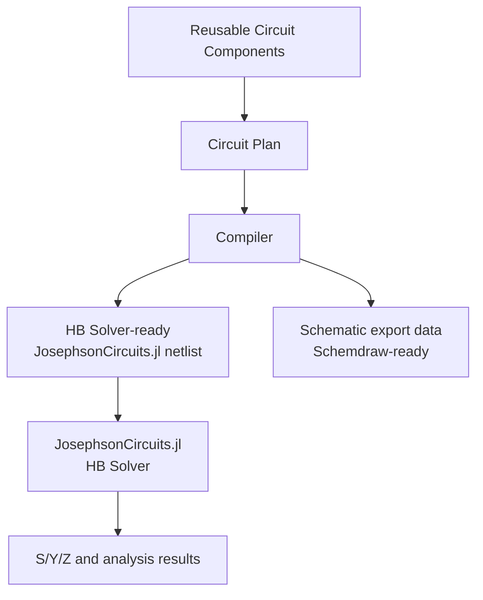

# Superconducting Circuits Research Workbench

<p align="center">
  
</p>

<p align="center">
  
  
  
  
  
</p>

An open-source research and education workbench for superconducting quantum
circuits, built to help researchers and students experience why analyzing
superconducting-circuit data is both useful and genuinely interesting.

This project is **research-platform first** and **education-friendly by design**.
The first interface is the notebook: a place to prototype circuit ideas, inspect
solver behavior, explore analysis methods, and learn the physics. The app layer
then gives those prototypes a stable path into repeatable lab workflows for
measurement data, circuit-simulation data, analysis results, tasks, and
provenance.

## Purpose

Superconducting quantum circuits are still a fast-moving research area. A useful
toolchain should not only run simulations. It should help people understand,
compare, and reuse the data that comes out of design, simulation, measurement,
and analysis.

This repository is built around that loop:



The core aim is to make superconducting-circuit data feel approachable,
inspectable, and practically valuable: from a student reading an S/Y/Z response
for the first time, to a researcher turning a notebook prototype into a
repeatable lab workflow.

## AI-Assisted, Physics-Validated

This project welcomes heavy use of AI-assisted development and research tools.
AI can help draft models, generate code, explore circuit variants, and summarize
large result sets. It is not treated as an authority.

Every AI-assisted result still has to be checked against physical understanding:
units, topology, conservation expectations, solver configuration, observable
families, trace shapes, and reproducible validation. The useful workflow is not
"AI says so"; it is "AI proposes, physics and results validate."

## Not a From-Scratch Circuit Simulator

This project does **not** attempt to replace
[JosephsonCircuits.jl](https://github.com/kpobrien/JosephsonCircuits.jl).
Instead, it builds a semantic wrapper layer above JosephsonCircuits.jl.

The wrapper layer focuses on:

- reusable circuit components;
- circuit-semantic assembly;
- `Circuit Plan` authoring and validation;
- compilation into a JosephsonCircuits.jl-compatible netlist for HB solving;
- schematic-export data that can be rendered with Python Schemdraw or another
  downstream renderer;
- reusable notebook and runner workflows that keep circuit meaning explicit.

The intended flow is:



JosephsonCircuits.jl remains the numerical simulation foundation. This project
adds the circuit-semantic layer needed to make model construction, reuse,
inspection, notebook prototyping, and app-backed execution easier to maintain.

## Notebook First, App Backed

The notebook layer is the first-class research interface. Researchers can move
quickly: build a circuit idea, test a modeling assumption, run a parameter
sweep, inspect plots, and refine the analysis without waiting for a productized
workflow to exist.

The application layer is where research prototypes become stable research
infrastructure. It supports repeatable workflows for datasets, traces, tasks,
simulation results, analysis results, publication, and provenance, so a lab can
accumulate knowledge across design iterations instead of losing it inside
one-off notebooks.

| Layer | Role |
| --- | --- |
| Pluto notebooks | First research cockpit for rapid prototyping, simulation experiments, sweep design, and physics learning. |
| Python notebooks | Programmable data inspection, local TraceStore investigation, and Backend API inspection when platform state matters. |
| Julia Core | Circuit-semantic authoring, reusable components, Circuit Plans, compilation, simulation helpers, and analysis helpers. |
| Electron application | Stable workbench for dataset management, simulation requests, analysis requests, task history, result views, and trace browsing. |
| Python Backend | Task lifecycle, metadata, publication, provenance, TraceStore registration, and platform data APIs. |
| Julia Runner | Async execution of Julia Core work and staged local Zarr result packages. |

## Who This Is For

- Researchers and quantum hardware teams working on superconducting-circuit
  design, simulation, measurement analysis, and feedback workflows.
- Students learning superconducting-circuit modeling, network response,
  notebook-based simulation, and the path from circuit definition toward
  quantum-circuit interpretation.
- Scientific tooling developers building maintainable infrastructure around
  notebooks, async compute runners, local data stores, and research provenance.

## Architecture Snapshot

The current source-of-truth architecture is:

```text
Notebook Interface + Electron Application Interface + Julia Runner Compute Plane
```

The main execution and inspection tracks are:

```text
[Pluto Notebook]
    |
    | direct Julia Core research execution
    v
[Julia Core]
```

```text
[Electron Application / Simulation Workbench / Analysis Workbench]
    |
    | persisted task request
    v
[Python Backend]
    |
    | runner task envelope
    v
[Julia Runner]
    |
    | staged result.zarr + manifest.json
    v
[Python Backend Publisher]
    |
    | validated publication
    v
[TraceStore / ResultView / Raw Data Browser]
```

```text
[Python Notebook]
    |
    | read-only local/exported/canonical data inspection
    v
[Ad hoc analysis]

[Python Notebook]
    |
    | platform state changes and task submission
    v
[Python Backend APIs]
```

Pluto is the direct research cockpit. It is not a backend task submitter in the
platform architecture. Python notebooks may inspect local data directly, but any
platform state change, task creation, publication, metadata update, or result
registration must use Backend contracts.

## Repository Layout

```text
core/
  julia/
    SuperconductingCircuitsCore/
    SuperconductingCircuitsVisualizer/
    SuperconductingCircuitsRunner/
  python/
    sc_data_contracts/
notebooks/
  pluto/
  python/
app/
  backend/
  frontend/
  desktop/
site/
scripts/
  dev/
docs/
```

## Getting Started

### Learn Path

Use this path if you want to understand superconducting-circuit modeling and run
the notebook examples first.

- Read the public site: <https://arfiligol.github.io/superconducting-circuits-research-workbench/>
- Read the technical docs: <https://arfiligol.github.io/superconducting-circuits-research-workbench/docs/>
- Start with the Pluto notebooks under `notebooks/pluto/`.
- Use the Julia Core reference when you need the current authoring and compiler
  contracts: `docs/reference/julia-core/`.
- Use the physics explanations when you need the S/Y/Z, equivalent-circuit, or
  modeling context: `docs/explanation/physics/`.

### Platform Path

Use this path if you want to run the local app-backed research platform.

Install the active workspaces:

```bash
uv sync --all-packages
npm install --prefix app/frontend
npm install --prefix app/desktop
```

Start the local application stack:

```bash
npm run app:dev
```

Stop it with:

```bash
npm run app:stop
```

The local stack starts:

- Next.js frontend on `http://127.0.0.1:3000`
- Python Backend on `http://127.0.0.1:8000`
- Julia Runner polling the backend runner API

No separate queue service is part of the local runtime.

## Validation

Run the focused checks with:

```bash
npm run backend:test
npm run frontend:typecheck
npm run runner:test
npm run julia:test
npm run build --prefix app/desktop
```

Use targeted tests while iterating:

```bash
uv run --package superconducting-circuits-backend pytest app/backend/tests/test_runner_api.py -q
julia --project=core/julia/SuperconductingCircuitsRunner -e 'using Pkg; Pkg.test()'
```

Build the static docs with:

```bash
./scripts/build_docs_sites.sh
```

Build the combined public site artifact with Astro at `/` and Zensical docs at
`/docs/`:

```bash
./scripts/build/build_public_site.sh
```

## Development Status

This repository should be read as an active research workbench, not a
production-ready service or a released external-user platform.

Current boundaries:

- Public introduction pages live in the Astro site under `site/`.
- Technical documentation lives in Zensical docs under `docs/` and is mounted at
  `/docs/` in the public artifact.
- Research execution lives in Pluto notebooks and Julia Core.
- Productized simulation and analysis tasks go through the Application, Python
  Backend, and Julia Runner.
- Python Backend owns task lifecycle, metadata, publication, provenance, and
  TraceStore APIs.
- Julia Runner owns async compute execution and staged result package
  generation.
- Large numeric arrays move through local filesystem Zarr, not HTTP JSON.
- User-facing command workflows, retired Python UI runtimes, separate local
  queue workers, and Python-in-process Julia execution are not active product
  surfaces.

## Contributing

Contributions are welcome when they preserve the current architecture
boundaries: scientific logic belongs in the core and runner layers, product
state belongs in Backend contracts, and notebook workflows should either remain
explicit research workflows or be promoted through the app-backed task and
publication path.

See `docs/how-to/contributing.md` and `docs/reference/guardrails/` before
changing public contracts, architecture boundaries, documentation source of
truth, or validation workflows.

## License

MIT
