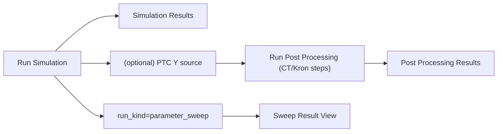

---
aliases:
- Simulation Result Views
- Simulation results view
tags:
- diataxis/explanation
- audience/team
- topic/architecture
- topic/simulation
status: stable
owner: docs-team
audience: team
scope: Simulation / Post-Processed / Sweep Result Architectural Mental Model of Three Types of Views
version: v0.2.0
last_updated: 2026-03-06
updated_by: codex
---

import { Aside } from '@astrojs/starlight/components';

# Simulation Result Views

The current implementation is not a single view, but three result nodes coexisting:

1. `Simulation Results` (Raw run)
2. `Post Processing Results` (CT/Kron after)
3. `Sweep Result View` (when run_kind=parameter_sweep)

This page describes the architectural mental model; fields and UI contracts are subject to Reference.

## Why Three Result Views

- Raw view retains the original semantics of the solver (especially `S`)
- Post-processed view presents the results after base transformation and dimensionality reduction
- Sweep view focuses on "the change of a certain selector on the scanning axis"

## Shared Interaction Pattern

Raw and Post-Processed use the same:

- family tabs
- metric selector
- `Add Trace` card (multiple trace overlays)
- single shared plot

This allows users to maintain consistent operations on different data nodes without having to re-learn a UI.

## Critical Semantics (Current)

1. `S` family must maintain solver-native raw `S` in Raw view
2. PTC mainly works on the `Y/Z` path and should not silently rewrite Raw `S` into another semantic meaning.
3. Post-processed naming To align the input/output labels of the trace card (for example, `Z_dm_cm`)
4. After switching family/metric/trace, title and y-axis label must be synchronized and cannot be stale.

## HFSS Comparison Position

HFSS comparable semantics mainly appear in the Post Processing path:

- Users can define equivalent port basis (such as dm/cm) through CT/Kron
- Use the output of this basis to judge `HFSS comparable` and the reason

Raw view still retains the original simulation semantics, and the two cannot be confused.

## Sweep Position

Sweep is a run-level result, not an additional type of trace hack.

- canonical authority in run payload (bundle)
-Result View allows quick browsing of representative points
- For complete sweep curve, use Sweep Result View for selector projection

<Aside type="note" title="Data contract anchor">

The payload authority for sweep / raw / post-processed is still `ResultBundleRecord`.
Concepts only helps to understand why the three types of nodes exist separately, and does not reiterate the JSON field table.

</Aside>

## The boundary between this page and Reference

<Aside type="caution" title="Read together">

- This page: Why three views and semantic layering (Concepts) are needed
- Reference: Formal contract (Reference) for each field, selector, and storage payload

</Aside>

## Related

- [Circuit Simulation](index.mdx)
- [Application Interface](../../../application-interface.md)
- [Julia Runner Compute Plane](../../contracts/julia-runner-compute-plane.md)
- [Dataset Record Schema](../../../data-contracts/dataset-record.mdx)
- [Analysis Result Schema](../../../data-contracts/analysis-result.mdx)
