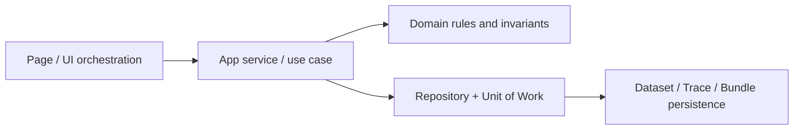

---
aliases:
 - "Clean Architecture"
 - "layered architecture"
tags:
 - diataxis/explanation
 - audience/team
 - topic/architecture
 - topic/data
 - topic/ui
status: stable
owner: docs-team
audience: team
scope: "Architectural mental model of dividing responsibilities by page / use case / domain / repository-uow"
version: v0.2.0
last_updated: 2026-03-06
updated_by: codex
sidebar:
 label: Clean Architecture
 order: 20
---

# Clean Architecture

This page describes not the file tree, but "how the current system divides responsibilities."
Reference will define the UI/data contract; here is why page, use case, domain, repository / Unit of Work should be layered.

## Current Flow in One Picture

This direction corresponds to the page contract and data contract in the current file:

- The page layer is responsible for the interactive arrangement and status presentation of `/schemas/{id}`, `/simulation`, and `/characterization`
- The app service / use case layer is responsible for stringing "formatting, expansion, simulation, post-processing, analysis, and saving" into a complete process
- The domain layer is responsible for defining which semantics are authority and which are just hints
- The repository / Unit of Work layer is responsible for saving traces, bundles, and derived results in a traceable manner

## Layer Responsibilities Today

### 1. Page layer

- Manage UI section, selector, feedback and page-level state
- For example, source-form editing of Schema Editor, result partitioning of Simulation, and trace selection of Characterization
- Data authority should not be redefined within the page

This is why UI Reference clearly distinguishes:

- source form vs expanded preview
- raw results vs post-processed results vs sweep view
- dataset-centric surface vs internal bundle provenance

## 2. App service / use case layer

- Receive page intent, coordinate parse / validate / expand / run / save process
- Decide which domain rules will be applied in this operation
- Wrap multiple repository operations into the same transaction / Unit of Work

The value of this layer is not to let the page decide for itself:

- Is trace compatible?
- How to write provenance in bundle when saving raw / save post-processed
- Can dataset profile be hard-block run?

## 3. Domain layer

What domain really protects is semantic boundaries, not picture details.

### Trace-first authority

- analysis and sweep selector of authority in compatible traces + selected trace ids
- `dataset_profile` only provides summary / recommendation
- So the UI can maintain dataset-centric, but the run is still determined by the trace-first rule

### Raw / processed / sweep semantics

- Raw `S` must maintain solver-native semantics
- Post-processing produces another output node, which cannot be mixed with raw result to form a single authority of one card.
- Sweep's canonical authority is in the bundle payload, not the UI for quick browsing of the projected single trace

### Source-form boundary

- `Schema Editor` save source form
- The netlist configuration of expanded preview and `/simulation` are both projections derived from the same expansion pipeline
- formatter can organize source text, but cannot rewrite netlist semantics

## 4. Repository / Unit of Work layer

- repository is responsible for reading and writing `DatasetRecord`, `DataRecord`, `ResultBundleRecord`, `ResultBundleDataLink`, `DerivedParameter`
- Unit of Work ensures that within a save/run, trace, bundle, link, and config snapshot are the same replayable transaction

This is why bundle / provenance should stay at this layer:

- provenance needs to be atomized and saved together with the data
- save raw, save post-processed, and characterization run must leave traceable sources
- post-process and sweep need to retain `source_meta` / `config_snapshot` / `result_payload` to reconstruct the upstream input

## Why This Split Matters

If the rules are placed at the wrong level, common results will be:

1. The page directly uses `dataset_profile` as a hard block, which violates trace-first authority.
2. For the sake of convenience, the UI treats the sweep projection data as the only SoT and loses the canonical payload.
3. The save action only saves the chart status, but does not save bundle provenance, resulting in results that cannot be traced.

The role of Clean Architecture in this project is to isolate these three types of errors.

## Read With Reference

- Page boundaries:
[Schema Editor](../../frontend/definition/schema-editor.mdx),
[Application Interface](../../application-interface.md),
 [Task Management](../../frontend/shared-workflow/task-management.md)
- Data authority and provenance:
[Data Storage](data-storage.md),
[Dataset Record Schema](../../data-contracts/dataset-record.mdx),
 [Analysis Result Schema](../../data-contracts/analysis-result.mdx)
- repository / Unit of Work read and write boundaries:
 [Query Indexing Strategy](../../data-contracts/query-indexing-strategy.mdx)
