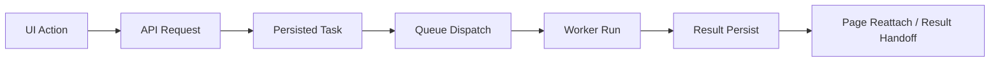

---
aliases:
 - Observability Taxonomy
 - Logging Layers
 - Observability layering
tags:
 - diataxis/explanation
 - audience/team
 - topic/architecture
 - topic/observability
status: draft
owner: docs-team
audience: team
scope: "Why the app should not have only one kind of logging, but should be divided into three layers: audit logging, workflow observability and product telemetry."
version: v0.1.0
last_updated: 2026-03-25
updated_by: codex
sidebar:
 label: Observability Taxonomy
 order: 50
---

import { Aside } from '@astrojs/starlight/components';

# Observability Taxonomy

This page answers:

- Why "doing more logs" is not enough to solve product governance, runtime diagnosis and performance optimization
- Why audit logging, workflow observability and product telemetry must be separated
- Why remote mode requires governance-facing `Audit Logs` surface, while local/remote requires workflow trace and performance data on both sides

<Aside type="caution" title="One logging stream is not enough">

This product faces at least three different problems simultaneously:
- Who did what governance-related operations?
- Which runtime stages a request/task/result has passed through
- Which UI/API/service paths are most commonly used or most in need of performance optimization

</Aside>

## Three Different Questions

| Layer | Primary question | Primary consumers |
|---|---|---|
| Audit Logging | Who in what workspace did what to which resource | admin, workspace governance, support |
| Workflow Observability | How an action / request / task passes through API, queue, worker, result handoff | runtime operator, developer, support |
| Product Telemetry | What do users do most, where is slow, and which path is worth optimizing | product engineering, performance analysis |

## Why Audit Logging Cannot Do Everything

The core value of audit logging is governance and accountability.

It is suitable to answer:

- Which user sent a task
- Which user cancels/terminates a task
- Which workspace import / publish / delete occurs

But it's not suitable to answer:

- Why is this task stuck at `dispatching`?
- Which worker crash leads to reconciliation
- Which service path goes through too many layers to accomplish the same thing?

If you put all these contents into the audit trail, the result will be:

- payload is difficult to read
- query is difficult to make
- Blurred permission boundaries

## Why Workflow Observability Must Exist

Workflow observability faces runtime and execution path.

What it cares about is:

- renderer action -> request
- request -> persisted task
- task -> queue dispatch
- queue -> worker claim
- worker -> solver run
- solver -> result persist
- result -> page reattach / publish

This layer is not intended to replace audit.
Its focus is:

- correlation propagation
- runtime stage timeline
- failure / reconcile diagnosis
- Common observation language for local desktop sidecar and remote server runtime

## Why Product Telemetry Must Stay Separate

The performance optimization you want to do does not rely on a single request log, but on aggregate data that can be analyzed.

product telemetry is concerned with:

- Which page does the user stay on most often?
- Which type of task submit flow is most often retried?
- Which API/service path latency is too high
- Which compare / analysis workflow is most commonly triggered

It doesn't need to look like an audit row, nor does it need to progressively replay the entire task timeline.

It's more like:

- usage counters
- latency histograms
- funnel / drop-off data
- feature-level performance baselines

## Local And Remote Do Not Need The Same Surfaces

### Online Mode

Online mode explicitly requires governance-facing audit surface, for example:

- workspace-scoped `Audit Logs` page
- actor / resource / action filters
- support-safe debug linkage

### Local And Remote Both Need Workflow Observability

Whether the compute is local or remote, you still need to know:

- Where is it slow?
- where failed
- Which queue / worker stage is problematic?

### Product Telemetry Also Spans Both

Performance analysis and product optimization are not just for remote collaboration.
The high-frequency flow of local desktop users is also worth measuring.

## Shared Correlation Language

These three layers should not be mixed into one store, but they can share a small number of shared identifiers:

| Field | Why it matters |
|---|---|
| `correlation_id` | Associate the same string of action / request / task / result |
| `debug_ref` | support-safe debug lookup |
| `task_id` |queue / worker / result handoff of public identity|
| `session_id` | session-scoped context linkage |
| `workspace_id` | governance / visibility boundary |
| `actor_user_id` |remote governance and actor-centric audit lookup|

## What Product Surfaces Fall Out Of This

If this layering is accepted, reasonable product surfaces will naturally grow into three categories:

| Surface family | Why it exists |
|---|---|
| Audit Logs page |Show actor-centric history to remote governance / admin|
| Runtime timeline / developer tooling |Show task and queue / worker timeline to operator / developer|
| Telemetry dashboards / analysis pipeline | Look at aggregate patterns for product and performance optimization |

## Related

- [App / Shared / Observability Model](../../shared/observability-model.mdx)
- [App / Shared / Audit Logging](../../shared/audit-logging.mdx)
- [App / Backend / Audit Logs](../../backend/audit-logs.mdx)
- [App / Shared / Task Runtime & Processors](../../shared/task-runtime-and-processors.md)
- [Logging Standards](../../../reference/guardrails/code-quality/logging.mdx)
