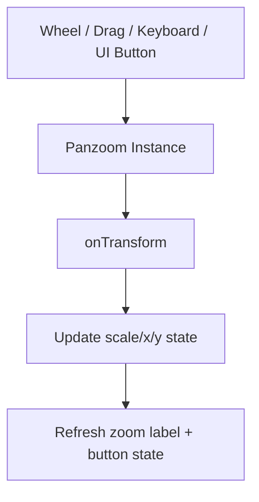

---
aliases:
 - Circuit Schema Live Preview
 - Circuit Schema instant preview
tags:
 - diataxis/explanation
 - audience/team
 - topic/architecture
 - topic/visualization
status: draft
owner: docs-team
audience: team
scope: Live Preview’s semantic-driven rendering strategy, Panzoom interaction contract, observability and verification rules
version: v0.5.5
last_updated: 2026-02-28
updated_by: docs-team
sidebar:
 label: Circuit Schema Live Preview
 order: 20
---

import { Aside } from '@astrojs/starlight/components';

# Circuit Schema Live Preview

This page defines the main contract of Live Preview: **domain-specific semantics** first, readability as the core, and verifiable behavior as the delivery standard.

<Aside type="note" title="Tech Stack description location">

This page does not expand into technical stack details. Please refer to [Guardrails / Project Basics / Tech Stack](../../../reference/guardrails/project-basics/tech-stack.mdx).

</Aside>

## Core Decision

| Decision | Description |
|---|---|
| Semantic priority | Superconducting circuits (Qubit/JPA/JTWPA) are not ordinary graph drawings, and you cannot just chase the shortest line length |
| Readability takes precedence | "Looks like a correct circuit" takes precedence over geometric shortest |
| Contractualization | Rendering, scaling, annotation, and routing must be verifiable and regressible |

<Aside type="note" title="Design input sources">

This page absorbs NetlistSVG/ELK practices, schematic hyperedge routing research, and common risks of Panzoom interactive layer. For detailed links, see References at the end of the article.

</Aside>

## Rendering Contract

| Contract Project | Master Requirements |
|---|---|
| Net/Hyperedge | The endpoints of the same node first converge to the same net, and then make trunk connections |
| Lanes | Signal/Ground as the backbone, Bridge is only enabled when conflicts are necessary |
| Layout Mode | Pattern-aware takes priority, falling back to Generic Orthogonal if it cannot be recognized |
| Labels | Use local constraints to select locations to avoid dense overlap caused by fixed offsets |
| Routing | Keep the main trunk horizontal and continuous to avoid unnecessary lifting/folding |
| Parameter Binding | The displayed value is fixed from `value_ref -> parameters` |

<Aside type="tip" title="Pattern-aware vs Generic fallback">

When detecting repeated cell structures such as JTWPA/JJTWPA, go to ladder-first.
When the classifier is not confident enough, it must fall back to generic orthogonal and cannot be forced to use ladder.

</Aside>

<Aside type="tip" title="The first stage of the program has been implemented (2026-02-28)">

Currently `circuit_visualizer` has implemented the following behaviors:
- Coarse-grained profile classifier: `generic` / `jpa_like` / `jtwpa_like`
- A simple chain topology will first extract a fixed signal backbone (backbone node anchor)
- Create shunt cluster metadata based on signal node (multiple vertical branches of the same node can be identified)
- High-density shunt will expand from the backbone to the left and right with branch offset, instead of squeezing the backbone forward
- The vertical branch labels are changed to cluster-aware's left and right expansion labels instead of being stacked next to the components.

</Aside>

<Aside type="caution" title="Bridge observability requirements">

Each bridge must record `bridge_id`, `conflict_reason`, `involved_nets`, `final_geometry`, otherwise it cannot be considered maintainable behavior.

</Aside>

<Aside type="caution" title="Known gaps (2026-02-28)">

At present, the program implementation has not yet completed the following contracts:
- The real `Net/Hyperedge` backbone model (currently only the "simple chain backbone" special case)
- Locally constrained label placement (currently only cluster-aware outward placement)
- Complete pattern-aware routing (currently only affects backbone / spacing / annotation first)
- bridge observability metadata (diagnostic information such as `bridge_id` has not yet been output)
Therefore, in higher-density shunts with more than three branches, ultra-long numerical strings, or hybrid coupling component areas, text may still be close to each other or the distance from the line segment is insufficient.

</Aside>

## Panzoom Contract

| Contract Project | Master Requirements |
|---|---|
| DOM layering | `Viewport` (event/cropping) -> `Panzoom Container` (unique transform) -> `SVG Host` (content replacement) |
| Lifecycle | mount creates a single instance, update only changes the host, unmount destroy instance |
| State | Save at least `scale`, `x`, `y`, `schema_id`, `svg_signature` |
| Input Policy | `Ctrl + wheel` zoom, `wheel` retain scrolling, touch gestures must have `touch-action` borders |
| Control Sync | Wheel/drag/keyboard/`+ - reset` buttons must share the same panzoom state and update callback |

<Aside type="caution" title="Zoom state retention conditions">

The transform is only retained if the dimensions are compatible; if not, `fit` or `reset`.
Recommended thresholds: aspect ratio difference at most 5%, and width and height difference at most 15% each.

</Aside>

<Aside type="tip" title="Button and direct action synchronization rules">

`+`, `-`, and `Reset` cannot maintain independent zoom values ​​by themselves and must call the same panzoom instance API.
UI percentage display (such as `120%`) can only come from the same `onTransform` event to avoid state splitting.

</Aside>

## Domain Semantics

The domain semantic setting is changed to separate file management to avoid the main text being too long and to facilitate independent evolution:

- [Live Preview Domain Semantics Profiles](live-preview-domain-semantics.mdx)

<Aside type="note" title="Current file splitting strategy">

First maintain "1 main text + 1 profile"; when there are enough stable cases in fields such as Quantum Memory, split it into multiple domain files.

</Aside>

## Validation and Non-Regression

| Case | Core Objectives |
|---|---|
| SmokeStableSeriesLC | baseline readability and node single annotation |
| Flux-pumped JPA | Border port tags and high-density shunt layout |
| JTWPA (10-20 cells) | ladder identifiable, trunk continuous, zoomable view |
| Floquet JTWPA with Dissipation | Variant components do not destroy the main vision |
| Label torture test | 100%/150% lower label cannot cover large areas of components |

<Aside type="tip" title="Hard non-regression constraints">

1) Each node is marked only once
2) The display value source is fixed to `value_ref -> parameters`
3) Do not allow wires to pass through component symbols
4) Reset Zoom must return to the default viewing angle stably

</Aside>

## Related

- [Live Preview Domain Semantics Profiles](live-preview-domain-semantics.mdx)
- [Dataset Schema Design](schema-design.md)
- [Visualization Backend](visualization-backend.md)
- [Data Formats](../../data-contracts/index.mdx)

## References

- NetlistSVG repository: [https://github.com/nturley/netlistsvg](https://github.com/nturley/netlistsvg)
- NetlistSVG layout notes: [https://observablehq.com/@nturley/netlistsvg-how-to-draw-a-better-schematic-than-graphviz](https://observablehq.com/@nturley/netlistsvg-how-to-draw-a-better-schematic-than-graphviz)
- Interactive orthogonal hyperedge routing: [https://www.researchgate.net/publication/354725826_Interactive_Orthogonal_Hyperedge_Routing_in_Schematic_Diagrams_Assisted_by_Layout_Automatisms](https://www.researchgate.net/publication/354725826_Interactive_Orthogonal_Hyperedge_Routing_in_Schematic_Diagrams_Assisted_by_Layout_Automatisms)
- svg-pan-zoom README: [https://github.com/bumbu/svg-pan-zoom/blob/master/README.md](https://github.com/bumbu/svg-pan-zoom/blob/master/README.md)
