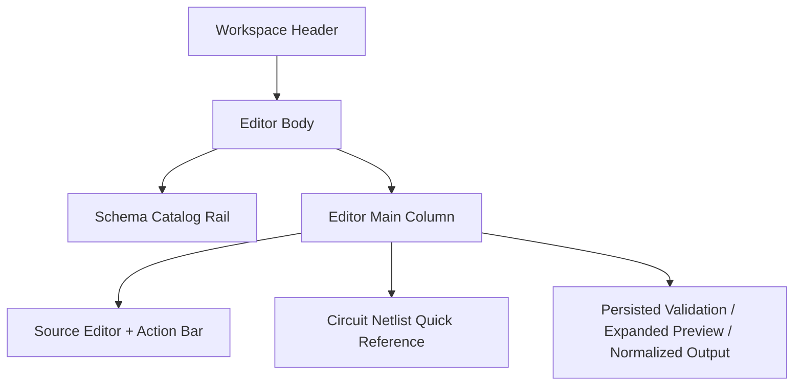

import { Aside, TabItem, Tabs } from '@astrojs/starlight/components';

# Schema Editor

This page defines the editing, formatting, persistence, and persisted preview contracts for a single active circuit schema.

<Aside type="note" title="Page Frame">

This page is responsible for canonical source editing, `Format` / `Save` / `Delete`, persisted validation preview, normalized output and schema authoring hints.
Schema list browse, simulation execution and analysis execution are not the responsibility of this page.

</Aside>

<Aside type="tip" title="Shared Shell">

This page is located in the shared [Header](../shared-shell/header.mdx) / [Sidebar](../shared-shell/sidebar.md) shell.
The page body can display active schema and dirty state, but cannot take over the global dataset, task execution, or user menu.

</Aside>

## Schema Identity Contract

| Concern | Rule |
|---|---|
| Persisted identity |The canonical identity of the active schema is full UUIDv4 `definition_id`|
| Header / title display | page can display short `Schema ID` to assist identification, but `Definition #...` cannot be used to imply numeric sequential identity |
| Same-name schema handling | If the user switches to the schema with the same name in the catalog rail, the editor must use short `Schema ID` + `created_at` / `updated_at` to remain distinguishable |
| Route / page binding | editor route state is bound to full `definition_id`; it cannot be replaced by row position or compact display token |
| Save / delete / publish / clone | mutations all sent as full `definition_id` against persisted definition |

## Purpose

| Responsibility | Meaning |
|---|---|
| Source editing | Direct editing canonical circuit netlist source |
| Auto-format | Organize source into canonical formatting without implicit storage |
| Persisted preview | Displays validation, expanded preview, normalized output after the last successful save |
| Authoring guidance | A scannable quick reference indicating available components, unit and topology rules |

## Layout Structure

## Component Inventory

| ID | Component | Required behavior |
|---|---|---|
| `C1` | Catalog Rail | Switch active schema without leaving editor workflow |
| `C2` | Source Editor | Edit canonical source; syntax highlighting, line numbers, dirty state are required |
| `C3` | Action Bar | Contains at least `Format`, `Save`, `Discard`, `Delete` |
| `C4` | Persisted Preview Panel |shows validation notices, expanded preview, normalized output|
| `C5` | Circuit Netlist Quick Reference | Present component, unit, topology hint as table or tabs |

## Formatting Contract

<Aside type="caution" title="Auto-format Is Required">

Code editors must support explicit auto-format behavior.
Users must at least be able to trigger formatting via the `Format` button and `Cmd/Ctrl + Shift + F`.

</Aside>

| Rule | Meaning |
|---|---|
| Explicit action only | `Format` can organize sources, but cannot trigger `Save` implicitly |
| Canonical shape | The formatted source should align with the canonical netlist form and avoid page-local style fork |
| Dirty remains meaningful | `Format` If the source is modified, the modification is still deemed not to be saved until `Save` succeeds |
| Failure feedback | When the formatter fails, clear diagnostics must be given and cannot be ignored silently |

Expected edit flow

1. The user modifies the source.
2. Click `Format` or use the shortcut keys.
3. Editor source is rearranged to canonical style.
4. dirty state remains.
5. Only after clicking `Save`, the persisted preview will be updated.

## Circuit Netlist Quick Reference

<Aside type="note" title="Authoring Hint Surface">

This page must directly display a scannable hint table.
Users should not be forced to leave the editor to learn component prefixes, units, and topology rules.

</Aside>

### Component & Unit Table

| Component | Prefix | Allowed Units | Example | Hint |
|---|---|---|---|---|
| Port | `P*` | `-` | `("P1", "1", "0", 1)` | port index uses an integer |
| Resistor | `R*` | `Ohm`, `kOhm`, `MOhm` | `("R1", "1", "0", "R1")` | Common shunt is `50 Ohm` |
| Inductor | `L*` | `H`, `mH`, `uH`, `nH`, `pH` | `("L1", "1", "2", "L1")` |separate from `Lj*`|
| Capacitor | `C*` | `F`, `mF`, `uF`, `nF`, `pF`, `fF` | `("C1", "1", "2", "C1")` | Please use `value_ref` for shared parameters |
| Josephson Junction | `Lj*` | `H`, `mH`, `uH`, `nH`, `pH` | `("Lj1", "2", "0", "Lj1")` |junction symbol shown by preview|
| Mutual Coupling | `K*` | project-specific | `("K1", "L1", "L2", "K1")` |Column 2/3 of topology is inductor name|

### Authoring Rules

| Rule | Meaning |
|---|---|
| `components` first | The component definition must exist first, `topology` then references the component name |
| Ground token | Ground only allows the string `0` |
| Topology references names | Non-Port components should reference component name in the topology |
| Hints are reference-only | quick reference helps write, but canonical truth is still subject to [Circuit Netlist](../../archive/old-app-contracts/circuit-netlist.mdx) |

## Data & State Contract

<Tabs>
<TabItem label="Read model">

| Data | Source | Why it matters |
|---|---|---|
| definition detail | definition service | Fill in editor and page identity; where `definition_id` is UUIDv4 opaque identity |
| validation notices | persisted definition detail | display validation result after save |
| expanded preview | persisted preview payload | Let the user check the result after repeat-expansion |
| normalized output | persisted preview payload | show backend derived canonical output |

</TabItem>

<TabItem label="Page states">

| State | Meaning |
|---|---|
| `Dirty` | editor source and persisted preview have been decoupled |
| `Formatting` | formatter executing |
| `Saving` | save mutation is being executed |
| `Persisted` | editor aligned with persisted preview |

</TabItem>

</Tabs>

<Aside type="caution" title="Persisted Preview Boundary">

`Validation Notices`, `Expanded Preview` and `Normalized Output` must be bound to the last successfully saved version.
Unsaved content cannot directly overwrite the preview authority.

</Aside>

## Acceptance Checklist

<Aside type="tip" title="Implementation-ready outcome">

* [ ] editor has `Format` button and `Cmd/Ctrl + Shift + F`
* [ ] `Format` does not implicitly `Save`
* [ ] dirty / formatting / saving / persisted status is identifiable
* [ ] page body displays `Circuit Netlist Quick Reference`
* [ ] quick reference containing at least component / units / topology rules
* [ ] persisted preview is clearly separated from unsaved draft

</Aside>

## Related

* [Schemas](schemas.mdx)
* [Circuit Netlist](../../archive/old-app-contracts/circuit-netlist.mdx)
* [Backend / Circuit Definitions](../../backend/circuit-definitions.mdx)
* [Header](../shared-shell/header.mdx)
* [Sidebar](../shared-shell/sidebar.md)
