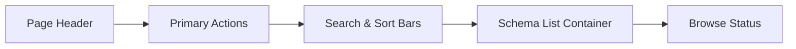

import { Aside, TabItem, Tabs } from '@astrojs/starlight/components';

# Schemas

This page defines the circuit schema catalog's browse, search, sort, cursor-based browse, create, open, and delete contracts.

<Aside type="note" title="Page Frame">

This page is responsible for schema catalog, search/sort/cursor-based browse, creation, deletion and opening of editor.
Source editing, preview rendering and simulation execution are not the responsibility of this page.

</Aside>

<Aside type="tip" title="Shared Shell">

This page is located in the shared [Header](../shared-shell/header.mdx) / [Sidebar](../shared-shell/sidebar.md) shell, but this page itself does not own the dataset or task context authority.

</Aside>

<Aside type="note" title="Workspace-scoped catalog">

Schema catalog only lists definitions currently visible in `Active Workspace`.
The `private` schema is only visible to owner, workspace owner and admin; the `workspace` schema is part of the common manifest.

</Aside>

<Aside type="caution" title="Schema identity display">

- persisted schema identity is UUIDv4-only `definition_id`
- The UI must no longer describe the schema identity as a compact sequential number such as `Definition #...`
- Schemas with the same name must be distinguished by short `Schema ID` + `created_at`; add owner / workspace context if necessary

</Aside>

---

## User Goals

* **Efficient Search**: Quickly locate targets in hundreds of Schemas.
* **Version Confirmation**: Confirm the latest development progress based on build time or name.
* **Convenient Management**: Quickly start a new project (New Circuit) or clean up abandoned circuit definitions.
* **Smooth docking**: Seamlessly guide from the list to `Schema Editor` or `Circuit Simulation`.

---

## UI configuration and component description

### Layout Structure

### List of key components (Components)

| ID | Component | Functional Description | Key Behaviors |
|:--- |:--- |:--- |:--- |
| **C1** | New Circuit Button | Located at the top, it is the main action button. | Directed to Schema to create the process. |
| **C2** | Filter Bar | Provides name search, field sorting and direction selection. | Trigger list requery. |
| **C3** | Schema Item Row | List core, showing `name`, short `Schema ID`, `created_at`. | Supports opening, editing and deletion. |
| **C4** | Browse Controls | Located at the bottom, controls cursor-based front and back browsing. | The driver is loaded in stages, and the total number and cursor status are updated simultaneously. |

---

## Data and status contract (Contract)

<Tabs>
<TabItem label="Data Dependencies">

| Information | Source | Necessity | Purpose |
|:--- |:--- |:---: |:--- |
| schema summary list | definition summary service | ✅ | Render a summary of each column. |
| total items count | definition summary service | ✅ | Display the total number of items and browse summary. |
| cursor meta | definition summary service | ✅ | Drive front and back browsing. |
| search & sort params | UI State | ✅ | Control filtering and sorting behavior. |
| active workspace | session surface | ✅ | Limit the visible range of catalog. |
| capability flags | session surface | ✅ | Determines whether to display create / delete affordance. |

</TabItem>

<TabItem label="Page States (States)">

| Status | Description |
|:--- |:--- |
| `Default` | Display the list and control items normally. |
| `Loading` | The data is being updated, and the list shows the loaded masks. |
| `Empty` | No data found (or no results after searching), corresponding prompts are displayed. |
| `Error` | The service request failed and error information is displayed in the list block. |

</TabItem>

</Tabs>

<Aside type="caution" title="boundary constraints">

Schema Catalog **disables** preloading the complete Definition Payload during the listing stage. Its details should only be read on demand in the Editor or Detail stream.

</Aside>

## Schema Identity And Ordering Rules

| Concern | Rule |
|---|---|
| Persisted identity | catalog row is bound to full UUIDv4 `definition_id` |
| Visible label | row can display short `Schema ID`, but this is just the abbreviation of full UUIDv4 display |
| Same-name rows | Do not use implicit display order as the only distinction; at least short `Schema ID` + `created_at` must be displayed |
| Sorting | Use `created_at`, `updated_at`, `name` fields; do not use `definition_id` value sorting |
| Open / delete / clone | Still using full `definition_id` as action binding; not binding with row order or visible short ID |

## Workspace And Permission Rules

| Concern | Rule |
|---|---|
| Catalog scope | Only query definitions visible to the currently active workspace |
| Create permission | Only sessions with `can_manage_definitions` can be created |
| Delete permission | Determined by backend capability and ownership; frontend does not guess on its own |
| Default creation scope | The new schema defaults to the current active workspace, and the default is `private` |
| Workspace switch | After switching workspace, the catalog must be rechecked; if the current editor target is no longer visible, it must not pretend to still exist in the list |

---

##Interaction Flow

<Tabs>
<TabItem label="Create/Open">

1. Click `New Circuit` -> Navigate to Editor to create a new file.
2. Click `Edit` or Row -> Navigate to Editor and bring in the selected full UUIDv4 `definition_id`.

</TabItem>

<TabItem label="Workspace Rebinding">

1.Header switching active workspace.
2. This page clears the old list results and rechecks the definition summaries of the new workspace.
3. If the current search/sort/cursor is no longer applicable, at least clear the cursor and retain the reusable filter.

</TabItem>

<TabItem label="Search/Sort">

1. Update search box or sorting options.
2. Clear the current cursor.
3. Refresh the list view based on the new criteria.

</TabItem>

<TabItem label="Delete process (Delete)">

1. Click `Delete` -> trigger the secondary confirmation window.
2. After successful deletion, refresh the list and recalibrate the cursor view (if necessary).

</TabItem>

</Tabs>

---

## Visual Rules

* **Clearly layered**: The visual weight of the Page Title must be significantly higher than that of the Subtitle.
* **CTA Positioning**: The `New Circuit` button should always be at the top of the main content area.
* **Consistent Density**: Whether using Table or Card, short `Schema ID`, `Created At` and Action buttons need to maintain stable alignment in each column.
* **Feedback Positioning**: Error or Mutation Feedback should be clearly visible near the list area.

---

## Related references

*  [Schema Editor](schema-editor.mdx)
*  [Header](../shared-shell/header.mdx)
*  [Sidebar](../shared-shell/sidebar.md)
*  [Circuit Simulation](../simulation-workbench/circuit-simulation.md)
*  [Backend: Circuit Definitions](../../backend/circuit-definitions.mdx)
*  [Record Format: Circuit Netlist](../../archive/old-app-contracts/circuit-netlist.mdx)
