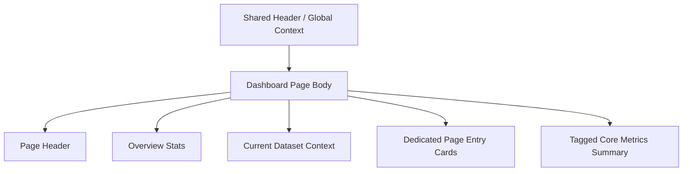

import { Aside } from '@astrojs/starlight/components';

# Dashboard

## Purpose

`/dashboard` is the canonical landing page of the `Dashboard` sidebar group. It is a summary-first workspace overview, not the only formal entry into dataset metadata.

This page is responsible for:

- Overview of the currently active dataset context
- Show read-only summary of tagged core metrics
- Provide streamlined entry to dedicated surfaces such as `Dataset`, `Tasks`, `Data Ingestion`, `Raw Data Browser`, etc.

This page is not responsible for:

- dataset profile editor
- raw-data ingestion authoring
- raw trace browse
- simulation / analysis configuration

<Aside type="caution" title="Dashboard is not the dataset-management page">

Dataset profile edit, lifecycle actions and active dataset browse should return to [Dataset](dataset.mdx).
`Dashboard` only does overview and next-step entry, and should not be changed back to metadata editor.

</Aside>

## User Goal

- Quickly confirm whether the current dataset context is correct
- See if tagged core metrics are ready
- Go to the correct dedicated page from overview

Non-target:

- Do not complete dataset lifecycle or profile mutation on this page
- Do not submit ingestion directly on this page
- Do not create a large number of cross-page handoff / explanation UI on this page

## Layout Structure

1. Page header
2. Compact overview stats
3. Current dataset context summary
4. Dedicated page entry cards
5. Tagged core metrics read-only summary

## Component Inventory

| ID | Component | Role | Required behavior |
|---|---|---|---|
| `C1` | Page Header | page identity | Indicates that this is an overview-first landing page, not a management page |
| `C2` | Overview Stats | summary | Displays dataset/metrics status that can be quickly scanned |
| `C3` | Current Dataset Context | context summary | Displays the concise summary of the active dataset and does not assume editorial responsibility |
| `C4` | Dedicated Page Entry Cards | next-step navigation | Lead to `Dataset`, `Tasks`, `Data Ingestion`, `Raw Data Browser` with a small number of clear entry cards |
| `C5` | Tagged Core Metrics Summary | read-only result summary | Display tagged metrics summary related to active dataset |

## Data & State Contract

### Data dependencies

| Data | Source | Required | Use |
|---|---|---:|---|
| active dataset summary | session surface | ✅ | Show current context |
| visible dataset count | datasets surface | ✅ | overview stats |
| dataset profile summary | datasets surface | ⚠️ | Only do concise summary, not editing |
| tagged core metrics summary | analysis results surface | ⚠️ | read-only summary |

### UI states

| State | Required behavior |
|---|---|
| `loading` | overview stats / summary block partition loading; do not turn the entire page into a large area diagnostics |
| `empty` | If there is no active dataset or metrics, display concise next-step guidance |
| `partial` | profile / metrics When any block fails, only that block is affected |
| `error` | Displays the local error block and does not affect other summary blocks |

## Interaction Flows

1. **Open a dedicated page**
- The user clicks on `Dataset`, `Tasks`, `Data Ingestion` or `Raw Data Browser` from the entry card
- Dashboard should not be laid out again first handoff explanation

2. **Refresh after shell context change**
- Header / Global Context switching active dataset
- Dashboard re-pulls overview stats, dataset summary and tagged metrics
- The page body is not allowed to invent another dataset context.

3. **Metrics empty state**
- If the active dataset does not have tagged metrics yet
- Show concise empty guidance
- Do not plug the analysis workflow directly back into the dashboard

## Visual Rules

- overview-first, cannot degenerate into dataset management wall
- Dedicated page entries can exist, but must be maintained as small next-step clusters, not large CTA walls
- page body must not repeat `Runtime Mode`, `Active Dataset`, `Task Execution`, submit authority, etc. shell-owned context
- The tagged metrics block maintains read-only summary and does not undertake identify / analysis operations.

## Acceptance Checklist

- [ ] `Dashboard` is defined as summary-first landing page, not dataset metadata editor
- [ ] dataset profile mutation no longer belongs to `/dashboard`
- [ ] entry cards only lead to dedicated pages and do not become excessive cross-page CTA walls
- [ ] active dataset context comes from shared shell / session, page body does not create a duplicate shell context
- [ ] tagged core metrics remain a read-only summary only

## Related

- [Dataset](dataset.mdx)
- [Tasks](tasks.mdx)
- [Data Ingestion](data-ingestion.mdx)
- [Raw Data Browser](raw-data-browser.mdx)
- [Header](../shared-shell/header.mdx)
- [Sidebar](../shared-shell/sidebar.md)
