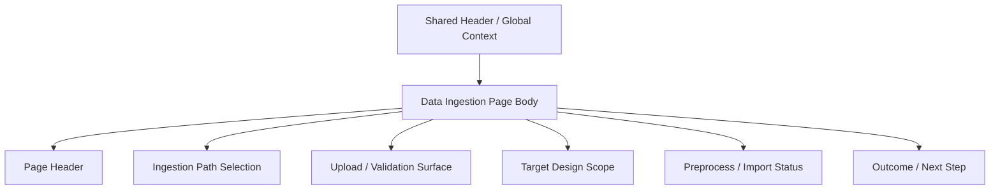

import { Aside } from '@astrojs/starlight/components';

# Data Ingestion

## Purpose

`/data-ingestion` is a dedicated page for raw-data intake. It should be centered around the upload-first ingestion workflow rather than the backend DTO authoring surface.

This page is responsible for:

- Select ingestion path / source family
- Upload raw data files
- Select the existing `Target Design Scope` in the active dataset, or explicitly create a new scope
- perform validation / preprocess / import
- Show import outcome with minimal necessary next steps

This page is not responsible for:

- duplicate shell-owned runtime / dataset / authority context
- Allow users to manually fill in raw DTO / trace payload JSON as a formal product process
- Take on IA with a full row of cross-page navigation buttons

<Aside type="caution" title="Upload-first, not DTO-first">

The backend ingestion request may still be a structured payload,
But frontend canonical UX should be driven by upload, validation, mapping, and import, rather than requiring users to directly edit raw DTO fields or JSON payloads.

</Aside>

## User Goal

- Import new measurement / layout-simulation data into the current active dataset
- Specify which dataset-local analytical scope the data should fall into
- Confirm whether validation and preprocess are successful
- Proceed to the correct next step after the import is complete

Non-target:

- Do not manage dataset lifecycle on this page
- Do not browse raw trace content on this page
- Do not display runtime mode / target dataset / submit authority cards repeatedly on this page

## Layout Structure

1. Page header
2. Ingestion path / source selection
3. Upload and validation surface
4. Target Design Scope selection
5. Preprocess / import status
6. Minimal outcome and next-step affordance

## Component Inventory

| ID | Component | Role | Required behavior |
|---|---|---|---|
| `C1` | Page Header | page identity | Clearly state that this page only accepts ingestion |
| `C2` | Ingestion Path Selector | workflow branch |Select measurement / layout-simulation and other intake paths|
| `C3` | Upload Surface | primary authoring surface | Accept raw data file and necessary metadata |
| `C4` | Validation / Preprocess Summary | stage feedback | Present schema / convention check and preprocess status |
| `C5` | Target Design Scope Selector | import target | Supports selecting existing active scope or create-new intent; cannot rely solely on free-text name implicit matching |
| `C6` | Import CTA | primary action | trigger formal import |
| `C7` | Outcome Panel | compact result handoff | Show success/failure with at most one major next step |

## Data & State Contract

### Data dependencies

| Data | Source | Required | Use |
|---|---|---:|---|
| active dataset | session surface | ✅ | ingestion target |
| target design scopes | datasets surface | ✅ | existing target / create-new gating |
| ingest authority | datasets surface / session capabilities | ✅ | gating |
| validation result | ingestion authority | ✅ | file / schema check |
| preprocess result | ingestion authority | ⚠️ |summary before import|
| import outcome | ingestion authority | ✅ | result handoff |

### UI states

| State | Required behavior |
|---|---|
| `idle` | No file has been selected or validation has not been started yet |
| `validating` | Show validation in progress |
| `preprocessing` | show preprocess in progress |
| `ready_to_import` | validation / preprocess is completed, you can enter import |
| `importing` |import mutation middle|
| `success` | Display concise success summary with a primary next action |
| `error` | Display concise failure summary; if there is raw detail, the density is controlled by Developer Mode |

### Target Design Scope Rules

| Concern | Rule |
|---|---|
| Existing target | page must be sent explicit `dataset_id + design_id` |
| Create-new target | page must send create intent and display name, and backend returns new `design_id` before becoming authority |
| Free-text name | can only be used as create-new default and cannot implicitly represent existing scope |
| Archived scope | must not appear in the normal target selector; if the deep link points to the archived scope, the page should display backend stale/redirect response |
| Circuit / source hint | uploaded source metadata can provide suggested label, but cannot replace user-selected target |

## Interaction Flows

1. **Upload and validate**
- The user selects the ingestion path and uploads the file
- The system is verified according to fixed convention or admin-extensible schema
- When verification fails, stay on this page for correction and do not jump to other pages.

2. **Preprocess and import**
- After validation is successful, enter preprocess/import
- The user first selects the existing `Target Design Scope` or explicitly create-new
- import request uses `design_id` for the existing scope; create-new path creates the scope from backend and then generates trace records
- page displays concise success summary

3. **Outcome handoff**
- After the import is successful, a main next action can be provided
- The default should lead to the page where the import results can best be checked, such as `Raw Data Browser`
- A large number of `Open Dataset` / `Open Raw Data` / `Go to X` button walls should not appear at the same time

## Visual Rules

- The layout should be based on the upload-first ingestion workflow rather than the form wall of hand-filled DTO
- `Active Dataset` can be used as a necessary target context for the page, but the entire shell context summary should not be copied
- `Target Design Scope` is the import target control, not the second global context
- Do not display `Runtime Mode`, `Submit Authority`, etc. stats cards that are duplicated by shared shell
- Keep the outcome section streamlined; don’t pile handoff / preview / authority explanation into a second workspace

## Acceptance Checklist

- [ ] `Data Ingestion` is defined as upload-first intake page, not DTO authoring page
- [ ] active dataset as target context from shared shell/session, no duplication of shell context wall
- [ ] You must explicitly select the existing `Target Design Scope` or create-new intent before importing
- [ ] Existing targets must submit explicit `design_id`; free-text name only serves create-new path
- [ ] validation / preprocess / import has clear stage feedback
- There is at most one main next action after [ ] import success, not button wall
- [ ] raw DTO / trace payload authoring is not written as an official product SoT

## Related

- [Dataset](dataset.mdx)
- [Raw Data Browser](raw-data-browser.mdx)
- [Header](../shared-shell/header.mdx)
