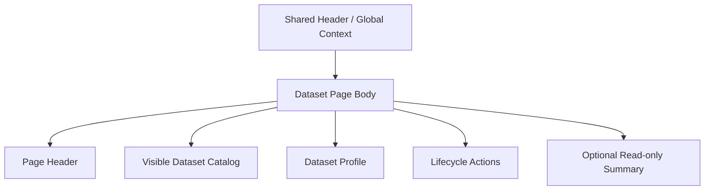

import { Aside } from '@astrojs/starlight/components';

# Dataset

## Purpose

`/dataset` is a dedicated page for dataset browse, active selection, profile metadata management and lifecycle actions.

This page is responsible for:

- Browse the currently visible dataset catalog
- Switch active dataset
- Edit dataset profile metadata
- Execute lifecycle actions such as create / archive / delete etc.

This page is not responsible for:

- duplicate shell-owned runtime / dataset / execution context
- raw-data ingestion authoring
- raw trace browse
- cross-page handoff button wall

<Aside type="caution" title="Dedicated management surface">

Formal management responsibility for the dataset belongs to this page and is no longer the responsibility of `Dashboard`.
But this page shouldn't put `Data Ingestion`, `Raw Data Browser` or shell context back together either.

</Aside>

## User Goal

- Find the correct dataset
- Make it active dataset
- Edit profile metadata
- Perform necessary lifecycle actions

Non-target:

- Do not do ingestion upload on this page
- Do not view trace payload on this page
- No need to replace clear IA with lots of `Open Raw Data` / `Open Data Ingestion` buttons

## Layout Structure

1. Page header
2. Dataset catalog / search / active selection
3. Dataset profile edit
4. Dataset lifecycle actions
5. Optional read-only metric summary

## Component Inventory

| ID | Component | Role | Required behavior |
|---|---|---|---|
| `C1` | Page Header | page identity | Description This is a dataset management page |
| `C2` | Dataset Search | catalog filter | Filter only visible datasets |
| `C3` | Visible Dataset Catalog | browse + selection |supports active dataset switch and row-level status summary|
| `C4` | Dataset Profile Form | metadata edit | Undertake profile fields and save action |
| `C5` | Lifecycle Actions | create / archive / delete | Display available mutations based on backend authority |
| `C6` | Read-only Metric Summary | optional secondary summary | Can display tagged metrics or compact result context, but cannot override the catalog / profile main process |

## Data & State Contract

### Data dependencies

| Data | Source | Required | Use |
|---|---|---:|---|
| visible dataset catalog | datasets surface | ✅ | browse / search / switch |
| active dataset summary | session surface | ✅ | Mark the current active row |
| dataset profile detail | datasets surface | ✅ | profile edit |
| allowed actions | datasets surface + session capabilities | ✅ | lifecycle gating |
| tagged metrics summary | analysis results surface | ⚠️ | optional read-only summary |

### UI states

| State | Required behavior |
|---|---|
| `loading` | catalog and profile partition loading |
| `empty` | If there are no visible datasets, display concise empty state and create guidance |
| `error` | catalog / profile / lifecycle mutation errors are displayed locally |
| `dirty` | Show clearly when profile form is dirty save affordance |

## Interaction Flows

1. **Switch active dataset**
- The user selects a dataset in the catalog
- session surface update active dataset
- page reload profile / metric summary

2. **Edit profile**
- User edit dataset profile
- After the backend mutation is successful, the profile summary and session-bound surfaces are updated synchronously

3. **Lifecycle action**
- User executes create/archive/delete
- The page displays confirmation and results according to the backend authority
- Do not use page-local state to pretend that mutation is completed

## Visual Rules

- catalog and profile are principals; read-only summaries can only be secondary auxiliaries
- The page body must not be paved with `Runtime Mode`, `Active Dataset`, `Submit Authority`, etc. shell-owned summary cards
- Don’t dilute the main task of dataset management with a row of cross-page navigation buttons
- lifecycle actions are clear but restrained; must not be mixed with profile editing to clutter the action wall

## Acceptance Checklist

- [ ] `Dataset` is defined as active dataset switch and profile/lifecycle management dedicated page
- [ ] `Dashboard` is no longer the only entry to dataset metadata
- [ ] shell-owned context is not repeated in page body as summary wall
- [ ] page does not rely on a large number of `Open X` / `Go to Y` buttons to complete its own IA
- [ ] create / archive / delete only displayed based on backend authority

## Related

- [Dashboard](dashboard.mdx)
- [Data Ingestion](data-ingestion.mdx)
- [Raw Data Browser](raw-data-browser.mdx)
- [Header](../shared-shell/header.mdx)
