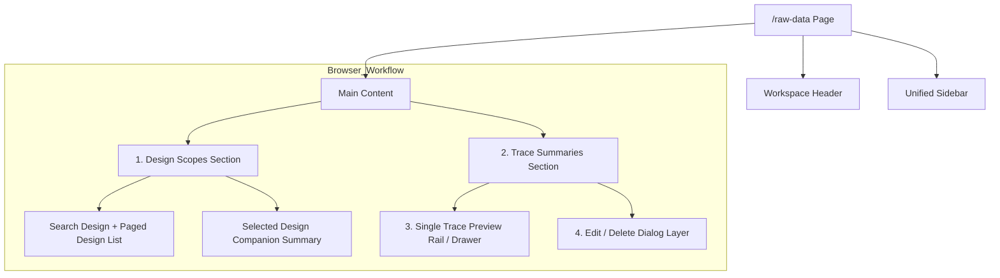

import { Aside, TabItem, Tabs } from '@astrojs/starlight/components';

# Raw Data Browser

This page defines the formal page contract for design-local trace browse, single-trace preview and trace-summary-level CRUD in active dataset.

<Aside type="note" title="Page Frame">

This page owns the design list, DesignScope create / rename / merge / archive request, trace filtering, trace summary selection, single-trace preview, single-trace edit / delete, and batch delete.
Raw data upload, dataset metadata editing, analysis execution, result publication and shell context management are not the responsibility of this page.

</Aside>

<Aside type="tip" title="Shared Shell">

This page uses shared [Header](../shared-shell/header.mdx) and [Sidebar](../shared-shell/sidebar.md).
The selected design context is page-local, but the active dataset context is still provided by the shared shell.

</Aside>

<Aside type="caution" title="Dataset-local design scope">

This page selects `design_id` in the active dataset.
Design row cannot replace the active dataset, nor can it exist independently of the current dataset.

</Aside>

## Purpose

This page is the dataset-local raw trace workbench.
It answers three things:

1. Which designs / traces are visible.
2. Which trace is currently being previewed in focus.
3. Which traces are allowed to be edited or deleted.
4. Which dataset-local DesignScope lifecycle actions can be executed by the backend.

<Aside type="caution" title="Browse page, not handoff page">

This page is a browse/preview surface. Cross-page CTA walls such as `Open Dataset` and `Open Data Ingestion` should not be included just because it looks convenient.
If the user needs to return to other pages, this should be done through clear IA and Sidebar/Header.

</Aside>

## User Goal

| Type | Content |
| --- | --- |
| Primary goals | Select design, manage DesignScope lifecycle request, filter trace summaries, focus on single preview, execute edit/delete on allowed traces, and execute batch delete on multiple traces that are allowed to be deleted |
| Non-goals | dataset profile editing, raw data ingest, simulation / analysis execution, source reconstruction or republish of system-produced trace |

<Aside type="tip" title="Preview and Selection separation">

`focused_trace_id` only determines the right single-trace preview.
`selected_trace_ids[]` only serves batch delete.
The two can overlap but cannot replace each other.

</Aside>

## Layout Structure

### Page Order

### Layout Rules

| Area | Rule |
| --- | --- |
| Design scopes | Maintain in the upper half of the page; the desktop is a two-column section, with `Search Design` + paged design list on the left and `Selected Design` companion summary on the right |
| Selected design summary | It is a companion summary within the `Design Scopes` section, not an independent mid-section panel; the content is `Source Coverage`, `Browse State`, `Trace Count`, `Updated` and low-noise lifecycle actions |
| Browse controls | design scopes and trace summaries must display explicit pagination controls instead of hiding cursor browse as a hidden behavior |
| Trace summaries pane | The main workspace, the visual width must be larger than the preview rail to accommodate row selection, row actions, filter rows and batch action bar |
| Preview rail / drawer | mobile remains inline; desktop occupies the right rail first, and when the trace section enters the active scroll threshold, it can be converted into a fixed right drawer |
| Dialog layer | edit and delete confirm are superimposed with modal/dialog; the background page is dimmed, but the original page context remains visible |

## Component Inventory

| ID | Component Name | Type/Location | Role | Key Behaviors |
| --- | --- | --- | --- | --- |
| `C1` | Design Scopes Panel | top section | Definition design browse / lifecycle request boundary | `Search Design` and paged design list are provided on the left; selected-design companion summary and backend-allowed lifecycle actions are provided on the right |
| `C2` | Selected Design Companion Summary | design scopes right column | Display the key browse summary of the current design | Display `design_id`, lifecycle state, compare readiness and `Source Coverage` / `Browse State` / `Trace Count` / `Updated` tiles |
| `C3` | Trace Summaries Table | trace section primary pane |Show trace metadata rows and per-row actions|New row focus, checkbox selection, search/filter, row-level `Edit` / `Delete`|
| `C4` | Batch Action Bar | Stable action card in trace summaries section | Display the number of selected traces and batch delete CTA | Only open to rows of `delete=true` destructive action; not sticky toolbar |
| `C5` | Single Trace Preview | trace section secondary rail / drawer | Display the current sampled preview of `focused_trace_id` | mobile inline; the desktop is first displayed in the rail, and if necessary, it is converted to a fixed right drawer |
| `C6` | Trace Edit Dialog | modal | Provide dedicated numeric editing surface | Load edit payload first, then display spreadsheet-like numeric editor and editable summary metadata |
| `C7` | Delete Confirmation Dialog | modal | Display destructive confirmation of single delete or batch delete | The deletion scope and irreversible prompt must be clearly stated |

## Data & State Contract

### Authority Pairing

| Concern | Authority | Page rule |
| --- | --- | --- |
| design list | [Backend / Datasets & Results](../../backend/datasets-results.mdx) `Design Browse` | Can only be browsed within the active dataset |
| design lifecycle | [Backend / Datasets & Results](../../backend/datasets-results.mdx) `Design Scope Lifecycle Contract` | create / rename / merge / archive / delete can only be used as backend request, not page-local re-parent |
| trace summaries | [Backend / Datasets & Results](../../backend/datasets-results.mdx) `Trace Metadata List Path` | Only contains summary-safe fields and row-level mutation gating, not large numeric payloads |
| single-trace preview | [Backend / Datasets & Results](../../backend/datasets-results.mdx) `Trace Preview Path` | Only driven by `focused_trace_id` |
| trace edit dialog | [Backend / Datasets & Results](../../backend/datasets-results.mdx) `Trace Edit Path` and `Trace Mutation Contract` | edit payload and mutation gating are determined by backend; preview payload cannot be directly used as edit authority |
| delete / batch delete | [Backend / Datasets & Results](../../backend/datasets-results.mdx) `Trace Mutation Contract` | destructive actions only respond to backend `allowed_actions` and mutation result |

### Page-local State

| State | Meaning |
| --- | --- |
| `selected_design_id` | Current design scope |
| `design_lifecycle_dialog` | `create`, `rename`, `merge`, `archive`, `delete` or `null` |
| `focused_trace_id` | Single trace currently in preview |
| `selected_trace_ids[]` | The trace identities currently selected in the batch action |
| `design_cursor` / `trace_cursor` | Explicit paging status for design scopes and trace summaries |
| `trace_filters` | trace search / family / representation / source filters |
| `active_dialog` | `edit`, `single_delete`, `batch_delete` or `null` |
| `pending_mutation` | Edit/delete action currently being submitted |

### Design Scope Lifecycle Rules

| Concern | Rule |
| --- | --- |
| Canonical resource | page uses `DesignScope` / `design_id`; merge target selector can display `Target Design Scope` |
| Create | page can ask backend to create active scope; after success, return row as selected design candidate |
| Rename | page only modifies the display name; `design_id` remains unchanged |
| Merge | page select source + target and submit backend merge; you are not allowed to change trace / batch / run `design_id` |
| Source after merge | source scope is displayed as archived / redirected, and cleared or jumped stale `selected_design_id` |
| Archive / delete | destructive action requires confirm dialog; availability only depends on backend `allowed_actions` |
| Store refs | page does not parse, move, or rewrite `store_ref` or TraceStore path |

### Stale Design Handling

| Situation | Page behavior |
| --- | --- |
| selected design becomes archived with redirect | show stale-link notice and switch to backend-provided target design summary |
| selected design becomes archived without redirect | clear selection and show archived-state explanation |
| selected design becomes deleted | clear selection and show unavailable / tombstone state |
| merge succeeds while source selected | reset trace filters / preview / selected trace rows before loading target scope |

### Mutation Rules

| Concern | Rule |
| --- | --- |
| Stable identity | `trace_id` is a stable trace identity; successful edit does not create a second trace identity |
| Editable fields | Only `numeric_payload` and UI-safe summary metadata can be edited; metadata is limited to fields explicitly allowed by backend, such as `parameter`, `representation`, `provenance_summary` |
| Immutable fields | `trace_id`, `dataset_id`, `design_id`, `family`, `trace_mode_group`, `source_kind`, `stage_kind`, `payload_ref` authority handle, `result_handles[]` cannot be rewritten from this page |
| Origin restrictions | provenance-bearing or system-produced traces may be `edit=false` but `delete=true`; page must not be guessed from `source_kind` / `stage_kind` by itself, must be displayed based on backend `allowed_actions` and restriction summary |
| Batch operations | Currently only supports batch delete; batch edit is not within the scope of this page |
| Audit semantics | edit / delete should be regarded as audited mutation; if versioned trace lineage needs to be saved independently, it needs to be separately defined by the backend contract. This page does not invent it by itself |

### UI States

<Tabs>
<TabItem label="Loading &amp; Error">

* **Loading**: design list, trace summaries, preview, edit payload and mutation submit load independently.
* **Error**: Error messages should be limited to the affected area; failure of preview / dialog should not cause the entire page to be marked as a full-page error.

</TabItem>

<TabItem label="Empty State">

* **Designs Empty**: Displays guidance for Data Ingestion or Dataset.
* **Trace List Empty**: Design selected but no trace rows, source/provenance prompt displayed.
* **Preview Empty**: When `focused_trace_id` has not been selected, single-trace preview guidance is displayed.

</TabItem>

</Tabs>

### Pagination Contract

| Surface | Rule |
| --- | --- |
| Design scopes | UI displays explicit previous / next page controls, and clearly indicates the current upper limit of each page; the current baseline is `Up to 6 design scopes per page` |
| Trace summaries | UI displays explicit previous / next page controls, and clearly indicates the current upper limit of each page; the current baseline is `Up to 12 traces per page` |
| Visibility | pagination is not a hidden implementation detail; page reference must treat it as an observable contract |

## Interaction Flows

Process A: Search and Select Design

1. The user enters design search or switches the cursor.
2. After clicking row, `selected_design_id` is updated.
3. Rebind the page to `Trace Metadata List Path` and clear the `focused_trace_id` and `selected_trace_ids[]` of the previous design.
4. `Selected Design` companion summary and `Trace Summaries` are reloaded with the same `dataset_id + design_id`.

Flow A2: Create / Rename Design Scope

1. The user opens the create or rename dialog from `Design Scopes Panel`.
2. Page submits display name; backend verifies active-name uniqueness.
3. After success, the page only uses the design row returned by the backend to update the browse list.

Flow A3: Merge Design Scope

1. The user opens the merge dialog on the selected source scope.
2. The dialog requires selecting the active target scope within the same dataset, and displays a destructive summary that will re-parent traces / batches / runs / results / assets.
3. Page submits a merge request without changing any record identity.
4. After success, the source scope displays archived redirect and the target scope is refreshed; if the source was originally selected, the page switches to the target and clears the stale trace preview/selection.

Flow A4: Archive / Delete Design Scope

1. The user clicks archive or delete.
2. The page displays a confirm dialog, clearly indicating that the scope will no longer appear in the normal target selector.
3. After success, the page updates the list according to the backend row; if the currently selected scope is no longer active, clear the trace table or follow the redirect.

Process B: Focus on single transaction Preview

1. The user clicks on the trace row body to update `focused_trace_id`.
2. The system executes `Trace Preview Path`.
3. Mobile is displayed in inline preview; desktop is displayed on the right preview rail first, and can be switched to a fixed drawer if necessary.
4. Table row selection does not automatically become batch selection.

Process C: Edit Trace

1. The user clicks `Edit` from the row action.
2. The system first verifies the `allowed_actions.edit=true` of the row and then turns on `Trace Edit Dialog`.
3. The dialog loads editable numeric payload and editable metadata through `Trace Edit Path`, and the background page is dimmed.
4. Users edit values ​​in the spreadsheet-like numeric surface and can modify the summary metadata allowed by the backend.
5. Execute single-trace mutation after sending.
6. Update the row summary when successful; if the current `focused_trace_id` is equal to the trace, preview must synchronize refresh.

Flow D: Single Delete

1. The user clicks `Delete` from the row action.
2. The page opens the confirm dialog, which lists `trace_id` and the main summary context.
3. The delete mutation is sent only after the user explicitly confirms it.
4. When successful, remove the row from the list and immediately refresh the `Selected Design` companion summary with the updated design row in the response.
5. If `focused_trace_id` is deleted, preview must be cleared and returned to empty state.

Process E: Batch Delete

1. The user selects multiple rows with checkbox to form `selected_trace_ids[]`.
2. `Batch Action Bar` displays the selected quantity and `Delete Selected` CTA.
3. When the user enters the confirm dialog, the dialog must display the number of deleted items and a summary list.
4. On success, remove all deleted rows, clear `selected_trace_ids[]`, and immediately refresh the design summary with the updated design row in response.
5. If it contains the current `focused_trace_id`, the preview must be cleared or switched to the still existing row according to the mutation result, but the stale preview must not be retained.

## Visual Rules

| Project | Rules |
| --- | --- |
| Table-first density | The trace surface is still based on the table, and the trace summaries are not changed to dense card walls |
| Filter grouping | trace filters should display the independent `Search` row first, and then the `Family` / `View` / `Source` controls row |
| Pane weighting | trace summaries pane should be wider than preview rail because this page has new row actions, selection and batch action card |
| Vertical hierarchy |Maintain the reading order of `Select Design -> View Trace Summaries -> Focus on single Preview / Open Dialog`|
| Mutation emphasis | destructive CTA should only be displayed in row action or batch toolbar, and should not be scattered in design summary or shell blocks |
| Batch action treatment | batch action group should be a stable card / action group in the trace section, not presented as sticky toolbar |
| Row action policy | row actions are presented using icon-first low-noise; disabled `Edit` is visible but muted, fully locked rows display compact `Locked` pill with hover/title hint, long paragraphs are not rendered inline restriction prose |
| Dialog treatment | The edit dialog should look like a dedicated numeric editing surface, not a small metadata popover; the background is dimmed but still retains the page context |
| Preview responsiveness | desktop preview is not just a static secondary pane; it is rail-first, and then turns into a fixed right-side drawer according to the scroll state; mobile remains inline |
| Preview controls | Undefined `Hide Preview` CTA |
| Low-noise context | page body does not duplicate shell context; only keep the dataset-local context required to complete trace browse / edit / delete |

## Acceptance Checklist

- [ ] design scopes section desktop two-column layout using browse on the left + selected-design companion summary on the right
- [ ] design browse, trace summaries, single-trace preview still maintain `dataset_id + design_id` binding
- [ ] DesignScope create / rename / merge / archive / delete is only executed through the backend contract and does not rewrite records by page-local
- [ ] After the merge is successful, the source scope is presented with archived redirect, and the page is cleared with stale trace preview/selection
- [ ] trace summaries support row selection, per-row `Edit` / `Delete` and batch delete
- [ ] design and trace browse both have clear pagination controls and visible page-size summary
- [ ] preview is still single-trace-focused and does not become multi-trace compare due to batch selection
- [ ] desktop preview can operate as rail / fixed drawer, mobile remains inline
- [ ] edit dialog uses dedicated numeric editing surface instead of just metadata text fields
- [ ] edit only allows numeric payload under stable trace identity and summary metadata explicitly allowed by backend
- [ ] delete flow has clear destructive confirmation for single / batch
- [ ] page does not deduce trace editability by itself; only displays actions based on backend `allowed_actions` and restriction summary
- [ ] batch edit has not been secretly expanded into this page

## Related references

* [Dashboard](dashboard.mdx)
* [Dataset](dataset.mdx)
* [Data Ingestion](data-ingestion.mdx)
* [Header](../shared-shell/header.mdx)
* [Sidebar](../shared-shell/sidebar.md)
* [Backend: Datasets & Results](../../backend/datasets-results.mdx)
* [Record Schema](../../data-contracts/dataset-record.mdx)
* [Frontend Reference](../index.md)
