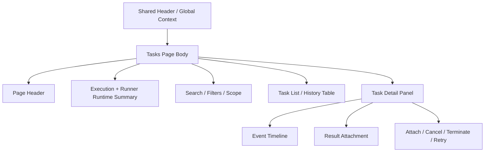

import { Aside } from '@astrojs/starlight/components';

# Tasks

## Purpose

`/tasks` is the Task / Execution Center. It is the product surface for cross-workbench execution visibility, task detail, progress, errors, actions, Runner runtime status summary, and result handoff.

This page is responsible for:

- View persisted tasks in extended browse mode
- View execution history, search and filter results
- View task detail, event history, result attachment and control actions in master-detail mode
- Provides a more complete Runner runtime summary and Runner status detail than Header `Global Context`

This page is not responsible for:

- Replaces the request-building surface of Simulation Workbench or Analysis Workbench
- Replaces the stage-local result context of workflow page
- Replaces quick management role of `Header -> Global Context`
- Become a separate queue-service UI or standalone runtime wall
- Redo the shell context wall of runtime mode / active dataset in page body

<Aside type="note" title="Two-layer task execution model">

`Header -> Global Context -> Tasks` is the quick shared-shell execution trigger.
`/tasks` is the extended Task / Execution Center for browse, history, detail, diagnostics, actions, and result handoff.
Simulation and Analysis workbenches remain first-class workflow surfaces; `/tasks` provides the cross-workbench execution center.

</Aside>

## User Goal

- Quickly find tasks that are running, just completed, or need to be processed
- Find specific tasks through filter / search / history
- Check task detail, event timeline, result linkage and Runner runtime status
- Execute `Attach`, `Cancel`, `Terminate`, `Retry` on visible tasks

Non-target:

- Do not re-complete the simulation or analysis workflow itself on this page
- Do not turn the page body into a second shell context management wall
- Do not replace clear task browse and detail IA with cross-page CTA wall
- Do not render persisted task execution into Redis/RQ-style queue-service product

## Layout Structure

1. Page header
2. Execution summary + Runner runtime summary
3. Filter / search controls
4. Master-detail body
5. Result / event / action detail

## Component Inventory

| ID | Component | Role | Required behavior |
|---|---|---|---|
| `C1` | Page Header | page identity | Make it clear that this is Task / Execution Center |
| `C2` | Execution Summary | top-level state |shows waiting / preparing / running / saving result / publishing / completed / failed / cancelled counts and concise Runner runtime overview|
| `C3` | Filter Bar | browse controls |Provide controls such as scope, status, task family, search, etc.|
| `C4` | Tasks Table | master list | Display persisted task rows, support sorting, selection and cursor-based browse |
| `C5` | Task Detail Panel | detail surface |shows selected task of lifecycle, context, result attachment and allowed actions|
| `C6` | Event Timeline | diagnostics drill-down |Display append-only event history of selected task|
| `C7` | Runner Status Detail | extended operational detail | Provides a more complete Runner runtime inspection than Header and presents liveness semantics with `idle / running / draining / degraded / offline` |

## Data & State Contract

### Data dependencies

| Data | Source | Required | Use |
|---|---|---:|---|
| task rows | task execution surface | ✅ | list / history browse |
| Runner runtime summary | task execution + runtime surface | ✅ |top summary and Runner status detail|
| task detail | task execution surface | ✅ | detail panel |
| event history | task execution surface | ✅ | timeline |
| result attachment | task execution surface | ✅ | result linkage / handoff |
| runtime mode / active workspace | shared shell / session | ✅ | scope boundary |

### UI states

| State | Required behavior |
|---|---|
| `loading` | table and detail panel can be partitioned for loading without locking the entire page |
| `empty` | If there are no rows under the current filter, concise no-executions guidance will be displayed |
| `partial` | When a detail block fails, only a partial error is reported |
| `error` | Display local errors of task query or detail fetch without covering other successful blocks |

### Product status labels

| Backend State | Product UI Label |
| --- | --- |
| `queued` | Waiting |
| `claimed` | Preparing |
| `running` | Running |
| `staging_result` | Saving result |
| `publishing` | Publishing |
| `completed` | Completed |
| `failed` | Failed |
| `cancelled` | Cancelled |

Backend state remains the lifecycle authority. Product labels are presentation vocabulary only.

### Status sync

Polling is the baseline status sync mechanism. SSE or WebSocket may be added as a transport optimization, but they must not replace Backend task lifecycle authority.

Runner completion does not equal product result availability. The Application may open ResultView only after Backend publication has completed.

## Interaction Flows

1. **Open from Global Context**
- User performs quick management on Header `Tasks` trigger
- If you need more history / filtering / detail, enter `/tasks`
- page initializes browse state with current runtime mode / workspace context

2. **Browse and inspect**
- User adjusts filters or search
- table update rows
- After selecting a row, the detail panel displays task detail, events, result attachment and allowed actions.

3. **Control action**
- User executes `Attach`, `Cancel`, `Terminate`, `Retry` in detail panel or row action
- backend writes back the new persisted state
- Synchronous refresh of table and detail panel

4. **Mode or workspace change**
- Header switches runtime mode or active workspace
- `/tasks` rebind task execution / Runner runtime authority
- Old rows must not be mixed with new mode / workspace

## Visual Rules

- Use master-detail instead of giant stacked diagnostics wall
- quick summary is at the top, extended browse / detail is at the bottom
- task history/detail should be the main visual; cross-page CTAs should be quiet and sparse
- Runner status detail can be more detailed than Header, but should not overwhelm task list and task detail bodies.
- page body must not repeat `Runtime Mode`, `Active Workspace`, `Active Dataset`, etc. shell-owned context cards

<Aside type="caution" title="Runner diagnostics are secondary">

Task list, task detail, result handoff, and execution history are the primary page content.
Runner runtime status is secondary diagnostic context.
Runner status must not dominate the page or become a standalone operations console.

</Aside>

## Acceptance Checklist

- [ ] `/tasks` is defined as Task / Execution Center, not as a replacement for workflow page
- [ ] The roles of `Header -> Global Context` and `/tasks` are clearly distinguished
- [ ] page supports extended history / filter / detail / action, not just an enlarged version of the panel
- [ ] task execution / Runner runtime authority still comes from the backend persisted task surface and is not assembled by the frontend itself.
- [ ] page body does not redo the shell context wall, nor does it become a handoff button wall

## Related

- [Header](../shared-shell/header.mdx)
- [Task Management](../shared-workflow/task-management.md)
- [Dashboard](dashboard.mdx)
- [Backend: Tasks & Execution](../../backend/tasks-execution.md)
