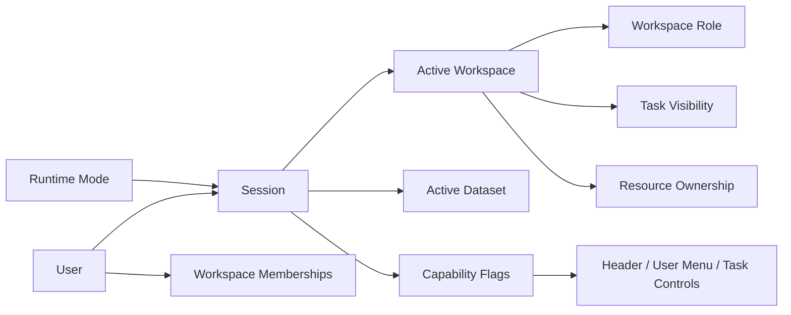

---
aliases:
 - "Identity Workspace Model"
 - "Identity and Workspace Model"
tags:
 - diataxis/reference
 - audience/team
 - sot/true
 - topic/app-reference
status: draft
owner: docs-team
audience: team
scope: shared app model for runtime mode, user / session / workspace / role / active workspace / active dataset / task visibility, and active-context switching
version: v0.4.0
last_updated: 2026-03-16
updated_by: codex
---

import { Aside, TabItem, Tabs } from '@astrojs/starlight/components';

# Identity & Workspace Model

This file defines the minimum runtime mode, identity, and workspace semantics in the App shared model.

<Aside type="note" title="App-level ownership">

This document answers the App collaboration model.
It also serves shared header, shared task execution, backend session surface and resource visibility.

</Aside>

<Aside type="caution" title="Session owns active context">

`Session` is active workspace, active dataset, user summary and capability exposure of canonical owner.
The frontend local state can cache UI state, but the identity and permission truth cannot be redefined.

</Aside>

## Runtime Mode Terms

| Term | Minimal meaning |
|---|---|
| `Runtime Mode` | The same App is currently running as `local` or `online` |
| `Local Session` | Implicit single-user session provided directly by backend in local mode |
| `Online Session` | session established by auth/membership in online mode |

## Core Terms

| Term | Minimal meaning |
|---|---|
| `User` | An identifiable and authorized operator |
| `Session` | Valid context binding `runtime mode`, `user`, `active workspace`, `active dataset` and `capabilities` |
| `Workspace` | Shared boundaries for task visibility, dataset context, resource ownership and collaboration; local mode is fixed to `Local Space` |
| `Workspace Role` |`owner`, `member`, `viewer` and similar values workspace-scoped role|
| `Active Workspace` | The single workspace currently being operated by session |
| `Active Dataset` | The current workflow default dataset context |
| `Design Scope` | The page-local analytical boundary within the active dataset, not the second global context |
| `Task Visibility` | Which persisted tasks are visible to which sessions / workspaces |

## Authority Rules

<Tabs>
<TabItem label="Session">

| Rule | Meaning |
|---|---|
| One runtime mode per session | A session at the same time belongs to only one active mode |
| One active workspace per session | Only one active workspace is bound to a session at the same time |
| Session owns dataset context |active dataset is not page-local state|
| Session exposes capability summary | pages permission should not be inferred |
| Mode switch invalidates old session | local / online cannot share the same session cache |

</TabItem>

<TabItem label="Mode-specific workspace model">

| Rule | Meaning |
|---|---|
| Local mode uses one implicit workspace | Use fixed `Local Space`, maintain shell-compatible context, but do not enter multi-membership collaboration model |
| Online mode may join multiple workspaces | membership can be multiple, but there is still only one active workspace |
| Same shell shape across modes | Header still sees workspace / dataset context, but authority semantics changes according to mode |

</TabItem>

<TabItem label="Workspace">

| Rule | Meaning |
|---|---|
| Resources belong to one workspace | dataset / schema / task / result only one `workspace_id` |
| Role is workspace-scoped | The same user can have different roles in different workspaces |
| Visibility is backend-enforced | task visibility cannot rely on front-end filtering alone |
| Cross-workspace sharing is explicit | Cross-workspace application export/import or publish/copy with lineage, no multiple mounts |

</TabItem>

</Tabs>

## Active Context Ordering

| Context | Owner | Priority |
|---|---|---|
| `Runtime Mode` | app session | best |
| `Active Workspace` | session | best |
| `Active Dataset` | session | second highest |
| selected `Design Scope` | page + backend browse/read model | Constrained by the first two |
| `Attached Task` | page + persisted task state | Constrained by the first two |
| page-local filters / selections | page-local UI state |lowest|

<Aside type="caution" title="Runtime Mode Rebinds Everything Below It">

Once `Runtime Mode` switches, `Active Workspace`, `Active Dataset`, task visibility, attached task validity and capability summary must all be revalidated.

</Aside>

## Relationship Model

## Mode Switch Sequence

| Step | Required behavior |
|---|---|
| 1. User picks mode | Select `local` or `online` from app-level mode switcher |
| 2. Frontend checks unsafe local state | dirty draft, attached task or destructive context requires confirmation first |
| 3. Old session is invalidated | The user summary, workspace, dataset, and task cache of the old mode are invalid |
| 4. Backend establishes new mode session | local mode establishes `Local Space` session; online mode establishes or requires a new auth session, and does not retain the previous remote login |
| 5. Shell context is rebuilt | Header, task execution, and page context use the session envelope of the new mode |

## Workspace Switch Sequence

| Step | Required behavior |
|---|---|
| 1. User picks workspace | Can only choose from membership list |
| 2. Frontend checks unsafe local state | If there is dirty draft or destructive context change on the current page, display confirmation first |
| 3. Backend mutates session | active workspace changes to new value |
| 4. Session rebinds active dataset | Determine `preserved`, `rebound` or `cleared` according to dataset activation rules |
| 5. Task visibility refreshes | Header task execution summary changed to tasks visible in the new workspace |
| 6. Attached task is revalidated | If the task is no longer visible, it must be detached and prompted |
| 7. Pages consume new shell context | Dashboard / Raw Data / Simulation Workbench / Analysis Workbench see the same set of new context |

## Active Dataset Activation

| Rule | Meaning |
|---|---|
| Dataset activation is session mutation |Not page-local state|
| Dataset must be visible in active workspace | Datasets pointing to other workspaces are not allowed |
| Activation may be explicit or resolved | From user active switch, or rebinding after workspace switch |

## Dataset Resolution Order

After the workspace switch, the session should determine the new `Active Dataset` in the following order:

1. The user's last active dataset in the target workspace and is still visible.
2. Default dataset explicitly set by workspace.
3. The most recently updated and visible dataset in the target workspace.
4. If there is no available dataset, the active dataset is set to `null`, and the Header requires the user to select it manually.

## Switch Outcomes

| Outcome | Meaning |
|---|---|
| `mode_switched` | session has been switched to another runtime mode |
| `preserved` | The original active dataset is still valid in the new context |
| `rebound` | The system points to another dataset according to resolution order |
| `cleared` | No dataset available, waiting for manual selection |
| `detached_task` | The existing attached task is invalid due to workspace / visibility change |

## Related

* [Runtime Modes](runtime-modes.mdx)
* [Resource Ownership & Visibility](resource-ownership-and-visibility.mdx)
* [Authentication & Authorization](authentication-and-authorization.mdx)
* [Backend / Session & Workspace](../backend/session-workspace.mdx)
* [Frontend / Header](../frontend/shared-shell/header.mdx)
