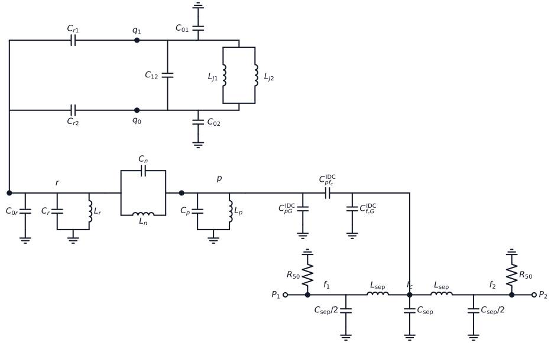
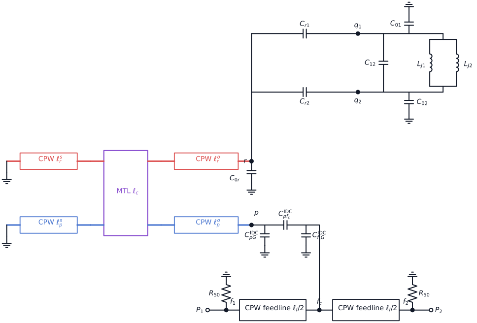
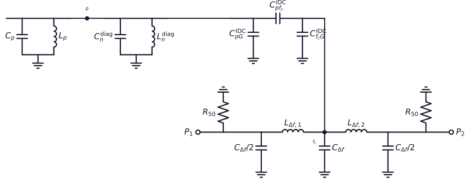
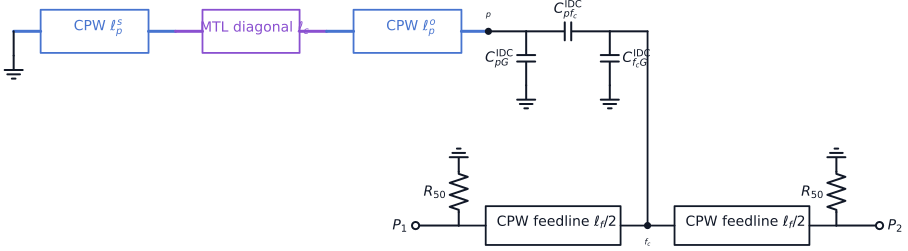
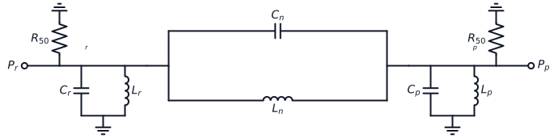
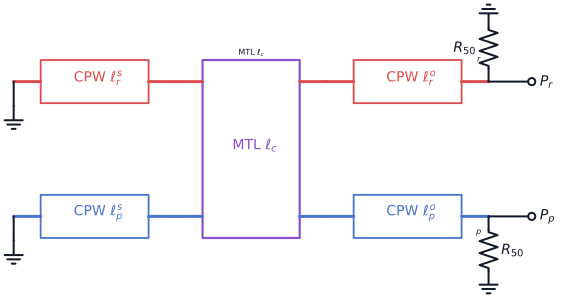

---
aliases:
 - D3 Readout Filter S21 Fit API
tags:
 - diataxis/reference
 - audience/team
 - topic/equivalent-circuit-modeling
status: provisional
owner: analysis-team
audience: team
scope: Workbench API and artifact handoff for the canonical D3 complex-S21 J-fit contract.
version: v0.1.0
last_updated: 2026-07-11
updated_by: codex
title: D3 Readout-Filter S21 Fit API
description: Locate the Python and Julia entrypoints, payload schemas, failures, and replay evidence for the D3 fit.
sidebar:
 label: D3 S21 J-Fit API
 order: 45
---

# D3 Readout-Filter S21 Fit API

Read the [canonical Readout-Filter S21 J Fit](https://github.com/arfiligol/SCQ_Design/blob/main/docs/knowledge/readout/readout-filter-s21-j-fit.qmd)
before reviewing this implementation. The Super Repo owns the physics,
identifiability, and interpretation. This page owns only the Workbench API,
failure, and artifact boundaries.

## Project-owned Circuit Plans

D3 owns the complete Equivalent and Hybridized research circuits in
`notebooks/pluto/D3 Intrinsic Purcell Filter Design/d3_circuit_plans.jl`.
The project Plan Builders compose the reusable Julia Core qubit/filter
components, then add the D3 feedline, two 50-ohm ports, physical-node labels,
and top-level schematic intent. The complete circuits are not Core reusable
components.

The committed diagrams follow the Workbench export path:

```text
D3 project Plan Builder
-> CircuitPlan + EngineeringGraph + SchematicLayoutIntent
-> schematic_export.json
-> explicit D3 Schemdraw projection
-> light/dark SVG
```

<picture>
  <source media="(prefers-color-scheme: dark)" srcset="../../assets/circuit_draw/circuit_plans/d3_intrinsic_purcell_equivalent/diagram.dark.svg" />
  
</picture>

<picture>
  <source media="(prefers-color-scheme: dark)" srcset="../../assets/circuit_draw/circuit_plans/d3_intrinsic_purcell_hybridized/diagram.dark.svg" />
  
</picture>

<picture>
  <source media="(prefers-color-scheme: dark)" srcset="../../assets/circuit_draw/circuit_plans/d3_linewidth_la_equivalent/diagram.dark.svg" />
  
</picture>

<picture>
  <source media="(prefers-color-scheme: dark)" srcset="../../assets/circuit_draw/circuit_plans/d3_linewidth_la_hybridized/diagram.dark.svg" />
  
</picture>

<picture>
  <source media="(prefers-color-scheme: dark)" srcset="../../assets/circuit_draw/circuit_plans/d3_intrinsic_pair_notch_equivalent/diagram.dark.svg" />
  
</picture>

<picture>
  <source media="(prefers-color-scheme: dark)" srcset="../../assets/circuit_draw/circuit_plans/d3_intrinsic_pair_notch_hybridized/diagram.dark.svg" />
  
</picture>

These are topology-review fixtures, not optimized design results. Their
three-branch IDC values are one coherent export fixture.
The explicit visual mapping is required because generic netlist-to-diagram
inference and plan-wide automatic layout are not implemented.

The D3 projection keeps the shared `Port50Ohm` load height at its `1.0u`
default. With this page's `unit_length = 1.5` and the reusable `0.25u` load
lead, the resistor receives `1.125` native drawing units, so its rendered
endpoint coincides with the ground anchor. Do not shorten the load height
without preserving the reusable-component glyph-span constraint documented in
the Circuit Diagrams Manual.

## Entry points

- Python
  `application.analysis.fitting.d3_purcell.calibrate_d3_channel_residue_s21`
  calibrates one filter-only channel result.
- Python
  `application.analysis.fitting.d3_purcell.fit_d3_through_line_s21` consumes the
  complete successful calibration and fits one isolated pair.
- Julia `SuperconductingCircuitsAnalysisBridge.calibrate_d3_channel_residue_s21`
  and `fit_d3_through_line_s21` are transport-only wrappers around those Python
  functions.
- `d3_coupled_evaluator.jl` is the retained physical caller. Notebook 07 loads
  it and only executes HB after an explicit user action.

## Required caller contract

Both Python entrypoints require finite, strictly increasing frequency samples,
complex measured and empty-through traces on the same grid, an explicit phasor
convention, fit and background windows, an empty-through magnitude condition,
quality conditions, and provenance. No condition has an implementation default.

Calibration additionally requires the fixed filter loaded-bare frequency,
filter loaded linewidth, and `linear_ls_rcond`.

The pair fit additionally requires:

- fixed filter and readout loaded-bare frequencies and loaded linewidths;
- declared left and right channel linewidths;
- the complete successful `channel_calibration` payload;
- caller-owned J bounds, J seeds, and seed-stability conditions;
- `linear_ls_rcond` for its affine background solve; and
- explicit `least_squares_max_nfev`, `least_squares_ftol`,
  `least_squares_xtol`, `least_squares_gtol`, and
  `least_squares_diff_step` values.

The pair fit requires the calibration schema, method, domain, status, phasor
convention, filter frequency, filter loaded linewidth, and port plane to match
the current call. The embedded residue must be finite, and the calibration's
normalization, gates, successful metrics, diagnostics, identity, and provenance
must be internally consistent. There is no independent residue value in the
pair call to compare against the embedded calibration value.

## Result schemas

Calibration results declare `schema = d3_channel_calibration` and
`fit_method = d3_filter_only_complex_channel_residue_linear_ls`.

Pair results declare `schema = d3_through_line_j_fit` and
`fit_method = d3_through_line_complex_s21_fixed_calibrated_residue`.

Successful results report the caller contract, algorithm settings, gates,
search bounds and seeds, provenance, fitted parameters, residual metrics,
diagnostics, and fit trace. A pair result also embeds a validated calibration
snapshot containing its windows, fixed references, algorithm, gates, parameters,
metrics, identity, and provenance. The evaluator's compact journal payload
preserves those contract fields.

## Failure boundary

Malformed input and incompatible persisted contracts raise immediately.
Unexpected `ValueError` or `RuntimeError` exceptions from the numerical stack
propagate as execution failures; they are not relabeled as candidate evidence.
Expected floating-point and linear-algebra failures may return a rejected fit.

At the physical evaluator boundary, a typed HB solver numerical exception,
an unsuccessful generic vector-fitting payload, or an empty-through reference
artifact below its declared integrity floor is an execution failure. Declared
resonance-count, artifact-pole, vector-fit RMS, ownership, fit-quality, and
stability conditions may reject a physical candidate without converting an
execution failure into evidence about that candidate.

For the qubit-loaded intrinsic notch, the evaluator first requires one unique
no-qubit reference crossing on the same candidate and grid. It assigns the
loaded root nearest that reference, preserves all loaded crossings, and rejects
an assignment margin below the configured 1 MHz condition. The private full
Maxwell input eliminates exactly four floating Coupler pads by linear solve;
the reduced readout diagonal is evidence only because the distributed resonator
owns readout self-capacitance.

Stable fit rejection codes are:

- `rank_failure`
- `numerical_failure`
- `optimizer_nonconvergence`
- `seed_coverage_failure`
- `unresolved_near_optimal_start`
- `ambiguous_near_optimal_basin`
- `insufficient_winning_seed_support`
- `bound_margin_failure`
- `quality_failure`

## Replay and artifact contract

The focused Python test serializes traces, caller contracts, and calibration to
JSON, reloads them, reruns calibration and pair fitting, and compares calibration
metrics, pair metrics, derived poles, the validated calibration snapshot, and the
search contract. Tampered successful-calibration payloads must fail fast. This is
synthetic API evidence, not a D3 design result.

A real result artifact must also persist the raw filter-only, pair, and
empty-through traces; the full Human-approved condition manifest; complete
calibration and pair results; source revision and dirty state; and Python,
NumPy, SciPy, Julia, and package versions. An image, compact summary, or
normalized fit window alone is not replay evidence.
