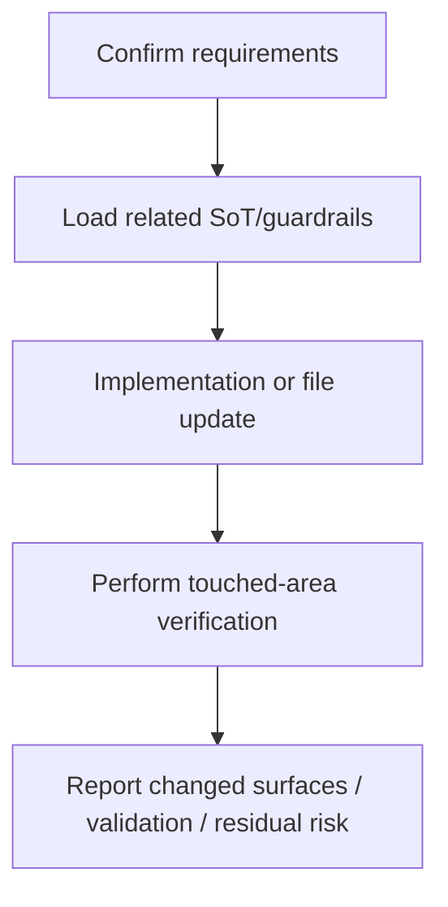

---
aliases:
 - "Codex Agent Workflow"
 - "Codex collaborative workflow"
tags:
 - diataxis/how-to
 - audience/contributor
 - topic/execution
status: stable
owner: docs-team
audience: contributor
scope: Use Codex as an integrator for a SoT-first, direct implementation, verification and reporting workflow.
version: v1.0.0
last_updated: 2026-05-28
updated_by: codex
sidebar:
 label: Codex Agent Workflow
 order: 30
---

import { Aside } from '@astrojs/starlight/components';

# Collaborative workflow using Codex

This how-to explains how to make Codex complete a reviewable change in this repo: first read the relevant SoT, then directly implement it, and finally verify and report the remaining risks.

<Aside type="note" title="This is not the SoT of branch policy">

Formal branch/worktree policy and subagent coordination are still subject to the following reference page:

- [Branch & Worktree Flow](../../reference/guardrails/execution-verification/branch-and-worktree-flow.mdx)
- [Codex Subagent Coordination](../../reference/guardrails/execution-verification/multi-agent-collaboration.mdx)

</Aside>

## Timing of use

Use this workflow to handle general docs, backend, frontend, runner, test or cleanup work.

Scenarios suitable for handing over directly to Codex:

- The SoT already exists and the task is to align the documentation or implementation to it.
- The user explicitly provides a fixup plan or cleanup plan.
- Changes can be verified with touched-area checks.
- Codex needs to decide whether to open a subagent on its own, but does not require users to manually allocate lanes.

If the product semantics itself is not clear, update the owner SoT of `docs/reference/**` first.

## Workflow



## Operation rules

1. Read the guardrails and owner docs related to the task first.
2. Modify directly on the appropriate canonical source surface.
3. Codex can use subagents on its own, but the final integration and return is the responsibility of the current dialogue.
4. Committed planning artifacts are not created; long-term decisions must be written back to `docs/reference/**`.
5. The verification is based on the touched area, and the final response indicates whether the check has been run or not.

## Common requests

### Update SoT

```text
Please write this architectural decision into the owner SoT in docs/reference.
```

### Implement Fixup

```text
Please follow this fixup plan, keep existing uncommitted changes, and finally run touched-area validation.
```

### Review results

```text
Please check this diff with code-review stance, listing bugs / regressions / missing tests first.
```

### Merge / Cleanup / Verify

```text
Please merge the accepted work back to develop, clean up the branch or worktree, and perform final verification.
```

##Report format

Generally the final response should contain:

- changed surfaces
- validation commands and results
- skipped checks or residual risk
- unrelated dirty state, if relevant

Wide range changes can be made using:

```markdown
## Summary
- <what changed>

## Validation
- `<command>`: <pass/fail + short detail>

## Risks
- <skipped check or remaining risk>
```

## Related

- [How to contribute (Contributing)](index.mdx)
- [Branch & Worktree Flow](../../reference/guardrails/execution-verification/branch-and-worktree-flow.mdx)
- [Codex Subagent Coordination](../../reference/guardrails/execution-verification/multi-agent-collaboration.mdx)
