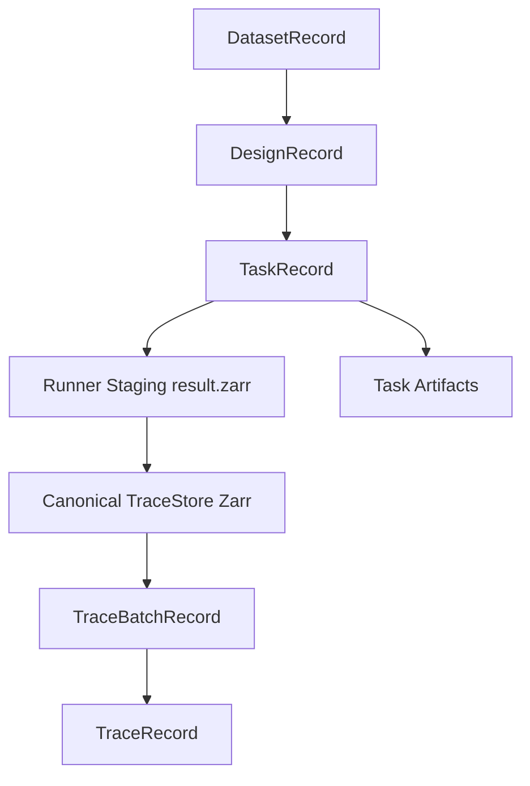

---
aliases:
  - Data Storage Architecture
  - 資料儲存架構
tags:
  - diataxis/explanation
  - audience/team
  - topic/architecture
  - topic/data
status: stable
owner: docs-team
audience: team
scope: Metadata DB, runner staging, and canonical TraceStore responsibility split
version: v2.0.0
last_updated: 2026-05-28
updated_by: codex
---

# Data Storage

The storage model separates metadata authority from numeric authority.
Python Backend owns metadata and publication.
TraceStore owns official numeric arrays.
Julia Runner only writes temporary staging packages.

## Core Model



## Filesystem Layout

Use this local layout:

```text
data/
├── metadata.db
├── trace_store/
│   └── datasets/<dataset_id>/designs/<design_id>/batches/<batch_id>.zarr/
├── artifacts/
│   └── tasks/<task_id>/
└── staging/
    └── tasks/<task_id>/
        ├── manifest.json
        ├── result.zarr/
        └── logs/
```

`data/staging/` is temporary.
`data/trace_store/` is the official numeric authority.
`data/artifacts/` keeps manifests, logs, reports, and summaries.

## Why Backend Publishes

The runner can generate arrays, but it does not own the formal database.
The backend validates before publishing:

- manifest path is local and safe
- `task_id` matches the task row
- Zarr format is v2
- every declared array exists
- real/imag arrays have matching shape, chunk shape, and dtype
- axis lengths match trace shapes

Only after validation does the backend create `TraceBatchRecord`, `TraceRecord`, and artifact metadata.

## Large Arrays

Do not put S/Y/Z matrices, sweeps, or ND traces in HTTP JSON.
Use HTTP JSON for control messages, status, progress, manifest locators, and error summaries.

For complex arrays, store real and imaginary arrays explicitly:

```text
/traces/S11/real
/traces/S11/imag
```

## Storage Extensions

The first implementation is local filesystem Zarr v2.
S3-compatible storage is a future Python Backend storage backend concern.
The Julia Runner should not write directly to S3 in the initial architecture.

## Related

- [TraceStore Zarr](../../reference/architecture/trace-store-zarr.md)
- [Runner Result Manifest](../../reference/architecture/runner-result-manifest.md)
- [Backend Architecture](../../reference/guardrails/project-basics/backend-architecture.md)
