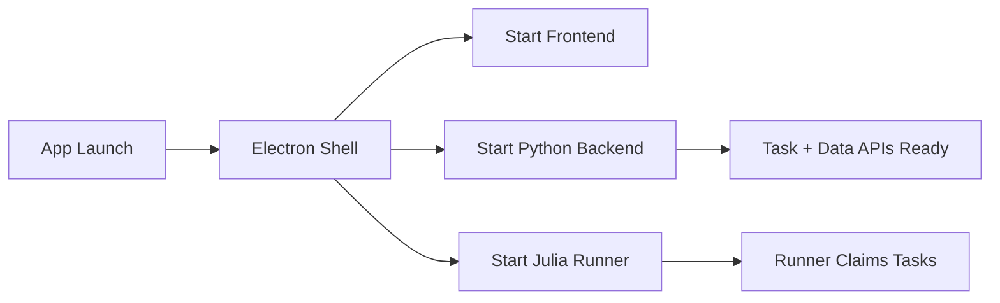

---
aliases:
  - Desktop Runtime Supervisor
  - Electron Runtime Profiles
  - 桌面執行時監管器
tags:
  - diataxis/explanation
  - audience/team
  - topic/architecture
  - topic/desktop
status: stable
owner: docs-team
audience: team
scope: Electron desktop shell 如何監管 frontend、Python Backend 與 Julia Runner
version: v0.2.0
last_updated: 2026-05-28
updated_by: codex
---

# Desktop Runtime Supervisor

The desktop shell supervises local application processes.
It does not own task authority, simulation logic, or TraceStore publication.

## Current Design

Electron local mode starts:

```text
app/frontend
app/backend
core/julia/SuperconductingCircuitsRunner
```

The shell is responsible for:

- launching local processes
- probing readiness
- collecting logs
- exposing safe IPC to the renderer
- shutting down local processes cleanly

It must not:

- run solver logic inside Electron main
- publish TraceStore records
- mutate metadata tables directly
- start a separate queue worker runtime

## Startup Flow



The shell can open before every process is ready.
The renderer should show local runtime startup or degraded state without blocking the whole application.

## Local And Remote Modes

| Mode | Meaning |
|---|---|
| Local Mode | Electron supervises frontend, Python Backend, and Julia Runner on the user's machine |
| Online Mode | Electron acts as a client to a remote backend; local heavy runtime is not started |

Local mode is the packaged desktop baseline.
Online mode uses the same task/result contracts through a remote backend; deployment and auth are separate concerns.

## Failure Model

| Situation | Expected behavior |
|---|---|
| backend not ready | renderer shows startup/degraded state and keeps shell interactive |
| runner not ready | task submission can queue; compute does not start until runner claims |
| runner crash | backend task truth remains in metadata DB; supervisor can restart runner |
| app close | shell performs graceful shutdown; persisted tasks and TraceStore data remain authoritative |

## Related

- [Application Interface](../../reference/app/application-interface.md)
- [Runtime Modes](../../reference/app/shared/runtime-modes.md)
- [Task Runtime & Processors](../../reference/app/shared/task-runtime-and-processors.md)
- [Build Commands](../../reference/guardrails/execution-verification/build-commands.md)
