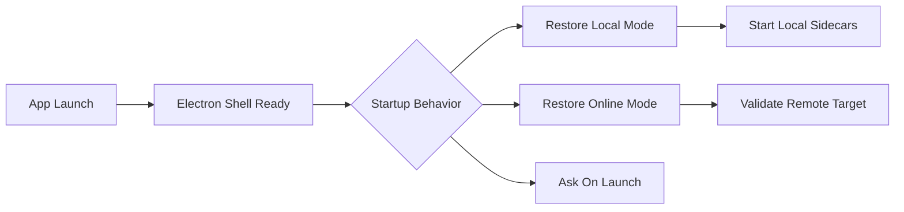

---
aliases:
  - Desktop Runtime Supervisor
  - Electron Runtime Profiles
  - 桌面執行時監管器
tags:
  - diataxis/explanation
  - audience/team
  - topic/architecture
  - topic/desktop
status: draft
owner: docs-team
audience: team
scope: Electron desktop shell 如何同時承載 local-managed 與 remote-server runtime profile，並以 supervisor 方式管理本地 sidecars。
version: v0.1.0
last_updated: 2026-03-25
updated_by: codex
---

# Desktop Runtime Supervisor

本頁回答的是：

- 為什麼 desktop app 應採單一 Electron shell，而不是做兩套產品
- 為什麼 Electron main 應是 runtime supervisor，而不是 solver host
- 為什麼 local 與 remote 應共用同一個 workbench，但用不同 runtime profile 運行

!!! important "Current design decision"
    - desktop app 採 **Electron + runtime profile supervisor**
    - Electron main / preload 只處理 shell、runtime lifecycle、health probe、log aggregation 與 secure IPC
    - heavy execution 仍由 `sc-app`、workers 與 Redis sidecars 承擔
    - `remote_server` profile 不啟動本地 heavy runtime

## The Product Problem

你要的不是單純把網頁塞進 Electron。

你要的是同一個桌面 workbench 同時滿足兩件事：

- **Local-managed**：使用者在本機跑 backend、workers 與 queue-backed task runtime，不被 UI thread 阻塞
- **Remote-server**：使用者只把 desktop app 當成 UI client，運算與 shared resources 留在遠端 server

如果把這兩種需求拆成兩個產品，會造成：

- mode switch 心智模型分裂
- shell vocabulary 不一致
- task / result / queue UX 重複維護

## Core Decision

### One shell, two runtime profiles

桌面應用維持同一個 Electron shell，但在 shell 之下分成兩種 runtime profile：

| Desktop runtime profile | Paired app mode | Meaning |
|---|---|---|
| `local_managed` | `Local Mode` | Electron main 監管本地 Redis、`sc-app`、`sc-worker-simulation`、`sc-worker-characterization` |
| `remote_server` | `Online Mode` | Electron main 只保留 shell / target validation / auth flow；不啟動本地 heavy runtime |

!!! info "Profile is not product mode"
    使用者看到的正式 mode 仍是 `Local Mode` 與 `Online Mode`。
    `local_managed` / `remote_server` 是 desktop packaging 與 runtime orchestration 的術語，不應取代 app mode vocabulary。

## Why Electron Main Must Be A Supervisor

| Option | Why it is rejected or accepted |
|---|---|
| Electron main 直接跑 solver / task workflow | 會把 desktop shell 與 execution runtime 綁死，故障隔離與 UI 響應最差 |
| Electron main 啟動本地 sidecars 並監管 | 保留 process isolation、能做 health check / restart / log aggregation，且不破壞 backend authority |
| Remote mode 仍順手啟本地 runtime | 浪費本地資源，也讓使用者誤以為 remote workflow 仍依賴本機運算 |

因此 Electron main 最合適的角色是：

- runtime launcher
- lifecycle supervisor
- readiness / compatibility gate
- local log aggregator
- secure IPC bridge

而不是：

- task authority owner
- solver host
- business workflow orchestrator

## Startup Experience

### Shell first, runtime second

從 UX 角度，desktop app 應優先做到「殼先開」。

這代表：

- 視窗不應等待 backend sidecars 全部 ready 才出現
- local profile 可以在 shell 內顯示 `Starting local runtime...`
- remote profile 則直接進入 target validation / auth flow

## Remembered Startup Behavior

desktop app 應允許記住上次的 runtime mode 與 target，因為這是高頻研究工作台的合理 UX。

建議保留 app-local startup config：

| Field | Meaning |
|---|---|
| `startup_behavior` | `restore_last_mode`、`always_local`、`always_online`、`ask_on_launch` |
| `last_runtime_mode` | 上次成功進入的 `local` 或 `online` |
| `last_online_target` | 上次成功使用的 remote target summary |
| `auto_start_local_runtime` | 進入 local profile 時是否自動啟動本地 sidecars |

!!! warning "Remembered mode is not remembered auth"
    記住上次使用的 `Online Mode` 與 remote target，不等於無條件恢復 remote authenticated session。
    remote auth continuity 應由安全憑證與 session policy 另外決定。

## Redis As A Bundled Sidecar

如果 local profile 的正式 baseline 是 queue-backed worker runtime，那 desktop app 就不能把 Redis 視為「使用者自己另外裝」的外部前提。

比較合理的產品化方向是：

- Redis 由 desktop app 以 private sidecar 方式管理
- 只綁 loopback / app-private config
- lifecycle 跟著 local runtime supervisor 收斂

這個決策的主要挑戰不是單一 binary 的大小，而是：

- 跨平台 release strategy
- binary signing / notarization
- sidecar startup / shutdown / crash recovery
- Windows 是否採同一套 local-managed runtime 策略

## Failure And Recovery Model

### Local-managed

| Situation | Expected behavior |
|---|---|
| app launch | shell 先起，接著 supervisor 啟動 Redis、`sc-app`、兩條 worker |
| sidecar not ready | shell 顯示 runtime startup / degraded state，不凍結整個 UI |
| worker crash | supervisor 可做 restart / operator prompt；task truth 仍由 backend persisted state 裁決 |
| app close | shell 關閉時應做 graceful shutdown；若只重啟 shell，不應假設既有 persisted task truth 消失 |

### Remote-server

| Situation | Expected behavior |
|---|---|
| app launch | shell 直接進 target restore / validation |
| target unreachable | 保持 shell 可互動，允許 Retry、改 target、切回 `Local Mode` |
| remote task still running | app 關閉後 task 仍由 server runtime 管理 |

## Why This Direction Scales Better

| Concern | Why runtime profile supervisor is the better fit |
|---|---|
| Performance | heavy execution stays out of renderer and Electron main |
| UX | same shell can feel instant, regardless of whether compute runs local or remote |
| Maintainability | backend remains task/result authority; Electron stays a shell/supervisor |
| Extensibility | new worker lanes or remote targets can be added without re-inventing the product shell |

## Related

- [App / Shared / Runtime Modes](../../reference/app/shared/runtime-modes.md)
- [App / Shared / Task Runtime & Processors](../../reference/app/shared/task-runtime-and-processors.md)
- [Project Overview](../../reference/guardrails/project-basics/project-overview.md)
- [Tech Stack](../../reference/guardrails/project-basics/tech-stack.md)
- [Build Commands](../../reference/guardrails/execution-verification/build-commands.md)
