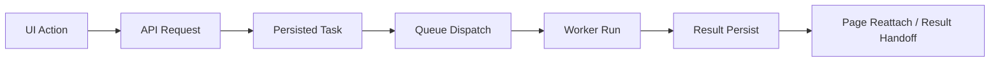

---
aliases:
  - Observability Taxonomy
  - Logging Layers
  - 可觀測性分層
tags:
  - diataxis/explanation
  - audience/team
  - topic/architecture
  - topic/observability
status: draft
owner: docs-team
audience: team
scope: 為什麼 app 不應只有一種 logging，而應分成 audit logging、workflow observability 與 product telemetry 三層。
version: v0.1.0
last_updated: 2026-03-25
updated_by: codex
---

# Observability Taxonomy

本頁回答的是：

- 為什麼「多打一點 logs」不足以解決產品治理、runtime diagnosis 與效能優化
- 為什麼 audit logging、workflow observability 與 product telemetry 必須分開
- 為什麼 remote mode 需要 governance-facing `Audit Logs` surface，而 local / remote 兩邊都需要 workflow trace 與 performance data

!!! important "One logging stream is not enough"
    這個產品至少同時面對三種不同問題：
    - 誰做了什麼有治理意義的操作
    - 一個 request / task / result 經過了哪些 runtime stage
    - 哪些 UI / API / service path 最常被使用，或最需要效能優化

## Three Different Questions

| Layer | Primary question | Primary consumers |
|---|---|---|
| Audit Logging | 誰在什麼 workspace 對哪種資源做了什麼事 | admin、workspace governance、support |
| Workflow Observability | 一個 action / request / task 是怎麼穿過 API、queue、worker、result handoff 的 | runtime operator、developer、support |
| Product Telemetry | 使用者最常做什麼、哪裡慢、哪種 path 值得優化 | product engineering、performance analysis |

## Why Audit Logging Cannot Do Everything

audit logging 的核心價值是治理與追責。

它適合回答：

- 哪位使用者送出了一個 task
- 哪位使用者 cancel / terminate 某個 task
- 哪個 workspace 發生 import / publish / delete

但它不適合回答：

- 這個 task 為什麼卡在 `dispatching`
- 哪個 worker crash 後導致 reconcile
- 哪條 service path 繞了太多層才完成同一件事

如果把這些內容都塞進 audit trail，結果會是：

- payload 難讀
- query 難做
- 權限邊界模糊

## Why Workflow Observability Must Exist

workflow observability 面對的是 runtime 與 execution path。

它關心的是：

- renderer action -> request
- request -> persisted task
- task -> queue dispatch
- queue -> worker claim
- worker -> solver run
- solver -> result persist
- result -> page reattach / publish

這一層不是要替代 audit。
它的重點是：

- correlation propagation
- runtime stage timeline
- failure / reconcile diagnosis
- local desktop sidecar 與 remote server runtime 的共同觀測語言

## Why Product Telemetry Must Stay Separate

你想做的效能優化，依賴的不是單筆 request log，而是能被分析的 aggregate data。

product telemetry 關心的是：

- 使用者在哪個 page 最常停留
- 哪類 task submit flow 最常重試
- 哪些 API / service path latency 太高
- 哪種 compare / analysis workflow 最常被觸發

它不需要長得像 audit row，也不需要逐步重播整個 task timeline。

它更像：

- usage counters
- latency histograms
- funnel / drop-off data
- feature-level performance baselines

## Local And Remote Do Not Need The Same Surfaces

### Online Mode

Online mode 明確需要 governance-facing audit surface，例如：

- workspace-scoped `Audit Logs` page
- actor / resource / action filters
- support-safe debug linkage

### Local And Remote Both Need Workflow Observability

不論 compute 在本機還是遠端，你都仍然需要知道：

- 哪裡慢
- 哪裡失敗
- 哪個 queue / worker stage 有問題

### Product Telemetry Also Spans Both

效能分析與產品優化不只屬於 remote collaboration。
local desktop 使用者的高頻 flow 也同樣值得量測。

## Shared Correlation Language

這三層不該混成一個 store，但可以共用少量 shared identifiers：

| Field | Why it matters |
|---|---|
| `correlation_id` | 將同一串 action / request / task / result 關聯起來 |
| `debug_ref` | support-safe debug lookup |
| `task_id` | queue / worker / result handoff 的 public identity |
| `session_id` | session-scoped context linkage |
| `workspace_id` | governance / visibility boundary |
| `actor_user_id` | remote governance 與 actor-centric audit lookup |

## What Product Surfaces Fall Out Of This

如果這個分層被接受，合理的產品 surface 就會自然長成三類：

| Surface family | Why it exists |
|---|---|
| Audit Logs page | 給 remote governance / admin 看 actor-centric history |
| Runtime timeline / developer tooling | 給 operator / developer 看 task 與 queue / worker timeline |
| Telemetry dashboards / analysis pipeline | 給產品與效能優化看 aggregate patterns |

## Related

- [App / Shared / Observability Model](../../reference/app/shared/observability-model.md)
- [App / Shared / Audit Logging](../../reference/app/shared/audit-logging.md)
- [App / Backend / Audit Logs](../../reference/app/backend/audit-logs.md)
- [App / Shared / Task Runtime & Processors](../../reference/app/shared/task-runtime-and-processors.md)
- [Logging Standards](../../reference/guardrails/code-quality/logging.md)
