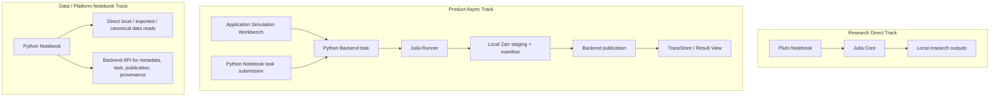

---
aliases:
  - Data Flow
  - 數據流程
tags:
  - diataxis/explanation
  - status/stable
  - topic/architecture
  - topic/pipeline
  - audience/team
status: stable
owner: docs-team
audience: team
scope: Research Direct、Product Async 與 Data / Platform Notebook tracks 的資料流與 authority handoff
version: v1.0.0
last_updated: 2026-05-28
updated_by: codex
---

# Data Flow

The platform has three data-flow tracks. Each track has a different authority boundary, so readers should identify the track before deciding where code or documentation belongs.

## Track Contracts

| Track | Contract |
| --- | --- |
| Research Direct | Pluto may call Julia Core directly and create local research artifacts. These outputs are not canonical platform records. |
| Product Async | Application Simulation Workbench and Python Notebook task submission use Backend contracts. Julia Runner writes staging packages; Backend validates and publishes. |
| Data / Platform Notebook | Python Notebook may directly read files for ad hoc analysis. It must use Backend APIs for platform state changes. |

## Authority Handoffs

| Handoff | Rule |
| --- | --- |
| Application to Backend | submit a product request, not a Runner payload |
| Backend to Runner | send a Backend-owned task envelope |
| Runner to Backend | return only manifest locator, hash, status, progress, and error summaries |
| Backend to TraceStore | validate staging result and create official metadata |
| Python Notebook to data files | read-only analysis is allowed |
| Python Notebook to platform state | use Backend contracts |

## Large Array Rule

Large ND arrays do not move through HTTP JSON. Simulation and trace payloads live in local filesystem Zarr packages, with complex values stored as real/imag arrays.

## Related

- [Product Async Contracts](../../../reference/architecture/product-async-contracts.md)
- [Runner Result Manifest](../../../reference/architecture/runner-result-manifest.md)
- [TraceStore Zarr](../../../reference/architecture/trace-store-zarr.md)
