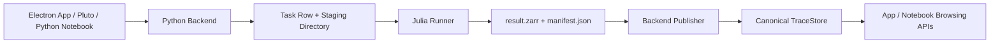

---
aliases:
  - Trace Platform Implementation Plan
  - 設計/Trace 平台實作計畫
tags:
  - diataxis/explanation
  - audience/team
  - topic/architecture
  - topic/implementation
status: stable
owner: docs-team
audience: team
scope: Notebook Interface, Application Interface, Julia Runner, and TraceStore refactor execution plan
version: v2.0.0
last_updated: 2026-05-28
updated_by: codex
---

# Trace Platform Implementation Plan

This plan makes the current Trace platform contract explicit:
Python Backend owns control/data-plane authority, Julia Runner owns compute, and TraceStore owns numeric authority after backend publication.

## Current Contract

The active architecture is:

```text
Notebook Interface + Electron Application Interface + Julia Runner Compute Plane
```

Use this runtime split:

| Plane | Responsibility |
|---|---|
| Python Backend | task lifecycle, dataset/design/trace metadata, provenance, publication, TraceStore registration, frontend/notebook APIs |
| Julia Runner | simulation, sweep execution, post-processing, fitting, derived extraction, local result package generation |
| Electron App | productized data workbench, task monitor, result browser |
| Pluto Notebook | direct Julia Core research cockpit |

Application-triggered simulation and analysis must be asynchronous.
Notebook direct execution is allowed because the notebook kernel is an explicit research execution environment.

## Data Flow



## Implementation Priorities

1. Keep architecture docs and guardrails as the source of truth.
2. Keep active application code under `app/`.
3. Keep reusable Julia code under `core/julia/SuperconductingCircuitsCore/`.
4. Keep asynchronous compute code under `core/julia/SuperconductingCircuitsRunner/`.
5. Keep large arrays in local filesystem Zarr packages.
6. Publish official traces only through the Python Backend.

## Acceptance Signals

The refactor is complete when:

- the top-level active layout is `core/`, `notebooks/`, `app/`, `scripts/`, and `docs/`
- active CLI and NiceGUI product surfaces are removed
- Electron local mode starts frontend, Python Backend, and Julia Runner
- Python Backend exposes runner claim/heartbeat/progress/cancellation/complete/fail APIs
- Julia Runner writes a fake local Zarr v2 result package
- Python Backend validates a runner manifest and publishes canonical TraceStore data
- frontend navigation is reduced to dataset, ingestion, raw trace, task, and result browsing surfaces
- retained tests pass

## Related

- [Julia Runner Compute Plane](../../reference/architecture/julia-runner-compute-plane.md)
- [Runner Result Manifest](../../reference/architecture/runner-result-manifest.md)
- [TraceStore Zarr](../../reference/architecture/trace-store-zarr.md)
- [Application Interface](../../reference/app/application-interface.md)
