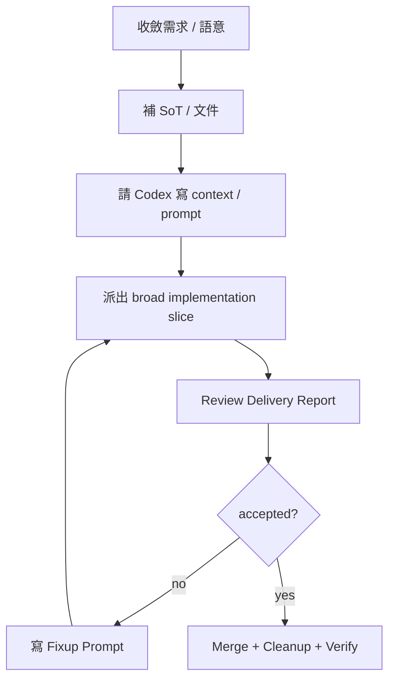

---
aliases:
  - "Codex Agent Workflow"
  - "Codex 協作工作流"
  - "Codex 分工與 Fixup 工作流"
tags:
  - diataxis/how-to
  - audience/contributor
  - topic/execution
status: draft
owner: docs-team
audience: contributor
scope: 以 Codex 作為 orchestration hub，進行 docs-first、多 agent、broad-slice + fixup iteration 的實務工作流。
version: v0.1.0
last_updated: 2026-03-30
updated_by: codex
---

# 使用 Codex 的分工與 Fixup 工作流

這份 how-to 描述一套高頻、可重複的實務工作流：
先收斂 SoT，再派出 implementation slices，之後靠 `Delivery Report` review 與 `Fixup Prompt`
逐步收斂，最後由 Codex 幫你整合、清理與驗證。

!!! info "這不是 branch policy 的 SoT"
    正式 branch/worktree policy 與 agent merge authority 仍以以下 reference 頁面為準：

    - [Branch & Worktree Flow](../../reference/guardrails/execution-verification/branch-and-worktree-flow.md)
    - [Multiple Agent Collaboration](../../reference/guardrails/execution-verification/multi-agent-collaboration.md)

## 1. 何時使用這個工作流

在以下情況，優先使用這套 workflow：

- 需求仍在演化，但你已經知道大方向
- 需要先補文件 / contract，再做實作
- 需要把工作分給 `Frontend / Backend / Core / Test / Document Agent`
- 你希望 implementation slice 先做得夠寬，再用 fixup 收斂
- 你希望由 Codex 幫你做 report review、merge、cleanup 與 live verification

## 2. 工作流總覽



## 3. 步驟

### 步驟 1：先決定是否要補 SoT

先問自己：

- 這是文件 / contract / page behavior / data model 問題嗎？
- implementation 現在是否容易因為 authority 不清而亂猜？
- 這個需求是不是會影響多個 surfaces？

若答案偏向「是」，先請 Codex 幫你寫 `Document Agent Context`，而不是直接丟 code prompt。

常見說法：

- `幫我先整理成 Document Agent Context`
- `這件事先討論清楚，然後幫我寫進文件的 context`

### 步驟 2：讓 Codex 寫 agent prompt

SoT 到位後，再請 Codex 寫 prompt 給對應 agent。

最常見的是：

- `Document Agent Context`
- `Frontend Prompt`
- `Backend Prompt`
- `Fixup Prompt`
- `Merge / cleanup / verify` 收尾指令

推薦直接使用：

- `$codex-workflow-prompt`

!!! tip "Prompt 的預設結構"
    除非你明確要別的格式，Codex 應預設產出這些區塊：

    - `Task Information`
    - `Current Problem` 或 `Goal`
    - `Read First`
    - `Required Outcome`
    - `Constraints / Non-Goals`
    - `Verification`
    - `Handoff`

### 步驟 3：slice implementation 要偏寬，不要先切太窄

對正常 implementation work，我們這套 workflow 的偏好是：

- 先給 **夠寬的 slice**
- 明確列 `Allowed Area`
- 明確列 `Do Not Touch`
- **不要**一開始就把 prompt 收斂成過窄的 `Allowed Files`

原因是：

- slice 太窄，會增加迭代次數
- agent 容易只做局部 patch，而不是把整段 flow 做完整
- 過度收斂會讓 UI / contract / backend adoption 很難一起優化

!!! warning "何時才應該把 slice 切很窄"
    只有在這些情況下，才推薦加上很窄的 `Allowed Files`：

    - surgical fixup
    - 高風險結構性手術
    - 已經明確知道只剩單一檔案 / 單一路徑的問題

### 步驟 4：請 Codex review Delivery Report

worker agent 回來後，不要直接 merge。

先把 `Delivery Report` 貼給 Codex，讓它做：

- scope 檢查
- guardrails / SoT 檢查
- report 與實際 diff 的對帳
- verification coverage 檢查
- live case 是否真的被修到的判斷

推薦直接使用：

- `$review-delivery-report`

常見說法：

- `收一下這個 Report`
- `檢查這份 Delivery Report`
- `看看需不需要 fixup`

### 步驟 5：若不夠，就寫 Fixup Prompt

如果 review 有發現：

- 真正 live case 沒修到
- report scope 與實際變更不一致
- docs / backend / frontend truth 不一致
- 有 blocker 但第一輪方向其實是對的

就不要重開大規模新任務，而是開 fixup。

推薦直接使用：

- `$write-fixup-prompt`

!!! tip "Fixup 的用途"
    implementation prompt 可以偏寬；
    但 fixup prompt 應針對已知缺口，收斂成精準補洞。

### 步驟 6：accepted 後再 merge、cleanup、verify

當 work 被接受後，再請 Codex 幫你：

- merge / cherry-pick accepted work
- cleanup worktrees / branches
- 保留必要的 parking branch
- 重啟服務
- 跑 smoke / API / browser verification

推薦直接使用：

- `$merge-cleanup-verify`

常見說法：

- `沒問題就 merge 回 develop`
- `收回來，順手 cleanup`
- `重啟服務後幫我再驗一次 live page`

## 4. 常用請求模板

### 4.1 寫文件 context

```text
幫我先整理成 Document Agent Context。
先把 SoT 補好，再讓 implementation agent 開工。
```

### 4.2 寫 implementation prompt

```text
幫我寫一份 Backend Prompt。
slice 不要切太窄，盡可能讓 agent 把整段 flow 做完，
只要清楚列 Allowed Area、Do Not Touch、Verification 就好。
```

### 4.3 review Delivery Report

```text
幫我收一下這份 Delivery Report。
如果有 blocker，先講 findings；如果方向對，就幫我判斷需不需要 fixup。
```

### 4.4 寫 fixup prompt

```text
方向是對的，但 live case 沒修到。
幫我寫一份 fixup prompt，讓 agent 只補這個缺口。
```

### 4.5 merge / cleanup / verify

```text
沒問題就幫我 merge 回 develop，
再 cleanup worktree / branch，最後做一次 live verify。
```

## 5. 建議搭配的技能 (Skills)

這套 workflow 最常搭配以下 4 個 local skills：

- `$codex-workflow-prompt`
- `$review-delivery-report`
- `$write-fixup-prompt`
- `$merge-cleanup-verify`

它們的用途分別是：

| Skill | 用途 |
|---|---|
| `$codex-workflow-prompt` | 寫 `Document Agent Context`、implementation prompt、merge/review prompt |
| `$review-delivery-report` | review worker agent 的 `Delivery Report`，判斷 accepted / needs fixup |
| `$write-fixup-prompt` | 把 findings 轉成精準 fixup prompt |
| `$merge-cleanup-verify` | merge accepted work、cleanup、live verify |

## 6. 什麼時候要停止直接派 implementation

出現以下情況時，先回文件或規格，不要直接再派新 code slice：

- 使用者其實還在定義產品語意
- 多個 surfaces 的 authority 邊界還不清楚
- backend / frontend / docs 對同一件事說法不同
- 你發現自己在用 implementation 去猜 contract

!!! warning "不要用 code 代替未定義的 contract"
    如果真正缺的是 SoT，就先補 SoT。
    這樣後面的 implementation 與 fixup 才不會一直反覆推翻。

## Related

- [如何參與貢獻 (Contributing)](../contributing.md)
- [Branch & Worktree Flow](../../reference/guardrails/execution-verification/branch-and-worktree-flow.md)
- [Multiple Agent Collaboration](../../reference/guardrails/execution-verification/multi-agent-collaboration.md)
