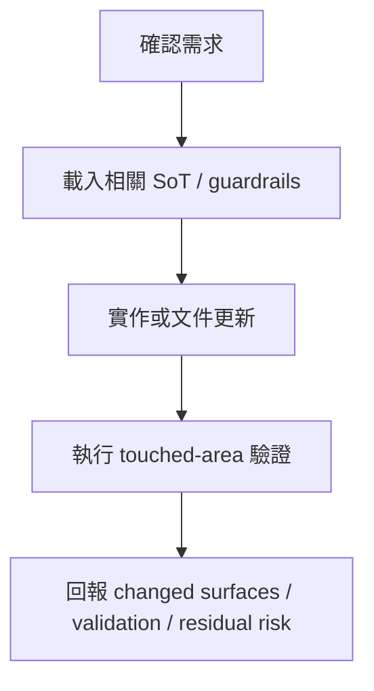

---
aliases:
  - "Codex Agent Workflow"
  - "Codex 協作工作流"
tags:
  - diataxis/how-to
  - audience/contributor
  - topic/execution
status: stable
owner: docs-team
audience: contributor
scope: 以 Codex 作為整合者，進行 SoT-first、直接實作、驗證與回報的工作流。
version: v1.0.0
last_updated: 2026-05-28
updated_by: codex
---

# 使用 Codex 的協作工作流

這份 how-to 說明如何讓 Codex 在本 repo 中完成一個可 review 的變更：先讀相關 SoT，再直接實作，最後驗證並回報剩餘風險。

!!! info "這不是 branch policy 的 SoT"
    正式 branch/worktree policy 與 subagent coordination 仍以以下 reference 頁面為準：

    - [Branch & Worktree Flow](../../reference/guardrails/execution-verification/branch-and-worktree-flow.md)
    - [Codex Subagent Coordination](../../reference/guardrails/execution-verification/multi-agent-collaboration.md)

## 使用時機

使用這套 workflow 處理一般 docs、backend、frontend、Runner、test 或 cleanup 工作。

適合直接交給 Codex 的情境：

- SoT 已經存在，任務是把文件或實作對齊它。
- 使用者明確提供了 fixup plan 或 cleanup plan。
- 變更可用 touched-area checks 驗證。
- 需要 Codex 自行決定是否開 subagent，但不需要使用者手動分 lane。

如果產品語意本身還不清楚，先更新 `docs/reference/**` 的 owner SoT。

## 工作流



## 操作規則

1. 先讀與任務相關的 guardrails 與 owner docs。
2. 直接在合適的 canonical surface 修改，例如 `app/`、`core/`、`notebooks/`、`scripts/` 或 `docs/`。
3. Codex 可自行使用 subagents，但最終整合與回報由目前對話負責。
4. 不建立 committed planning artifacts；長期決策必須寫回 `docs/reference/**`。
5. 驗證以 touched area 為準，並在 final response 說明已跑與未跑的檢查。

## 常用請求

### 更新 SoT

```text
請把這個架構決策寫進 docs/reference 的 owner SoT。
```

### 實作 Fixup

```text
請照這份 fixup plan 實作，保留既有未提交變更，最後跑 touched-area validation。
```

### Review 結果

```text
請用 code-review stance 檢查這份 diff，先列 bugs / regressions / missing tests。
```

### Merge / Cleanup / Verify

```text
請把 accepted work merge 回 develop，清理分支或 worktree，並執行最後驗證。
```

## 回報格式

一般 final response 應包含：

- changed surfaces
- validation commands and results
- skipped checks or residual risk
- unrelated dirty state, if relevant

寬範圍變更可以使用：

```markdown
## Summary
- <what changed>

## Validation
- `<command>`: <pass/fail + short detail>

## Risks
- <skipped check or remaining risk>
```

## Related

- [如何參與貢獻 (Contributing)](../contributing.md)
- [Branch & Worktree Flow](../../reference/guardrails/execution-verification/branch-and-worktree-flow.md)
- [Codex Subagent Coordination](../../reference/guardrails/execution-verification/multi-agent-collaboration.md)
