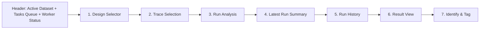

# Characterization

本頁定義 design-scoped characterization workflow 的 analysis selection、sweep-aware trace selection、derived input collection、latest run summary、run history、result view 與 identify mode 契約。

!!! info "Page Frame"
    本頁負責 design scope、compatible traces / collections、analysis run、persisted result inspection 與 identify / tagging。
    raw data ingest、schema editing 與 simulation execution 不屬於本頁責任。

!!! info "Analysis Path"
    本頁遵循嚴格線性邏輯：
    `選擇 Design` → `篩選相容 Traces / Collections` → `執行分析` → `檢閱 latest run state` → `檢閱持久化結果`。

!!! tip "Shared Surfaces"
    本頁使用 shared [Header](../shared-shell/header.md)、[Sidebar](../shared-shell/sidebar.md) 與 [Task Management](../shared-workflow/task-management.md)。
    `Tasks Queue` 與 worker status 由 Header 提供；`Run History` 是 characterization-specific artifact surface，不取代 shared task queue / attach semantics。

!!! warning "Research workbench first"
    本頁是 characterization research workbench，不是 task management page。
    global queue、worker summary、attach / cancel / terminate / retry、cross-page recovery 與 deep task diagnostics 仍屬於 Header `Global Context` 或 standalone [`Tasks`](../workspace/tasks.md) page。

!!! warning "No duplicated queue surface"
    page body 不得重做全域 queue、worker dashboard、large attached-task wall 或長段 infrastructure log 面板。
    本頁只保留完成 characterization workflow 所需的 page-local task / result state。

## Shell Context Requirements

| Context | Requirement |
|---|---|
| active workspace | design list、trace visibility、run history 與 queue 都受其限制 |
| active dataset | design scope 必須來自 active dataset；本頁不得自行擁有另一份 dataset authority |
| focused run task | 只要 task 對目前 session 仍可見，就可從 queue 或 refresh recovery 重建 compact run state |

!!! info "Design selector meaning"
    本頁的 Design Selector 選的是 active dataset 內的 dataset-local `design_id`。
    它不是第二個 global dataset context。

## 核心職責

=== "配置與執行"
    * **範圍定義**: 選擇一個 Design 並檢視其 Source Coverage。
    * **分析選擇**: 選擇 Analysis 類型並確認與當前 Traces 的相容性。
    * **任務提交**: 選取多筆 Traces；backend 依 persisted trace structure 派生 input collection 後啟動 Characterization Run。
    * **執行狀態**: 以 compact latest-run summary 回答目前分析是否 queued / running / completed / failed。

=== "結果與標記"
    * **歷史追蹤**: 檢視過往執行紀錄 (Run History) 與其持久化 artifacts。
    * **多維檢視**: 透過 axis-aware Table 或 Plot 檢視 Result Artifacts。
    * **參數標記**: 進入 Identify Mode，將分析結果標記回系統核心度量。

## UI 佈局與工作流

## 關鍵組件清單

| ID | 組件名稱 | 作用 |
| :--- | :--- | :--- |
| **C1** | Design Selector | 決定分析資料邊界與相容性檢查基準。 |
| **C2** | Analysis Selector | 選擇演算法類型並顯示 `Recommended / Available / Unavailable`。 |
| **C3** | Trace Selection Table | 展示 compatible traces 與 collection hints，支援 `All / Base / Clear` 與 sweep-aware filtering。 |
| **C4** | Latest Run Summary | 顯示目前 characterization stage 的 compact run state、`Resume Latest Run`、`View Task`、`Open in Global Context`。 |
| **C5** | Run History | 展示 persisted analysis runs。 |
| **C6** | Result View Controls | 切換結果類別、artifact 頁籤與 analysis-aware preset views。 |
| **C7** | Identify & Tag | 自動提取參數並執行 tagging 提交。 |

## 狀態與相容性契約

=== "分析可用性"
    | 狀態 | 定義 |
    | :--- | :--- |
    | **Recommended** | 偵測到相容 Traces，且符合 profile 建議。 |
    | **Available** | 具備基礎執行條件。 |
    | **Unavailable** | 當前 Design 範圍內無相容數據。 |

=== "Trace 模式"
    * **Base**: 基礎掃描數據。
    * **Sideband**: 側帶或輔助測量數據。
    * **All**: 包含所有已索引 Trace 種類。

!!! tip "Profile 只做提示"
    Design Profile 僅作為推薦參考。
    analysis 是否可執行的最終判定權在於 compatible traces 的存在與否。

## Trace Selection And Input Collection Contract

| Concern | Rule |
|---|---|
| User interaction | 使用者仍可直接選取 traces；這是 submit 的 interaction input |
| Scientific model | backend 會依 selected traces 的 canonical axes、family、representation、source 與 lineage 派生 input collection |
| Sweep awareness | selection/filtering 應可使用 structured sweep axis 資訊，例如 `L_jun`、`C_q` 等 axis names |
| ND trace direction | parameter-swept traces 應以 canonical ND trace 結構參與分析；point-level rows 只可做 browse projection |
| Collection hints | page 可顯示來自 backend 的 collection / grouping hints，但不得自行發明 scientific grouping authority |
| No provenance parsing | page 不得靠字串解析 provenance 或 parameter label 來猜 sweep meaning |

!!! warning "Selected traces are not the final scientific model"
    `selected_trace_ids[]` 仍是必要的使用者互動資料，
    但 Characterization 的 scientific meaning 來自 backend 根據 persisted trace structure 派生的 input collection。

## Result View Contract

| Concern | Rule |
|---|---|
| Result authority | result view 只依賴 persisted artifact manifest 與 artifact payload |
| Axis-aware explorer | result artifacts 應明示 input axes、derived axes 與 metric semantics |
| Table preset | table 可用 row / column axes 呈現 matrix-style result |
| Plot preset | plot 可用 x / y / series 軸呈現 analysis-specific result view |
| Preset ownership | preset views 由 backend artifact contract 定義；page 不得自行猜測欄列 / series 語意 |

### First-phase Admittance Resonance Extraction

| Surface | Contract |
|---|---|
| Input axis | sweep parameter，例如 `L_jun` |
| Derived axis | `mode_index` |
| Metric | `frequency_ghz` |
| Table preset | rows=`mode_index`，columns=`L_jun`，cell=`frequency_ghz` |
| Plot preset A | x=`mode_index`，y=`frequency_ghz`，series=`L_jun` |
| Plot preset B | x=`L_jun`，y=`frequency_ghz`，series=`mode_index` |

!!! tip "First-phase mode semantics are conservative"
    `mode_index` 目前只代表單一 sweep point 內的 ordinal extracted modes。
    本頁不得宣稱已具備跨 sweep 的 physical mode tracking；
    若需此能力，應由更強的 `mode_track_id` 類型 contract 定義。

## Permission And Gating

| Concern | Rule |
|---|---|
| Submit analysis task | 依 `can_submit_tasks` 與 selected trace compatibility 決定 |
| Queue row actions | 依 backend `allowed_actions` 顯示，不由頁面自行推導 |
| Deep task control | deeper attach / cancel / terminate / retry / queue browse 應回到 Header `Global Context` 或 [`Tasks`](../workspace/tasks.md) |
| No active dataset | 不允許進入正常 design selection 流；顯示空 shell guidance |
| Workspace switch | design scope、trace table、run history 與 focused run task 都必須重驗 |

## 數據持續性與運行時規則

* **Task Attachment**: Run 啟動後，Header queue 必須立即出現該 task；本頁可回到 compact latest-run summary，但不應長出全域 queue / log wall。
* **Result Persistence**: 結果檢閱僅依賴持久化 artifacts，刷新頁面後必須能精確還原 axis-aware view 與 preset。
* **非重複計算**: 切換 Table / Plot 或類別時，僅改變呈現方式，不重跑分析。

??? example "Workspace / Dataset Rebinding"
    1. Header 切換 active workspace 或 active dataset。
    2. 本頁重新抓取 design scope、compatible traces 與 run history。
    3. 若目前 focused run task 或 selected design 不再有效，頁面必須明確清除並提示原因。

!!! warning "Run History 不是 Queue"
    使用者若要重新附著到正在執行或剛完成的 task，應從 Header `Tasks Queue` 進入。
    `Run History` 只負責回看 persisted analysis artifacts。

!!! tip "Run History is not task management"
    `Run History` 回答的是「這個 analysis workflow 已經產生了哪些 persisted runs / artifacts」。
    若使用者需要更深的 queue browse、worker status、control actions 或 event drill-down，應回到 Header `Global Context` 或 [`Tasks`](../workspace/tasks.md)。

## 相關參考

* [Raw Data Browser](../workspace/raw-data-browser.md)
* [Tasks](../workspace/tasks.md)
* [Header](../shared-shell/header.md)
* [Sidebar](../shared-shell/sidebar.md)
* [Task Management](../shared-workflow/task-management.md)
* [Backend: Tasks & Execution](../../backend/tasks-execution.md)
* [Backend: Characterization Results](../../backend/characterization-results.md)
* [Data Format: Dataset / Design / Trace Schema](../../../data-formats/dataset-record.md)
* [Data Format: Analysis Result](../../../data-formats/analysis-result.md)
