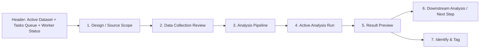

# Characterization

本頁定義 design-scoped characterization workbench 的 Data Collection Review、analysis pipeline、analysis run、result preview 與 identify mode 契約。

!!! info "Page Frame"
    本頁負責 design scope、Data Collection Review、analysis pipeline、analysis run、persisted result inspection 與 identify / tagging。
    raw data ingest、schema editing 與 simulation execution 不屬於本頁責任。

!!! info "Workflow Path"
    本頁採 pipeline-first workflow：
    `選擇 Design / Source Scope` → `檢閱 Data Collection Review` → `選擇 Analysis` → `執行單一 analysis run` → `檢閱 Result Preview` → `進入下一個可用 analysis`。

!!! tip "Shared Surfaces"
    本頁使用 shared [Header](../shared-shell/header.md)、[Sidebar](../shared-shell/sidebar.md) 與 [Task Management](../shared-workflow/task-management.md)。
    `Tasks Queue` 與 worker status 由 Header 提供；`Run History` 是 characterization-specific artifact surface，不取代 shared task queue / attach semantics。

!!! warning "Research workbench first"
    本頁是 characterization research workbench，不是 task management page。
    global queue、worker summary、attach / cancel / terminate / retry、cross-page recovery 與 deep task diagnostics 仍屬於 Header `Global Context` 或 standalone [`Tasks`](../workspace/tasks.md) page。

!!! warning "No duplicated queue surface"
    page body 不得重做全域 queue、worker dashboard、large attached-task wall 或長段 infrastructure log 面板。
    本頁只保留完成 characterization workflow 所需的 page-local task / result state。

## Shell Context Requirements

| Context | Requirement |
|---|---|
| active workspace | design list、trace visibility、run history 與 queue 都受其限制 |
| active dataset | design scope 必須來自 active dataset；本頁不得自行擁有另一份 dataset authority |
| selected design scope | 必須解析為 active `DesignScope`；archived / deleted / redirected scope 不得作為 normal analysis target |
| focused run task | 只要 task 對目前 session 仍可見，就可從 queue 或 refresh recovery 重建 compact run state |

!!! info "Design selector meaning"
    本頁的 Design Selector 選的是 active dataset 內的 dataset-local `design_id`。
    它不是第二個 global dataset context。
    若 stored `design_id` 已 merge / archived，page 必須依 backend redirect / stale-state response 清除或切換 selection。

## User Mental Model

| Workflow step | User question |
|---|---|
| Design / Source Scope | 我現在要分析哪個 design、有哪些來源可用？ |
| Data Collection Review | backend 實際會分析哪些 canonical traces / collections？ |
| Analysis Pipeline | 哪些 analysis 現在可跑，哪些被擋住，下一步是什麼？ |
| Active Analysis Run | 目前這一步 analysis 有沒有在跑、最近一次結果如何？ |
| Result Preview | 這一步 analysis 產生了什麼 surface / fit / diagnostics？ |
| Downstream Analysis / Next Step | 哪個 analysis 已被解鎖，接下來該往哪一步？ |

## UI 佈局與工作流

## 關鍵組件清單

| ID | 組件名稱 | 作用 |
| :--- | :--- | :--- |
| **C1** | Design / Source Scope | 決定分析資料邊界、顯示 design source coverage 與 trace source概況。 |
| **C2** | Data Collection Review | 顯示使用者 selection 與 backend-derived scientific collection。 |
| **C3** | Analysis Pipeline | 列出可用 analysis、prerequisite gating、upstream / downstream 關係。 |
| **C4** | Active Analysis Run | 顯示目前 analysis 的 compact run state、`Resume Latest Run`、`View Task`、`Open in Global Context`。 |
| **C5** | Result Preview | 顯示 analysis-aware table / plot / diagnostics 與 artifact presets。 |
| **C6** | Downstream Analysis / Next Step | 顯示 completion 後可解鎖的下一步 analysis 與 blocking summary。 |
| **C7** | Identify & Tag | 從 persisted result surface 提取參數並執行 tagging 提交。 |

## Workflow Sections

| Section | Primary role | Must show |
|---|---|---|
| `Design / Source Scope` | 回答這次 analysis 的資料邊界 | active dataset 內的 selected design、source coverage、selection scope |
| `Data Collection Review` | 回答 backend 將如何解讀使用者選取的 traces | selected traces、derived collection、shared axes、available sweep axes、collection members、source coverage、grouping summary、readiness |
| `Analysis Pipeline` | 回答可跑什麼、被擋住什麼、依賴什麼 | analysis cards、prerequisite state、required upstream result、next-step hints |
| `Active Analysis Run` | 回答目前 analysis 任務有沒有在跑 | compact task state、latest run summary、history entry、global-context handoff |
| `Result Preview` | 回答這一步 analysis 產生了什麼 | table / plot presets、diagnostics、member-aware semantics、identify surface |
| `Downstream Analysis / Next Step` | 回答哪個 analysis 已被解鎖 | downstream analysis availability、blocking summary、required upstream result source |

## Analysis Availability And Run States

| State | Meaning |
|---|---|
| `ready` | collection 與 prerequisite 都已滿足，可直接提交這個 analysis |
| `blocked` | 當前 design scope / selected traces / collection 結構不滿足此 analysis 基本條件 |
| `requires upstream result` | collection 本身足以辨識 analysis 類型，但還缺前一個 analysis 的 persisted result |
| `running` | 此 analysis 已提交，且 latest run 仍在 queue / worker runtime 中執行 |
| `completed` | 此 analysis 已產生可檢閱的 persisted result surface |

!!! warning "Do not conflate page states"
    `ready / blocked / requires upstream result` 是 analysis availability / prerequisite state。
    `running / completed / failed` 是單一 analysis run 的 execution state。
    page 不得把 worker state 或 queue state 混成 analysis pipeline state。

## Data Collection Review Contract

| Concern | Rule |
|---|---|
| User selection | page 顯示 `selected_trace_ids[]` 與 trace rows，讓使用者知道自己勾選了什麼 |
| Derived collection | backend 依 canonical trace structure 派生 scientific collection；這是 submit 前的第一-class review surface |
| Shared axes | review surface 必須指出 selected traces 共同可解讀的 canonical axes |
| Available sweep axes | review surface 必須指出哪些 structured sweep axes 可供 analysis / result explorer 使用 |
| Collection members | review surface 必須指出 backend 派生出的 collection members，以及它們對應的 source / trace membership |
| Source coverage | review surface 必須指出 measurement / layout simulation / circuit simulation 等來源覆蓋情況 |
| Grouping summary | review surface 必須指出 shared axes / lineage / batch 派生出的 grouping summary |
| Readiness | review surface 必須指出 collection 本身是否 `ready`、`inspect_only` 或 `blocked` |
| Runnable analyses | review surface 必須指出哪些 analyses 現在 runnable |
| Blocked analyses | review surface 必須指出哪些 analyses 被擋住，以及擋住原因 |

!!! warning "Selected traces are not the final scientific model"
    `selected_trace_ids[]` 仍是必要的使用者互動資料，
    但 Characterization 的 scientific meaning 來自 backend 根據 persisted trace structure 派生的 input collection。

!!! warning "Collection review is derived, not editable"
    `Data Collection Review` 顯示的是 derived scientific collection。
    它不是 persisted editable collection resource，也不是把 `collection_projection` 偷渡成使用者可管理的 authority。

!!! tip "No saved input-set contract in this page"
    若需要可命名、可重用、可分享的 reusable input sets，必須另定獨立 contract。
    本頁目前只定義 user selection 與 backend-derived collection review。

## Analysis Pipeline Contract

| Concern | Rule |
|---|---|
| Pipeline-first model | page 必須把 Characterization 呈現成 analysis pipeline，不是單次 run page |
| Separate runs | 每個 analysis 都是自己的 run；不得把 extraction、fitting、comparison 合成單一 mega-run |
| Upstream prerequisite | 某些 analyses 可以依賴 upstream persisted result，而不是只依賴 raw trace collection |
| Blocking explanation | pipeline surface 必須顯示 `blocked` 或 `requires upstream result` 的具體原因 |
| Next-step visibility | analysis 完成後，page 必須指出哪些 downstream analyses 因此解鎖 |
| Compact task state | inline 只保留完成 workflow 所需的 latest run summary；queue / worker 深入資訊仍在 Header / Tasks |

### Extraction vs Downstream Fitting

| Analysis | Input contract | Output contract | Explicit non-goal |
|---|---|---|---|
| `admittance_extraction` | compatible admittance trace collection | resonance surface、diagnostics、identify-ready extraction artifacts | 不做 model fitting、不宣稱 physical mode tracking |
| `junction_parameter_identification` | extraction result surface，而不是 raw `Im(Y)` trace bag | model fit parameters、member-aware fit overlay、residual / diagnostics | 不擁有 raw resonance extraction 邏輯 |

!!! warning "Fitting controls do not belong to extraction"
    fit bounds、branch / member selection、model config 與 fit diagnostics 應屬於 downstream fitting analysis。
    它們不得回滲到 `admittance_extraction` setup。

## Cross-source Compare Contract

| Concern | Rule |
|---|---|
| Compare eligibility | measurement、layout simulation、circuit simulation traces 只要共享相容的 scientific structure，就可成為 compare candidate |
| Compatibility baseline | 至少必須滿足 family / representation / required axes / `axis_signature` 或等價 shared-axis compatibility |
| Scope baseline | cross-source compare candidates 必須位於同一 active `DesignScope`；HFSS / layout data 與 circuit simulation data 的對齊應先透過 target scope selection 或 DesignScope merge 完成 |
| Identity preservation | compare-preserving result 不得把不同 source members 平均成單一 surface；必須透過 explicit member/source dimension 或等價語意保留 identity |
| Overlay semantics | compare plot 應能表達 `同一 sweep axis` 下的多 source members，而不是只回傳 aggregated average |
| Downstream fit relation | 若 downstream fitting 需要逐 source/member fitting，fit output 也必須保留同一份 member/source identity |

!!! warning "Current phase-1 truth"
    目前 `admittance_extraction` runtime 會先對多筆對齊 selected traces 做平均，再執行 extraction。
    因此現在的 phase-1 persisted extraction surface 適合單一來源或明確接受聚合語意的分析，
    但不是真實的 cross-source compare overlay contract。

!!! tip "Compare-preserving contract upgrade"
    若要支援 `L_q` 對 resonance frequency 的多來源比較，
    extraction result 必須升級成 compare-preserving surface：
    讓 raw extracted resonance points、plot series 與 downstream fit lines 都能保留 member/source identity。

## Result Preview Contract

| Concern | Rule |
|---|---|
| Result authority | result view 只依賴 persisted artifact manifest 與 artifact payload |
| Axis-aware explorer | result artifacts 應明示 input axes、derived axes 與 metric semantics |
| Table preset | table 可用 row / column axes 呈現 matrix-style result |
| Plot preset | plot 可用 x / y / series 軸呈現 analysis-specific result view |
| Preset ownership | preset views 由 backend artifact contract 定義；page 不得自行猜測欄列 / series 語意 |
| Member-aware preview | 若 analysis 支援 compare-preserving result，preview 必須保留 member/source identity，不得只剩 averaged surface |

### Extraction Preview

| Surface | Contract |
|---|---|
| Input axis | sweep parameter，例如 `L_jun` 或 `L_q` |
| Derived axis | `mode_index` |
| Metric | `frequency_ghz` |
| Table preset | rows=`mode_index`，columns=`L_jun`，cell=`frequency_ghz` |
| Plot preset A | x=`mode_index`，y=`frequency_ghz`，series=`L_jun` |
| Plot preset B | x=`L_jun`，y=`frequency_ghz`，series=`mode_index` |
| Compare-preserving extension | 若 compare overlay 已啟用，series 或 equivalent member dimension 必須能區分不同 source members |

!!! tip "First-phase mode semantics are conservative"
    `mode_index` 目前只代表單一 sweep point 內的 ordinal extracted modes。
    本頁不得宣稱已具備跨 sweep 的 physical mode tracking；
    若需此能力，應由更強的 `mode_track_id` 類型 contract 定義。

### Downstream Fitting Preview

| Surface | Contract |
|---|---|
| Fit parameter table | 顯示 fitted parameter、unit、fit metadata 與 source/member scope |
| Overlay plot | 顯示 extracted resonance points 與 fitted curve / surface 的對照 |
| Residual / diagnostics | 顯示 residual、fit quality、failed branch/member 或 blocked reason |
| Member-aware output | 若 fitting 對多個 source members 分別進行，結果不得丟失 member/source identity |

## User Control And Authority Split

| Surface | Authority |
|---|---|
| trace selection | 使用者控制哪些 traces 被送入 review / submit path |
| Data Collection Review | backend 依 selected traces + canonical structure 派生的 read model |
| analysis pipeline gating | backend 定義哪些 analyses 可跑、被擋住、依賴哪個 upstream result |
| persisted analysis result | backend 持久化的 run / artifact / identify surface |
| reusable saved input sets | 本頁目前不定義；若需要，必須另立新 contract |

## Permission And Gating

| Concern | Rule |
|---|---|
| Submit analysis task | 依 `can_submit_tasks`、selected trace compatibility 與 prerequisite state 決定 |
| Blocked analysis | page 必須顯示為何 blocked，而不是只把按鈕 disabled |
| Requires upstream result | page 必須指出需要哪一個 upstream analysis result 才能解鎖 |
| Queue row actions | 依 backend `allowed_actions` 顯示，不由頁面自行推導 |
| Deep task control | deeper attach / cancel / terminate / retry / queue browse 應回到 Header `Global Context` 或 [`Tasks`](../workspace/tasks.md) |
| No active dataset | 不允許進入正常 design selection 流；顯示空 shell guidance |
| Archived / redirected design | 不允許提交新 analysis；page 必須顯示 backend stale / redirect reason |
| Workspace switch | design scope、trace table、run history 與 focused run task 都必須重驗 |

## 數據持續性與運行時規則

* **Task Attachment**: 單一 analysis run 啟動後，Header queue 必須立即出現該 task；本頁只保留 compact latest-run summary。
* **Pipeline Continuity**: refresh 或 reattach 後，page 必須回到正確的 design scope、Data Collection Review 與 active analysis result，而不是退回 generic task detail。
* **Result Persistence**: extraction result、fit result 與 identify surface 都必須依 persisted artifacts / result payload 精確重建。
* **非重複計算**: 切換 Table / Plot、artifact preset 或 result tab 時，只改變呈現方式，不重跑分析。

??? example "Workspace / Dataset Rebinding"
    1. Header 切換 active workspace 或 active dataset。
    2. 本頁重新抓取 design scope、compatible traces 與 run history。
    3. 若目前 focused run task 或 selected design 不再有效，頁面必須明確清除並提示原因。
    4. 若 selected design 已 archived 且有 redirect，page 應提示 stale selection 並切換到 backend 回傳的 target scope。

!!! warning "Run History 不是 Pipeline"
    `Run History` 回答的是哪些 persisted runs / artifacts 已存在。
    它不是 pipeline gating owner，也不是 queue surface。

!!! tip "Run History is not task management"
    若使用者需要更深的 queue browse、worker status、control actions 或 event drill-down，應回到 Header `Global Context` 或 [`Tasks`](../workspace/tasks.md)。

## 相關參考

* [Raw Data Browser](../workspace/raw-data-browser.md)
* [Tasks](../workspace/tasks.md)
* [Header](../shared-shell/header.md)
* [Sidebar](../shared-shell/sidebar.md)
* [Task Management](../shared-workflow/task-management.md)
* [Backend: Tasks & Execution](../../backend/tasks-execution.md)
* [Backend: Characterization Results](../../backend/characterization-results.md)
* [Data Format: Dataset / Design / Trace Schema](../../../data-formats/dataset-record.md)
* [Data Format: Analysis Result](../../../data-formats/analysis-result.md)
