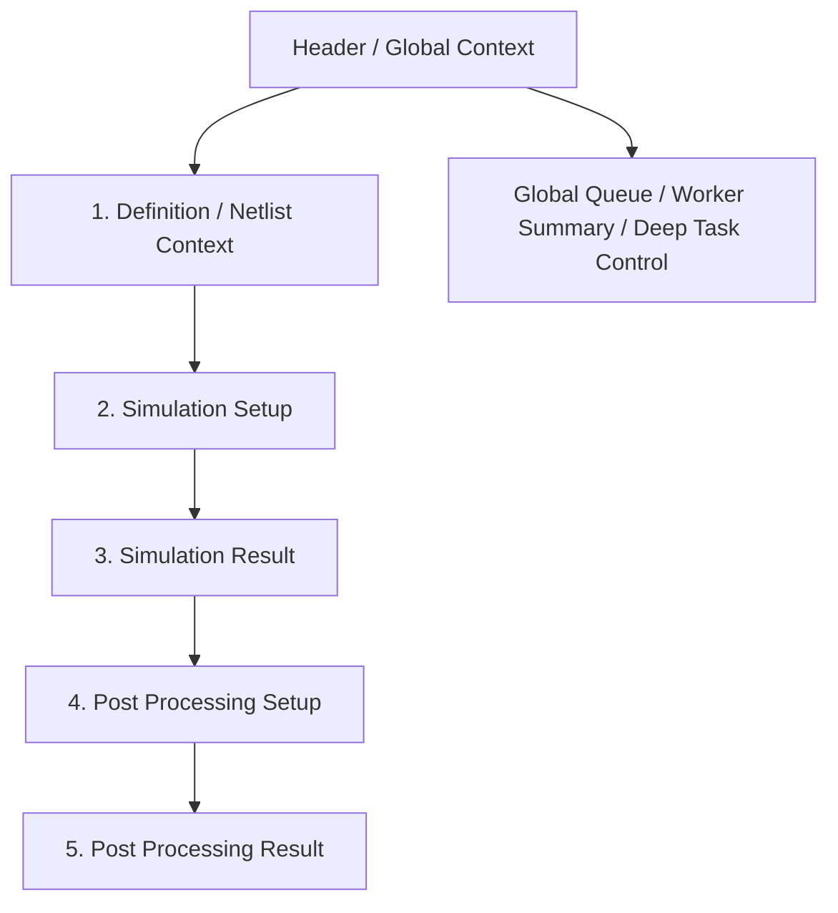

# Circuit Simulation

本頁定義 `/circuit-simulation` 的 workflow-first research surface：definition / netlist context、simulation setup、simulation result、post-processing setup 與 post-processing result。

!!! info "Page Frame"
    本頁負責 simulation workflow 本身：definition / netlist context、simulation setup、run CTA、stage-local execution state、simulation result、post-processing setup 與 post-processing result。
    schema authoring、raw data browse、characterization analysis、global queue browse 與 worker diagnostics 不屬於本頁責任。

!!! tip "Shared Surfaces"
    本頁使用 shared [Header](../shared-shell/header.md)、[Sidebar](../shared-shell/sidebar.md) 與 [Task Management](../shared-workflow/task-management.md)。
    `Tasks Queue` 與 `Worker Status` 由 Header 提供；本頁只保留完成 workflow 所需的最小 stage-local task state。

!!! warning "Pipeline-first, not task-dominated"
    task 是執行基礎設施，不是頁面的主要資訊架構。
    使用者主觀上應感受到的是：
    `Definition / Netlist Context -> Simulation Setup -> Simulation Result -> Post Processing Setup -> Post Processing Result`，
    而不是在 task attach / queue recovery / worker diagnostics 頁面裡順便做模擬。

## Shell Context Requirements

| Context | Requirement |
|---|---|
| active workspace | definition 可見性、task queue 與 worker summary 都受其限制 |
| active dataset | submit simulation task 前必須已解析到有效 active dataset，除非明確定義該 lane 可 dataset-null |
| active definition | 必須屬於目前 active workspace 且對 session 可見 |
| attached task | 若 workspace switch 後不再可見，必須解除附著並提示 |

## User Mental Model

| Stage | User question |
|---|---|
| Definition / Netlist Context | 我現在要模擬的是什麼？ |
| Simulation Setup | 我準備怎麼跑這次 simulation？ |
| Simulation Result | 這次 simulation 跑了沒有？結果在哪？ |
| Post Processing Setup | simulation output 是否已足夠進入下一步？ |
| Post Processing Result | post-processing 產生了什麼，與上游 simulation result 有什麼關係？ |

## Workflow Topology

## Global vs Page-local Responsibility

| Surface | Owns |
|---|---|
| Header / Global Context | global queue visibility、worker summary、cross-page task recovery、attach / cancel / terminate / retry、runtime-mode-aware worker state |
| Circuit Simulation page | definition context、simulation setup、simulation result、post-processing setup、post-processing result、stage-local execution summary |

!!! tip "Open in Global Context"
    本頁可以顯示 `View Task`、`Resume Latest`、`Open in Global Context`。
    但 queue browse、worker lane health、完整 event history 與 cross-page recovery 仍應回到 shared shell。

## Layout Baseline

| Concern | Baseline |
|---|---|
| Overall shape | 一頁式、強 section hierarchy 的 workflow workbench |
| Visual reading order | 必須清楚看出 5-stage path，而不是左右兩欄平行競爭 |
| First screen focus | definition / setup / run CTA，不能先被 queue / task diagnostics 佔滿 |
| Stage progression | 每個 stage 要清楚回答 `ready / blocked / running / completed / failed / next step` |
| Task infrastructure density | 只允許 stage-local summary，不可讓 full queue / worker summary / attachment diagnostics 成為主版面 |

## Workflow Sections

| Section | Primary role | Must show |
|---|---|---|
| `Definition / Netlist Context` | 回答這次要模擬什麼 | canonical definition、可讀 netlist / expanded snapshot、與 simulation 直接相關的 context |
| `Simulation Setup` | 配置 runnable simulation stage | frequency sweep、parameter sweeps、solver、sources、advanced options、`Run Simulation` |
| `Simulation Result` | 承接 simulation stage output | stage status、latest run summary、simulation result surface |
| `Post Processing Setup` | 配置 downstream stage | post-processing config、blocking reason、`Run Post Processing` |
| `Post Processing Result` | 承接 downstream output | stage status、post-processing result、與 upstream simulation result 的關聯 |

## Simulation Setup Contract

!!! warning "Setup vs Definition"
    此處的配置屬於「運行參數」，僅存於 task snapshot 中，不會回寫至 Circuit Definition 的源碼。

=== "Sweep & Solver"
    * **Frequency Sweep**: 設定 Start、Stop 與 Points。
    * **HB Solve**: 設定 Harmonics 與進階 Solver 容差。
    * **Parameter Sweeps**: 啟用多軸參數掃描模式。

=== "Sources & PTC"
    * **Sources**: 設定 Pump 頻率、埠口電流與模式。
    * **PTC**: 埠口終止補償 (Port Termination Compensation)，僅作用於 `Y/Z` 參數。

## Runnable Stage Contract

| Stage | Runnable action | Inline task state allowed | Must not dominate the page |
|---|---|---|---|
| Simulation | `Run Simulation` | `Not started / Queued / Running / Completed / Failed`、latest run summary、`View Task`、`Resume Latest`、`Open in Global Context` | global queue block、worker dashboard、large attachment / recovery diagnostics |
| Post Processing | `Run Post Processing` | `Not started / Queued / Running / Completed / Failed`、latest run summary、`View Task`、`Resume Latest`、`Open in Global Context` | duplicated queue、lane summary、full task event wall |

!!! warning "Minimal inline task state only"
    runnable stage 只保留完成 workflow 所需的執行狀態。
    若使用者要看更深的 task / queue / worker 細節，必須導向 `Global Context`。

## Stage Blocking Rules

| Stage | Blocking baseline |
|---|---|
| Simulation Setup | 若 definition 或 active dataset 不可用，顯示 concise blocking state 與 next action |
| Simulation Result | 若尚未提交 simulation，顯示 `Not started`，而不是空 task panel |
| Post Processing Setup | 在 simulation result 尚未可用前保持 blocked，並以簡短原因說明 `Simulation result required` |
| Post Processing Result | 若 post-processing 尚未執行，顯示 `Not started` 或 `Blocked`，不搶過 upstream result |

## Result Handoff Rules

| Concern | Rule |
|---|---|
| Simulation result | 必須明確屬於 simulation stage，不與 post-processing result 混成單一 task result 面板 |
| Post-processing unlock | 只有在 simulation result 已可用時才解鎖 |
| Downstream relation | post-processing result 必須明確指出其 upstream simulation result / run |
| Export / compare | 應附著在對應的 result stage，而不是 task diagnostics 區塊 |
| Re-entry | refresh / reattach 後，頁面必須能回到正確 stage result，而不是只剩 generic task detail |

## Event And Recovery Density

| Concern | Baseline |
|---|---|
| Inline event history | 只保留 compact latest event / failure summary；不常駐完整 event log |
| Recovery wording | 優先使用 `Resume Latest Run`、`Open Latest Result` 等 workflow 語言，而不是 `Reattach Task` |
| Deep diagnostics | 透過 `View Task` 或 `Open in Global Context` drill down |

## Data And Continuity

=== "Data dependencies"
    | Data | Source | Required |
    | :--- | :--- | :---: |
    | definition detail | definition service | ✅ |
    | task detail | task execution surface | ✅ |
    | result refs | persisted output | ✅ |
    | active workspace / dataset | session surface | ✅ |
    | capability flags | session surface | ✅ |

=== "Recovery"
    | Situation | Expected behavior |
    | :--- | :--- |
    | **Page refresh** | 根據 persisted run / task context，自動重建目前 stage 狀態與 result handoff。 |
    | **Task detachment** | 透過 `Resume Latest Run` 或 Header `Tasks Queue` 快速連回最新執行任務。 |

!!! warning "PTC applicability"
    **S-parameters** 永遠顯示 solver 原始值；**PTC** 補償機制僅允許施作於 **Y/Z** 路徑。

## Permission And Gating

| Concern | Rule |
|---|---|
| Submit task | 依 `can_submit_tasks` 與 definition / dataset visibility 決定 |
| View / resume / open task | 依 shared [Task Management](../shared-workflow/task-management.md) 與 backend `allowed_actions` 決定 |
| No active dataset | 顯示 clear blocking state，不得假設 page-local dataset 足以代替 session context |
| Workspace switch during run | 不停止已存在 task，但本頁若失去可見性需解除附著 |

## Interaction Flows

??? example "Flow A: Run simulation"
    1. 選擇 Definition 與配置 Setup。
    2. 點擊 `Run Simulation` → 建立 persisted task。
    3. Header `Tasks Queue` 立即出現新 row 與 worker summary 更新。
    4. `Simulation Result` stage 轉為 `Queued` / `Running`，並顯示 latest run summary。

??? example "Flow B: Workspace switched while a run exists"
    1. Header 切換 active workspace。
    2. 本頁重驗 definition 與 active dataset。
    3. 若舊 task 不再可見，相關 stage 改為 detached / stale state，並提示 `Resume Latest Run` 或 `Open in Global Context`。

??? tip "Flow C: Result handoff"
    1. 當 simulation task 變為 terminal，`Simulation Result` 載入 persisted result summary。
    2. 若 simulation result 已可用，`Post Processing Setup` 解鎖。
    3. 當 post-processing 完成時，`Post Processing Result` 顯示 downstream result，並明確標示 upstream simulation relation。

## Acceptance Checklist

| Check | Requirement |
|---|---|
| Workflow readability | 使用者必須能清楚感受到 5-stage path |
| First-screen density | 首屏不得被 queue / worker / attachment diagnostics 佔滿 |
| Task integration | task 可見，但只能以 stage-local execution summary 出現 |
| Blocking clarity | blocked stage 必須有短原因與明確 next action |
| Result ownership | simulation result 與 post-processing result 必須有明確 stage 邊界 |
| Recovery language | 使用 workflow-oriented wording，不以 infrastructure wording 主導 |
| Shared boundary | global queue / worker / deep task control 必須回到 `Global Context` |

## 相關參考

* [Schemas List](../definition/schemas.md)
* [Header](../shared-shell/header.md)
* [Sidebar](../shared-shell/sidebar.md)
* [Task Management](../shared-workflow/task-management.md)
* [Backend: Tasks & Execution](../../backend/tasks-execution.md)
* [Backend: Datasets & Results](../../backend/datasets-results.md)
