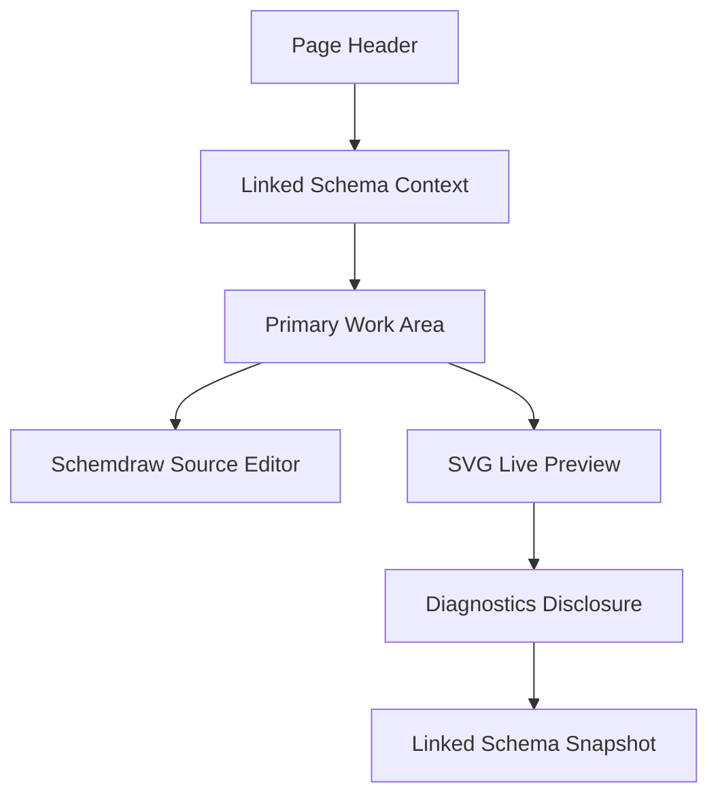

# Schemdraw

本頁定義 Schemdraw workspace 的 linked schema context、source editor、SVG live preview、preview download dialog、diagnostics disclosure 與 advanced mapping disclosure 契約。

!!! info "Page Frame"
    Frontend 只負責編輯 source、顯示 linked schema context、送出 render request、呈現 diagnostics 與 SVG preview。
    relation mapping / config 只屬於 optional advanced concern，不再佔據主工作區層級。
    authoritative syntax validation、controlled execution 與 render result 組裝由 backend 擁有。

!!! warning "Backend Owns Live Preview"
    本頁可以有本地 syntax highlighting、cursor helpers 與 basic editor cues；
    但正式的 syntax check、runtime validation 與 SVG live preview authority 必須來自 backend render service。

!!! tip "Not a task workflow"
    Schemdraw preview 不走 shared task queue。
    它是 request/response 型的 editor-assist surface，不應與 Simulation / Characterization 的 persisted task lifecycle 混在一起。

## Purpose

| Responsibility | Meaning |
|---|---|
| Page header utilities | 只允許 compact adjacent-navigation，例如 `Back to Catalog` 與 `Open Schema Editor`；不應長成 handoff button wall |
| Source editing | 使用者在 code editor 中撰寫 Schemdraw Python source |
| SVG live preview | 直接檢視最新成功 render 的 SVG |
| Preview download | 從最新成功 preview 下載 `SVG` 或 `PNG` |
| Linked schema context | 在工作區頂部顯示 linked schema 選擇與 lightweight context summary |
| Diagnostics | 只在錯誤、warning 或使用者開啟 disclosure 時查看 syntax / runtime diagnostics |
| Advanced mapping | optional advanced metadata / mapping UI，用於精修 relation metadata，不得搶過 editor / preview |

## Shell Context Requirements

| Context | Requirement |
|---|---|
| active workspace | linked schema search 與 render authorization 必須受目前 active workspace 限定 |
| active dataset | 非必要；本頁不以 active dataset 作為 primary authority |
| linked schema | 若提供 linked schema，必須是目前 active workspace 中可見的 persisted definition |

## Linked Schema Identity Rules

| Concern | Rule |
|---|---|
| Persisted identity | linked schema 綁定的是 full UUIDv4 `definition_id` |
| Visible context | UI 可顯示 short `Schema ID`，但不得用 `Definition #...` 或任何 numeric-order wording 暗示 identity shape |
| Same-name linked schemas | 必須依 short `Schema ID` + `created_at` 區分；必要時加 owner / workspace context |
| Selection order | linked schema dropdown / chooser 應依 `name`、`created_at`、`updated_at` 等欄位排序，不得按 `definition_id` 值排序 |
| Render request binding | frontend 送給 backend 的 linked schema reference 仍必須是 full UUIDv4 `definition_id` |

## Layout Structure

## Component Inventory

| ID | Component | Required behavior |
|---|---|---|
| `C0` | Page Header Actions | 只保留 compact utilities，例如 `Back to Catalog`、`Open Schema Editor` |
| `C1` | Linked Schema Context | 顯示 linked schema selection 與 lightweight chips，不鋪 summary card wall |
| `C2` | Schemdraw Source Editor | 左側 primary editor，負責 source editing |
| `C3` | SVG Live Preview | 右側 primary preview，顯示最新成功 render 的 SVG 與單一 `Download` action |
| `C4` | Render Controls | 主要為 `Render Now`；`Reset Template` 屬於 advanced mapping disclosure 的附屬動作 |
| `C5` | Diagnostics Disclosure | 錯誤時顯示 concise recovery；完整 diagnostics 預設折疊 |
| `C6` | Linked Schema Snapshot | read-only code surface，預設折疊 |
| `C7` | Advanced Mapping Disclosure | optional advanced disclosure，用於 relation metadata / mapping，不得佔據 main workspace slot |

## Three-step Processing Flow

!!! tip "正式流程"
    Schemdraw live preview 應被視為三步驟流程，而不是單一 editor 小技巧。

1. **Edit locally**
   前端更新 Python source、linked schema context，必要時再調整 advanced mapping。
2. **Send snapshot**
   停止輸入後以 debounce 方式送出 request snapshot；手動點擊 `Render Now` 可跳過 debounce。
3. **Validate and render on backend**
   backend 進行 syntax validation、entrypoint validation、controlled render execution，最後回傳 diagnostics 與 SVG。

## Backend Assist Rules

| Concern | Rule |
|---|---|
| Syntax check | authoritative parser / runtime validation 在 backend |
| Diagnostics mapping | backend diagnostics 應帶 line / column，供 editor inline 呈現 |
| Stale result | request 發出後，舊 preview 保留但標成 stale |
| Response authority | frontend 只根據最新 `request_id` / `document_version` 套用結果 |

## Frontend Rules

| Rule | Meaning |
|---|---|
| Local cues are lightweight | editor 可做 syntax highlighting、indent guides、cursor hints |
| Preview becomes stale on edit | 任何 source / advanced mapping 變動都應把 preview 標為 `Stale` |
| Latest-only apply | 前端只採用最新 `document_version` / `request_id` 的 response |
| No implicit persistence | 本頁不保存 schema source、不保存 render draft |
| Advanced mapping is secondary | relation mapping / config 只能作 advanced disclosure，不得比 editor 或 preview 更顯眼 |
| Diagnostics are hidden until needed | diagnostics 只在錯誤、warning 或 disclosure 開啟時顯示，不得和 primary work area 同級競爭注意力 |
| Snapshot is reference-only | linked schema snapshot 為 read-only code surface，預設折疊，不得壓過 editor / preview 的主要工作流 |
| No cross-page CTA wall | 除了 compact adjacent-navigation 之外，不得額外堆疊 handoff / preview / authority buttons |
| Download stays singular | preview area 只允許單一 `Download` action，不得長成多個常駐 export buttons |

## Preview Download Contract

| Concern | Rule |
|---|---|
| Entry point | live preview 區只允許一個 `Download` action |
| Format selection | 點擊 `Download` 後，使用單一 dialog 讓使用者選擇 `SVG` 或 `PNG` |
| Availability | 只有當最新 authoritative render response 為 `Rendered` 且 `svg` 存在時，download action 才可用 |
| Stale protection | download 必須綁定最新成功且未被 newer response 淘汰的 preview；不得導出被丟棄的 stale response |
| SVG ownership | `SVG` download 直接保存 authoritative backend `svg` payload，不另造第二份 preview authority |
| PNG ownership | `PNG` 可由 frontend 根據同一份 authoritative `svg` payload 衍生 raster export；本頁 contract 不要求 backend 另提供 PNG export endpoint |
| UI density | download format selection 必須留在 dialog，不得把 preview header 擴成多顆 export buttons |

??? example "Edit-to-preview behavior"
    1. 使用者修改 Python source。
    2. editor 立即顯示本地 cue，preview 狀態轉為 `Stale`。
    3. debounce 後送出 render request。
    4. backend 回傳 `rendered` / `syntax_error` / `runtime_error`。
    5. 前端更新 diagnostics；只有成功時替換 SVG。

## Runtime States

| State | Meaning |
|---|---|
| `Editing` | editor 內容變動中 |
| `Stale Preview` | 當前 SVG 仍是舊版本 |
| `Validating` | backend 正在做 syntax / request / relation validation |
| `Rendering` | backend 正在 controlled render |
| `Rendered` | 最新 SVG 已可用 |
| `Syntax Error` | backend 判定 source 無法 parse 或不符合 entrypoint contract |
| `Runtime Error` | syntax 正常，但 render execution 失敗 |

## Context Mismatch Rules

| Situation | Required behavior |
|---|---|
| linked schema 在 workspace switch 後不可見 | 清除 linked schema 並提示使用者重新選擇 |
| advanced mapping 與 backend schema contract 不符 | diagnostics 顯示為 blocking，不更新 preview |
| manual render during stale response race | 只保留最新 response；舊回應直接丟棄 |
| download after render race | `Download` dialog 只能對應目前被採用的 latest successful preview，不可回指被淘汰的 request |

## Authority Pair

| Concern | Authority |
|---|---|
| linked schema metadata | [Backend / Circuit Definitions](../../backend/circuit-definitions.md) |
| render transport / diagnostics / SVG envelope | [Backend / Schemdraw Render](../../backend/schemdraw-render.md) |
| shell context | [Header](../shared-shell/header.md), [Sidebar](../shared-shell/sidebar.md) |

## Acceptance Checklist

!!! success "Implementation-ready outcome"
    * [ ] frontend 只負責 source editing、response 呈現與 linked schema context
    * [ ] backend 擁有 authoritative syntax check 與 live preview
    * [ ] three-step flow 已明確：edit -> send snapshot -> backend validate/render
    * [ ] stale preview 與 latest-only apply 有正式定義
    * [ ] `Download` action 被定義為 preview area 的單一入口，格式選擇在 dialog 中完成
    * [ ] `SVG` 與 `PNG` download ownership 已明確：`SVG` 直接來自 backend preview，`PNG` 可由 frontend 從同一份 SVG 衍生
    * [ ] main hierarchy 明確是 `Linked Schema Context -> Source Editor + SVG Live Preview -> Diagnostics Disclosure -> Linked Schema Snapshot`
    * [ ] relation mapping / config 被定義為 optional advanced concern，不佔 main workspace slot
    * [ ] linked schema snapshot 被定義為 folded read-only code surface，而不是壓扁的文字 blob
    * [ ] page 不會把 preview workflow誤寫成 task queue 或 persistence workflow

## Related

* [Backend / Schemdraw Render](../../backend/schemdraw-render.md)
* [Schema Editor](../definition/schema-editor.md)
* [Header](../shared-shell/header.md)
* [Sidebar](../shared-shell/sidebar.md)
