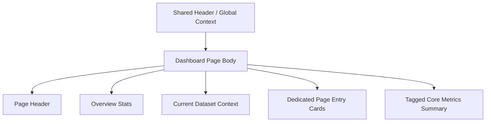

# Dashboard

## Purpose

`/dashboard` 是 `Dashboard` sidebar group 的 canonical landing page。它是 summary-first workspace overview，不是 dataset metadata 的唯一正式入口。

本頁負責：

- 概覽目前 active dataset context
- 顯示 tagged core metrics 的唯讀摘要
- 提供前往 `Dataset`、`Tasks`、`Data Ingestion`、`Raw Data Browser` 等 dedicated surfaces 的精簡 entry

本頁不負責：

- dataset profile 編輯
- raw-data ingestion authoring
- raw trace browse
- simulation / characterization configuration

!!! warning "Dashboard is not the dataset-management page"
    dataset profile edit、lifecycle actions 與 active dataset browse 應回到 [Dataset](dataset.md)。
    `Dashboard` 只做 overview 與 next-step entry，不應重新變回 metadata editor。

## User Goal

- 快速確認目前 dataset context 是否正確
- 看到 tagged core metrics 是否已就緒
- 從 overview 進入正確的 dedicated page

非目標：

- 不在此頁完成 dataset lifecycle 或 profile mutation
- 不在此頁直接提交 ingestion
- 不在此頁建立大量跨頁 handoff / explanation UI

## Layout Structure

1. Page header
2. Compact overview stats
3. Current dataset context summary
4. Dedicated page entry cards
5. Tagged core metrics read-only summary

## Component Inventory

| ID | Component | Role | Required behavior |
|---|---|---|---|
| `C1` | Page Header | page identity | 說明這是 overview-first landing page，而不是 management page |
| `C2` | Overview Stats | summary | 顯示可快速掃讀的 dataset / metrics 狀態 |
| `C3` | Current Dataset Context | context summary | 顯示 active dataset 的 concise summary，不承接編輯責任 |
| `C4` | Dedicated Page Entry Cards | next-step navigation | 以少量清楚 entry cards 導向 `Dataset`、`Tasks`、`Data Ingestion`、`Raw Data Browser` |
| `C5` | Tagged Core Metrics Summary | read-only result summary | 顯示 active dataset 相關的 tagged metrics 摘要 |

## Data & State Contract

### Data dependencies

| Data | Source | Required | Use |
|---|---|---:|---|
| active dataset summary | session surface | ✅ | 顯示目前 context |
| visible dataset count | datasets surface | ✅ | overview stats |
| dataset profile summary | datasets surface | ⚠️ | 只做 concise summary，不做 editing |
| tagged core metrics summary | characterization results surface | ⚠️ | read-only summary |

### UI states

| State | Required behavior |
|---|---|
| `loading` | overview stats / summary 區塊分區 loading；不要把整頁變成大面積 diagnostics |
| `empty` | 若尚無 active dataset 或 metrics，顯示 concise next-step guidance |
| `partial` | profile / metrics 任一區塊失敗時，只影響該區塊 |
| `error` | 顯示局部 error block，不影響其他 summary 區塊 |

## Interaction Flows

1. **Open a dedicated page**
   - 使用者從 entry card 點進 `Dataset`、`Tasks`、`Data Ingestion` 或 `Raw Data Browser`
   - Dashboard 不應先再鋪一輪 handoff explanation

2. **Refresh after shell context change**
   - Header / Global Context 切換 active dataset
   - Dashboard 重新拉取 overview stats、dataset summary 與 tagged metrics
   - page body 不得自己發明另一套 dataset context

3. **Metrics empty state**
   - 若 active dataset 尚無 tagged metrics
   - 顯示 concise empty guidance
   - 不把 characterization workflow 直接塞回 dashboard

## Visual Rules

- overview-first，不可退化成 dataset management wall
- dedicated page entry 可以存在，但必須維持為小型 next-step cluster，而不是大型 CTA 牆
- page body 不得重複 `Runtime Mode`、`Active Dataset`、`Tasks Queue`、submit authority 等 shell-owned context
- tagged metrics 區塊保持 read-only summary，不承擔 identify / analysis 操作

## Acceptance Checklist

- [ ] `Dashboard` 被定義為 summary-first landing page，而不是 dataset metadata editor
- [ ] dataset profile mutation 不再屬於 `/dashboard`
- [ ] entry cards 只導向 dedicated pages，不變成過量 cross-page CTA 牆
- [ ] active dataset context 來自 shared shell / session，page body 不重複造一份 shell context
- [ ] tagged core metrics 只做 read-only summary

## Related

- [Dataset](dataset.md)
- [Tasks](tasks.md)
- [Data Ingestion](data-ingestion.md)
- [Raw Data Browser](raw-data-browser.md)
- [Header](../shared-shell/header.md)
- [Sidebar](../shared-shell/sidebar.md)
