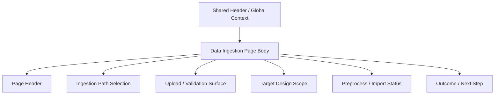

# Data Ingestion

## Purpose

`/data-ingestion` 是 raw-data intake 的專用頁。它應以 upload-first ingestion workflow 為核心，而不是 backend DTO authoring surface。

本頁負責：

- 選擇 ingestion path / source family
- 上傳原始資料檔案
- 選擇 active dataset 內既有 `Target Design Scope`，或明確建立新 scope
- 進行 validation / preprocess / import
- 顯示 import outcome 與最小必要的下一步

本頁不負責：

- 重複 shell-owned runtime / dataset / authority context
- 讓使用者手填 raw DTO / trace payload JSON 作為正式產品流程
- 以一整排 cross-page navigation buttons 承擔 IA

!!! warning "Upload-first, not DTO-first"
    backend ingestion request 可能仍是結構化 payload，
    但 frontend canonical UX 應由 upload、validation、mapping 與 import 驅動，而不是要求使用者直接編 raw DTO 欄位或 JSON payload。

## User Goal

- 把新的 measurement / layout-simulation data 匯入目前 active dataset
- 指定資料要落在哪個 dataset-local analytical scope
- 確認 validation 與 preprocess 是否成功
- 在 import 完成後進入正確的下一步

非目標：

- 不在這頁管理 dataset lifecycle
- 不在這頁瀏覽 raw trace 內容
- 不在這頁重複顯示 runtime mode / target dataset / submit authority cards

## Layout Structure

1. Page header
2. Ingestion path / source selection
3. Upload and validation surface
4. Target Design Scope selection
5. Preprocess / import status
6. Minimal outcome and next-step affordance

## Component Inventory

| ID | Component | Role | Required behavior |
|---|---|---|---|
| `C1` | Page Header | page identity | 明確說明本頁只承接 ingestion |
| `C2` | Ingestion Path Selector | workflow branch | 選擇 measurement / layout-simulation 等 intake path |
| `C3` | Upload Surface | primary authoring surface | 接受原始資料檔案與必要 metadata |
| `C4` | Validation / Preprocess Summary | stage feedback | 呈現 schema / convention check 與 preprocess 狀態 |
| `C5` | Target Design Scope Selector | import target | 支援選既有 active scope 或 create-new intent；不得只靠 free-text name 隱性匹配 |
| `C6` | Import CTA | primary action | 觸發正式 import |
| `C7` | Outcome Panel | compact result handoff | 顯示成功 / 失敗與最多一個主要下一步 |

## Data & State Contract

### Data dependencies

| Data | Source | Required | Use |
|---|---|---:|---|
| active dataset | session surface | ✅ | ingestion target |
| target design scopes | datasets surface | ✅ | existing target / create-new gating |
| ingest authority | datasets surface / session capabilities | ✅ | gating |
| validation result | ingestion authority | ✅ | file / schema check |
| preprocess result | ingestion authority | ⚠️ | import 前摘要 |
| import outcome | ingestion authority | ✅ | result handoff |

### UI states

| State | Required behavior |
|---|---|
| `idle` | 尚未選檔或尚未開始 validation |
| `validating` | 顯示 validation in progress |
| `preprocessing` | 顯示 preprocess in progress |
| `ready_to_import` | validation / preprocess 完成，可進入 import |
| `importing` | import mutation 中 |
| `success` | 顯示 concise success summary 與一個主要 next action |
| `error` | 顯示 concise failure summary；若有 raw detail，由 Developer Mode 控制密度 |

### Target Design Scope Rules

| Concern | Rule |
|---|---|
| Existing target | page 必須送出 explicit `dataset_id + design_id` |
| Create-new target | page 必須送出 create intent 與 display name，backend 回傳新 `design_id` 後才成為 authority |
| Free-text name | 只能作為 create-new default，不可隱性代表既有 scope |
| Archived scope | 不得出現在 normal target selector；若 deep link 指到 archived scope，page 應顯示 backend stale/redirect response |
| Circuit / source hint | uploaded source metadata 可提供 suggested label，但不可取代 user-selected target |

## Interaction Flows

1. **Upload and validate**
   - 使用者選擇 ingestion path 並上傳檔案
   - 系統依固定 convention 或 admin-extensible schema 驗證
   - 驗證失敗時留在本頁修正，不跳轉到其他頁

2. **Preprocess and import**
   - validation 成功後進入 preprocess / import
   - 使用者先選擇既有 `Target Design Scope` 或明確 create-new
   - import request 對既有 scope 使用 `design_id`；create-new path 由 backend 建 scope 後再產生 trace records
   - page 顯示 concise success summary

3. **Outcome handoff**
   - import 成功後，可提供一個主要 next action
   - 預設應導向最能檢查 import 結果的頁面，例如 `Raw Data Browser`
   - 不應同時出現大量 `Open Dataset` / `Open Raw Data` / `Go to X` 按鈕牆

## Visual Rules

- 版面應以 upload-first ingestion workflow 為主，而不是手填 DTO 的表單牆
- `Active Dataset` 可作為頁面必要 target context，但不應複製整套 shell context summary
- `Target Design Scope` 是 import target control，不是第二個 global context
- 不顯示 `Runtime Mode`、`Submit Authority` 等與 shared shell 重複的 stats cards
- outcome 區塊保持精簡；不要把 handoff / preview / authority explanation 堆成第二個工作區

## Acceptance Checklist

- [ ] `Data Ingestion` 被定義為 upload-first intake page，而不是 DTO authoring page
- [ ] active dataset 作為 target context 來自 shared shell / session，不重複造 shell context wall
- [ ] import 前必須明確選擇既有 `Target Design Scope` 或 create-new intent
- [ ] 既有 target 必須提交 explicit `design_id`；free-text name 只服務 create-new path
- [ ] validation / preprocess / import 有清楚 stage feedback
- [ ] import success 後最多只有一個主要 next action，而不是 button wall
- [ ] raw DTO / trace payload authoring 不被寫成正式產品 SoT

## Related

- [Dataset](dataset.md)
- [Raw Data Browser](raw-data-browser.md)
- [Header](../shared-shell/header.md)
