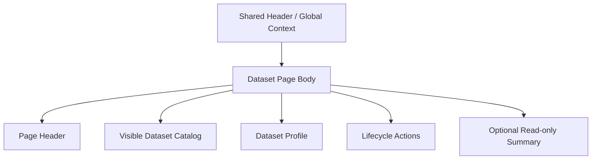

# Dataset

## Purpose

`/dataset` 是 dataset browse、active selection、profile metadata management 與 lifecycle actions 的專用頁。

本頁負責：

- 瀏覽目前可見 dataset catalog
- 切換 active dataset
- 編輯 dataset profile metadata
- 執行 create / archive / delete 等 lifecycle actions

本頁不負責：

- 重複 shell-owned runtime / dataset / queue context
- raw-data ingestion authoring
- raw trace browse
- cross-page handoff button wall

!!! warning "Dedicated management surface"
    dataset 的正式管理責任屬於本頁，不再由 `Dashboard` 承擔。
    但本頁也不應把 `Data Ingestion`、`Raw Data Browser` 或 shell context 一起塞回來。

## User Goal

- 找到正確的 dataset
- 將它設為 active dataset
- 編輯 profile metadata
- 執行必要 lifecycle actions

非目標：

- 不在這頁做 ingestion upload
- 不在這頁瀏覽 trace payload
- 不用大量 `Open Raw Data` / `Open Data Ingestion` 按鈕取代清楚 IA

## Layout Structure

1. Page header
2. Dataset catalog / search / active selection
3. Dataset profile edit
4. Dataset lifecycle actions
5. Optional read-only metric summary

## Component Inventory

| ID | Component | Role | Required behavior |
|---|---|---|---|
| `C1` | Page Header | page identity | 說明這是 dataset management page |
| `C2` | Dataset Search | catalog filter | 只過濾 visible datasets |
| `C3` | Visible Dataset Catalog | browse + selection | 支援 active dataset switch 與 row-level status summary |
| `C4` | Dataset Profile Form | metadata edit | 承接 profile fields 與 save action |
| `C5` | Lifecycle Actions | create / archive / delete | 依 backend authority 顯示可用 mutation |
| `C6` | Read-only Metric Summary | optional secondary summary | 可顯示 tagged metrics 或 compact result context，但不可壓過 catalog / profile 主流程 |

## Data & State Contract

### Data dependencies

| Data | Source | Required | Use |
|---|---|---:|---|
| visible dataset catalog | datasets surface | ✅ | browse / search / switch |
| active dataset summary | session surface | ✅ | 標示目前 active row |
| dataset profile detail | datasets surface | ✅ | profile edit |
| allowed actions | datasets surface + session capabilities | ✅ | lifecycle gating |
| tagged metrics summary | analysis results surface | ⚠️ | optional read-only summary |

### UI states

| State | Required behavior |
|---|---|
| `loading` | catalog 與 profile 分區 loading |
| `empty` | 若無 visible datasets，顯示 concise empty state 與 create guidance |
| `error` | catalog / profile / lifecycle mutation 錯誤各自局部顯示 |
| `dirty` | profile form dirty 時明確顯示 save affordance |

## Interaction Flows

1. **Switch active dataset**
   - 使用者在 catalog 中選擇 dataset
   - session surface 更新 active dataset
   - page 重新載入 profile / metric summary

2. **Edit profile**
   - 使用者編輯 dataset profile
   - backend mutation 成功後，profile summary 與 session-bound surfaces 同步更新

3. **Lifecycle action**
   - 使用者執行 create / archive / delete
   - page 依 backend authority 顯示 confirmation 與結果
   - 不得以 page-local state 假裝 mutation 已完成

## Visual Rules

- catalog 與 profile 是主體；read-only summaries 只能是次要輔助
- page body 不得再鋪 `Runtime Mode`、`Active Dataset`、`Submit Authority` 等 shell-owned summary cards
- 不要用一排 cross-page navigation buttons 稀釋 dataset management 主任務
- lifecycle actions 明確但克制；不得與 profile 編輯混成雜亂 action wall

## Acceptance Checklist

- [ ] `Dataset` 被定義為 active dataset switch 與 profile/lifecycle management 專用頁
- [ ] `Dashboard` 不再是 dataset metadata 的唯一入口
- [ ] shell-owned context 不在 page body 重複成 summary wall
- [ ] page 不依賴大量 `Open X` / `Go to Y` 按鈕完成自身 IA
- [ ] create / archive / delete 僅依 backend authority 顯示

## Related

- [Dashboard](dashboard.md)
- [Data Ingestion](data-ingestion.md)
- [Raw Data Browser](raw-data-browser.md)
- [Header](../shared-shell/header.md)
