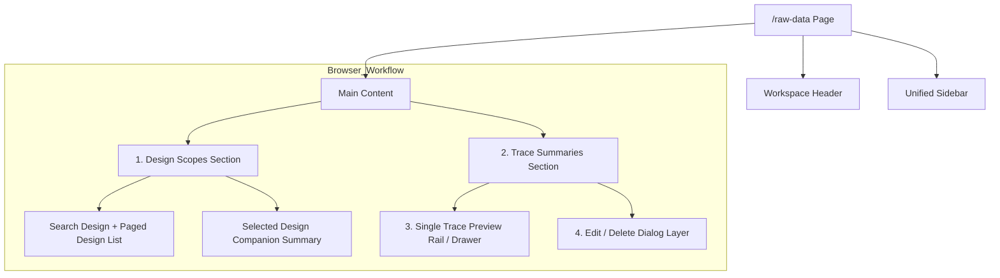

# Raw Data Browser

本頁定義 active dataset 內 design-local trace browse、single-trace preview 與 trace-summary-level CRUD 的正式頁面契約。

!!! info "Page Frame"
    本頁負責 design list、DesignScope create / rename / merge / archive request、trace filtering、trace summary selection、single-trace preview、single-trace edit / delete 與 batch delete。
    raw data upload、dataset metadata 編輯、analysis execution、result publication 與 shell context 管理不屬於本頁責任。

!!! tip "Shared Shell"
    本頁使用 shared [Header](../shared-shell/header.md) 與 [Sidebar](../shared-shell/sidebar.md)。
    selected design context 是 page-local，但 active dataset context 仍由 shared shell 提供。

!!! warning "Dataset-local design scope"
    本頁選擇的是 active dataset 內的 `design_id`。
    design row 不能取代 active dataset，也不能跨出目前 dataset 單獨存在。

## Purpose

本頁是 dataset-local raw trace workbench。
它回答三件事：

1. 哪些 design / traces 可見。
2. 哪一筆 trace 目前被聚焦預覽。
3. 哪些 trace 允許被編輯或刪除。
4. 哪些 dataset-local DesignScope lifecycle action 可由 backend 執行。

!!! warning "Browse page, not handoff page"
    本頁是 browse / preview surface，不應因為看起來方便，就再塞 `Open Dataset`、`Open Data Ingestion` 等 cross-page CTA 牆。
    若使用者需要回到其他頁面，應透過清楚 IA 與 Sidebar / Header 完成。

## User Goal

| 類型 | 內容 |
| --- | --- |
| Primary goals | 選擇 design、管理 DesignScope lifecycle request、篩選 trace summaries、聚焦單筆 preview、對允許的 trace 執行 edit / delete、對多筆允許刪除的 trace 執行 batch delete |
| Non-goals | dataset profile 編輯、raw data ingest、simulation / characterization execution、system-generated trace 的來源重建或 republish |

!!! tip "Preview 與 Selection 分離"
    `focused_trace_id` 只決定右側 single-trace preview。
    `selected_trace_ids[]` 只服務 batch delete。
    兩者可以重疊，但不得互相取代。

## Layout Structure

### Page Order

### Layout Rules

| Area | Rule |
| --- | --- |
| Design scopes | 維持在頁面上半部；desktop 為兩欄 section，左側是 `Search Design` + paged design list，右側是 `Selected Design` companion summary |
| Selected design summary | 是 `Design Scopes` section 內的 companion summary，不是獨立中段 panel；內容為 `Source Coverage`、`Browse State`、`Trace Count`、`Updated` 與 low-noise lifecycle actions |
| Browse controls | design scopes 與 trace summaries 都必須顯示明確 pagination controls，而不是把 cursor browse 藏成隱性行為 |
| Trace summaries pane | 主要工作區，視覺寬度必須大於 preview rail，以容納 row selection、row actions、filter rows 與 batch action bar |
| Preview rail / drawer | mobile 維持 inline；desktop 先佔右側 rail，當 trace section 進入 active scroll threshold 後可轉成固定右側 drawer |
| Dialog layer | edit 與 delete confirm 以 modal/dialog 疊加；背景 page dimmed，但原頁上下文保持可見 |

## Component Inventory

| ID | 組件名稱 | 類型 / 位置 | 作用 | 關鍵行為 |
| --- | --- | --- | --- | --- |
| `C1` | Design Scopes Panel | top section | 定義 design browse / lifecycle request 邊界 | 左側提供 `Search Design` 與 paged design list；右側提供 selected-design companion summary 與 backend-allowed lifecycle actions |
| `C2` | Selected Design Companion Summary | design scopes right column | 顯示目前 design 的 key browse summary | 顯示 `design_id`、lifecycle state、compare readiness 與 `Source Coverage` / `Browse State` / `Trace Count` / `Updated` tiles |
| `C3` | Trace Summaries Table | trace section primary pane | 顯示 trace metadata rows 與 per-row actions | 支援 row focus、checkbox selection、search/filter、row-level `Edit` / `Delete` |
| `C4` | Batch Action Bar | trace summaries section內穩定 action card | 顯示已選取 trace 數量與 batch delete CTA | 只對 `delete=true` 的 rows 開放 destructive action；不是 sticky toolbar |
| `C5` | Single Trace Preview | trace section secondary rail / drawer | 顯示目前 `focused_trace_id` 的 sampled preview | mobile inline；desktop 先在 rail 內顯示，必要時轉成固定右側 drawer |
| `C6` | Trace Edit Dialog | modal | 提供 dedicated numeric editing surface | 先載入 edit payload，再顯示 spreadsheet-like numeric editor 與可編輯 summary metadata |
| `C7` | Delete Confirmation Dialog | modal | 顯示 single delete 或 batch delete 的 destructive confirmation | 必須明列刪除範圍與不可逆提示 |

## Data & State Contract

### Authority Pairing

| Concern | Authority | Page rule |
| --- | --- | --- |
| design list | [Backend / Datasets & Results](../../backend/datasets-results.md) `Design Browse` | 只能在 active dataset 內瀏覽 |
| design lifecycle | [Backend / Datasets & Results](../../backend/datasets-results.md) `Design Scope Lifecycle Contract` | create / rename / merge / archive / delete 只可作為 backend request，不可 page-local re-parent |
| trace summaries | [Backend / Datasets & Results](../../backend/datasets-results.md) `Trace Metadata List Path` | 只載 summary-safe 欄位與 row-level mutation gating，不載大型 numeric payload |
| single-trace preview | [Backend / Datasets & Results](../../backend/datasets-results.md) `Trace Preview Path` | 只由 `focused_trace_id` 驅動 |
| trace edit dialog | [Backend / Datasets & Results](../../backend/datasets-results.md) `Trace Edit Path` 與 `Trace Mutation Contract` | edit payload 與 mutation gating 由 backend 決定；preview payload 不得直接當 edit authority |
| delete / batch delete | [Backend / Datasets & Results](../../backend/datasets-results.md) `Trace Mutation Contract` | destructive actions 只依 backend `allowed_actions` 與 mutation result 回應 |

### Page-local State

| State | Meaning |
| --- | --- |
| `selected_design_id` | 目前 design scope |
| `design_lifecycle_dialog` | `create`, `rename`, `merge`, `archive`, `delete` 或 `null` |
| `focused_trace_id` | 目前預覽中的單筆 trace |
| `selected_trace_ids[]` | 目前 batch action 選中的 trace identities |
| `design_cursor` / `trace_cursor` | design scopes 與 trace summaries 的顯式分頁狀態 |
| `trace_filters` | trace search / family / representation / source filters |
| `active_dialog` | `edit`, `single_delete`, `batch_delete` 或 `null` |
| `pending_mutation` | 目前正在提交的 edit / delete action |

### Design Scope Lifecycle Rules

| Concern | Rule |
| --- | --- |
| Canonical resource | page 使用 `DesignScope` / `design_id`；merge target selector 可顯示 `Target Design Scope` |
| Create | page 可請 backend 建立 active scope；成功後以返回 row 作為 selected design 候選 |
| Rename | page 只修改 display name；`design_id` 不變 |
| Merge | page 選 source + target 並提交 backend merge；不得自行改 trace / batch / run 的 `design_id` |
| Source after merge | source scope 顯示為 archived / redirected，並清空或跳轉 stale `selected_design_id` |
| Archive / delete | destructive action 需要 confirm dialog；可用性只依 backend `allowed_actions` |
| Store refs | page 不解析、不移動、不重寫 `store_ref` 或 TraceStore path |

### Stale Design Handling

| Situation | Page behavior |
| --- | --- |
| selected design becomes archived with redirect | show stale-link notice and switch to backend-provided target design summary |
| selected design becomes archived without redirect | clear selection and show archived-state explanation |
| selected design becomes deleted | clear selection and show unavailable / tombstone state |
| merge succeeds while source selected | reset trace filters / preview / selected trace rows before loading target scope |

### Mutation Rules

| Concern | Rule |
| --- | --- |
| Stable identity | `trace_id` 是 stable trace identity；successful edit 不建立第二個 trace identity |
| Editable fields | 只有 `numeric_payload` 與 UI-safe summary metadata 可以被 edit；metadata 僅限 backend 明確允許的欄位，例如 `parameter`、`representation`、`provenance_summary` |
| Immutable fields | `trace_id`、`dataset_id`、`design_id`、`family`、`trace_mode_group`、`source_kind`、`stage_kind`、`payload_ref` authority handle、`result_handles[]` 不可由本頁改寫 |
| Origin restrictions | provenance-bearing 或 system-generated traces 可能 `edit=false` 但 `delete=true`；page 不得自行從 `source_kind` / `stage_kind` 猜測，必須依 backend `allowed_actions` 與 restriction summary 顯示 |
| Batch operations | 目前只支援 batch delete；batch edit 不屬於本頁範圍 |
| Audit semantics | edit / delete 應被視為 audited mutation；versioned trace lineage 若需要獨立保存，需由 backend contract 另行定義，本頁不自行發明 |

### UI States

=== "Loading & Error"
    * **Loading**: design list、trace summaries、preview、edit payload 與 mutation submit 各自獨立 loading。
    * **Error**: 錯誤訊息應侷限於受影響區域；preview / dialog 失敗不得把整頁打成 full-page error。

=== "Empty State"
    * **Designs Empty**: 顯示導向 Data Ingestion 或 Dataset 的 guidance。
    * **Trace List Empty**: 已選 design 但沒有 trace rows，顯示 source/provenance 提示。
    * **Preview Empty**: 尚未選定 `focused_trace_id` 時，顯示 single-trace preview guidance。

### Pagination Contract

| Surface | Rule |
| --- | --- |
| Design scopes | UI 顯示 explicit previous / next page controls，並明示目前每頁上限；目前 baseline 為 `Up to 6 design scopes per page` |
| Trace summaries | UI 顯示 explicit previous / next page controls，並明示目前每頁上限；目前 baseline 為 `Up to 12 traces per page` |
| Visibility | pagination 不是 hidden implementation detail；page reference 必須把它視為可觀察 contract |

## Interaction Flows

??? example "流程 A: 搜尋與選取 Design"
    1. 使用者輸入 design search 或切換 cursor。
    2. 點擊 row 後，`selected_design_id` 更新。
    3. 頁面重綁 `Trace Metadata List Path`，清除前一個 design 的 `focused_trace_id` 與 `selected_trace_ids[]`。
    4. `Selected Design` companion summary 與 `Trace Summaries` 以同一個 `dataset_id + design_id` 重新載入。

??? example "流程 A2: Create / Rename Design Scope"
    1. 使用者從 `Design Scopes Panel` 開啟 create 或 rename dialog。
    2. page 提交 display name；backend 驗證 active-name uniqueness。
    3. 成功後 page 只使用 backend 回傳的 design row 更新 browse list。

??? warning "流程 A3: Merge Design Scope"
    1. 使用者在 selected source scope 上開啟 merge dialog。
    2. dialog 要求選擇同 dataset 內的 active target scope，並顯示會 re-parent traces / batches / runs / results / assets 的 destructive summary。
    3. page 提交 merge request，不自行改任何 record identity。
    4. 成功後 source scope 顯示 archived redirect，target scope 刷新；若 source 原本被選中，page 切到 target 並清空 stale trace preview / selection。

??? warning "流程 A4: Archive / Delete Design Scope"
    1. 使用者點擊 archive 或 delete。
    2. page 顯示 confirm dialog，明確說明 scope 不會再出現在 normal target selector。
    3. 成功後 page 依 backend row 更新 list；若目前 selected scope 不再 active，清空 trace table 或跟隨 redirect。

??? tip "流程 B: 聚焦單筆 Preview"
    1. 使用者點擊 trace row 本體，更新 `focused_trace_id`。
    2. 系統執行 `Trace Preview Path`。
    3. mobile 以 inline preview 顯示；desktop 先在右側 preview rail 顯示，必要時可切換成固定 drawer。
    4. table row selection 不因此自動變成 batch selection。

??? example "流程 C: Edit Trace"
    1. 使用者從 row action 點 `Edit`。
    2. 系統先驗證該 row 的 `allowed_actions.edit=true`，再開啟 `Trace Edit Dialog`。
    3. dialog 透過 `Trace Edit Path` 載入 editable numeric payload 與 editable metadata，背景 page dimmed。
    4. 使用者在 spreadsheet-like numeric surface 編輯數值，並可修改 backend 允許的 summary metadata。
    5. 送出後執行 single-trace mutation。
    6. 成功時更新該 row summary；若目前 `focused_trace_id` 等於該 trace，preview 必須同步 refresh。

??? warning "流程 D: Single Delete"
    1. 使用者從 row action 點 `Delete`。
    2. 頁面開啟 confirm dialog，明列 `trace_id` 與主要 summary context。
    3. 使用者明確確認後才送出 delete mutation。
    4. 成功時從 list 中移除該 row，並以 response 內的 updated design row 立即刷新 `Selected Design` companion summary。
    5. 若刪除的是 `focused_trace_id`，preview 必須清空並回到 empty state。

??? warning "流程 E: Batch Delete"
    1. 使用者以 checkbox 選取多筆 rows，形成 `selected_trace_ids[]`。
    2. `Batch Action Bar` 顯示選取數量與 `Delete Selected` CTA。
    3. 使用者進入 confirm dialog，dialog 必須顯示刪除筆數與摘要清單。
    4. 成功時移除所有已刪除 rows、清除 `selected_trace_ids[]`，並以 response 內的 updated design row 立即刷新 design summary。
    5. 若包含目前 `focused_trace_id`，preview 必須依 mutation result 清空或切換到仍存在的 row，但不得保留 stale preview。

## Visual Rules

| 項目 | 規則 |
| --- | --- |
| Table-first density | trace surface 仍以 table 為主，不把 trace summaries 改成密集卡片牆 |
| Filter grouping | trace filters 應先顯示獨立 `Search` row，再顯示 `Family` / `View` / `Source` controls row |
| Pane weighting | trace summaries pane 應比 preview rail 寬，因為本頁新增 row actions、selection 與 batch action card |
| Vertical hierarchy | 維持 `選 Design → 看 Trace Summaries → 聚焦單筆 Preview / 開啟 Dialog` 的閱讀順序 |
| Mutation emphasis | destructive CTA 只在 row action 或 batch toolbar 顯示，不得散落在 design summary 或 shell 區塊 |
| Batch action treatment | batch action group 應是 trace section 內的穩定 card / action group，不以 sticky toolbar 呈現 |
| Row action policy | row actions 採 icon-first low-noise 呈現；disabled `Edit` 可見但 muted，fully locked rows 顯示 compact `Locked` pill 與 hover/title hint，不渲染長段 inline restriction prose |
| Dialog treatment | edit dialog 應像 dedicated numeric editing surface，而不是小型 metadata popover；背景 dimmed 但仍保留 page context |
| Preview responsiveness | desktop preview 不只是一個靜態 secondary pane；它是 rail-first，再依 scroll 狀態轉成 fixed right-side drawer；mobile 維持 inline |
| Preview controls | 不定義 `Hide Preview` CTA |
| Low-noise context | page body 不重複 shell context；只保留完成 trace browse / edit / delete 所需的 dataset-local context |

## Acceptance Checklist

- [ ] design scopes section 使用左側 browse + 右側 selected-design companion summary 的 desktop 兩欄布局
- [ ] design browse、trace summaries、single-trace preview 仍維持 `dataset_id + design_id` 綁定
- [ ] DesignScope create / rename / merge / archive / delete 只透過 backend contract 執行，不由 page-local 重寫 records
- [ ] merge 成功後 source scope 以 archived redirect 呈現，page 清除 stale trace preview / selection
- [ ] trace summaries 支援 row selection、per-row `Edit` / `Delete` 與 batch delete
- [ ] design 與 trace browse 都有明確 pagination controls 與 visible page-size summary
- [ ] preview 仍是 single-trace-focused，不因 batch selection 變成 multi-trace compare
- [ ] desktop preview 可作為 rail / fixed drawer 運作，mobile 維持 inline
- [ ] edit dialog 使用 dedicated numeric editing surface，而不是只編 metadata text fields
- [ ] edit 只允許 stable trace identity 下的 numeric payload 與 backend 明確允許的 summary metadata
- [ ] delete flow 對 single / batch 都有明確 destructive confirmation
- [ ] page 不自行推導 trace 可編輯性；只依 backend `allowed_actions` 與 restriction summary 顯示動作
- [ ] batch edit 沒有被偷偷擴進本頁

## 相關參考

* [Dashboard](dashboard.md)
* [Dataset](dataset.md)
* [Data Ingestion](data-ingestion.md)
* [Header](../shared-shell/header.md)
* [Sidebar](../shared-shell/sidebar.md)
* [Backend: Datasets & Results](../../backend/datasets-results.md)
* [Record Schema](../../../data-formats/dataset-record.md)
* [Characterization](../removed-workflows/characterization.md)
