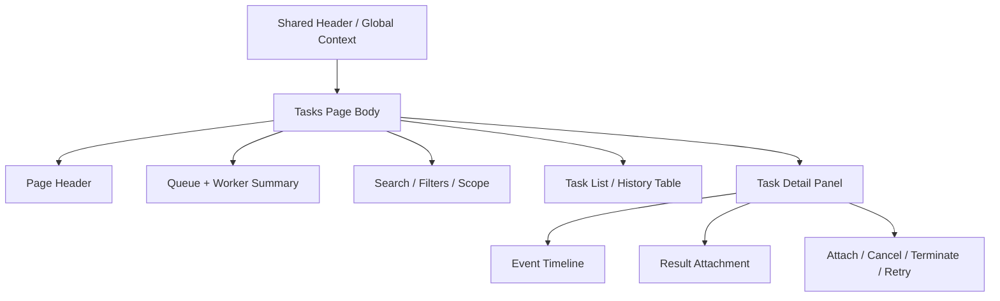

# Tasks

## Purpose

`/tasks` 是 shared queue / worker model 的 standalone extended surface。

本頁負責：

- 以 extended browse 方式檢視 persisted tasks
- 檢視較長的 queue history、search 與 filter 結果
- 以 master-detail 方式檢視 task detail、event history、result attachment 與 control actions
- 提供比 Header `Global Context` 更完整的 worker / lane inspection

本頁不負責：

- 取代 workflow page 的 stage-local result surface
- 取代 `Header -> Global Context` 的 quick management 角色
- 在 page body 重做 runtime mode / active dataset 的 shell context wall

!!! info "Two-layer queue model"
    `Header -> Global Context -> Tasks Queue` 是 quick shared-shell management surface；
    `/tasks` 則是 extended browse / history / detail / audit surface。
    正常 workflow 不應依賴 `/tasks` 才能成立，但需要更深 queue 操作與檢視時，必須有這個正式入口。

## User Goal

- 快速找到正在跑、剛完成、或需要處理的 task
- 透過 filter / search / history 找到特定 task
- 檢查 task detail、event timeline、result linkage 與 worker / lane 狀態
- 對可見 task 執行 `Attach`、`Cancel`、`Terminate`、`Retry`

非目標：

- 不在此頁重新完成 simulation / characterization workflow 本身
- 不把 page body 變成第二個 shell context 管理牆
- 不以跨頁 CTA 牆取代清楚的 queue browse 與 detail IA

## Layout Structure

1. Page header
2. Queue summary + worker summary
3. Filter / search controls
4. Master-detail body
5. Result / event / action detail

## Component Inventory

| ID | Component | Role | Required behavior |
|---|---|---|---|
| `C1` | Page Header | page identity | 明確說明這是 extended queue / history / detail surface |
| `C2` | Queue Summary | top-level state | 顯示 active / recent task counts 與 concise worker overview |
| `C3` | Filter Bar | browse controls | 提供 scope、status、lane、search 等 controls |
| `C4` | Tasks Table | master list | 顯示 persisted task rows，支援排序、選取與 cursor-based browse |
| `C5` | Task Detail Panel | detail surface | 顯示 selected task 的 lifecycle、context、result attachment 與 allowed actions |
| `C6` | Event Timeline | diagnostics drill-down | 顯示 selected task 的 append-only event history |
| `C7` | Worker / Lane Detail | extended operational detail | 提供比 Header 更完整的 lane-level worker inspection，並以 `idle / running / draining / degraded / offline` 呈現 liveness semantics |

## Data & State Contract

### Data dependencies

| Data | Source | Required | Use |
|---|---|---:|---|
| queue rows | task execution surface | ✅ | list / history browse |
| worker summary | task execution + runtime surface | ✅ | top summary 與 lane inspection |
| task detail | task execution surface | ✅ | detail panel |
| event history | task execution surface | ✅ | timeline |
| result attachment | task execution surface | ✅ | result linkage / handoff |
| runtime mode / active workspace | shared shell / session | ✅ | scope boundary |

### UI states

| State | Required behavior |
|---|---|
| `loading` | table 與 detail panel 可分區 loading，不把整頁鎖死 |
| `empty` | 若當前 filter 下沒有 rows，顯示 concise queue-empty guidance |
| `partial` | 某個 detail 區塊失敗時，只局部報錯 |
| `error` | 顯示 queue query 或 detail fetch 的局部錯誤，不遮蔽其他已成功區塊 |

## Interaction Flows

1. **Open from Global Context**
   - 使用者在 Header `Tasks Queue` 進行 quick management
   - 若需要更多 history / filtering / detail，進入 `/tasks`
   - page 以目前 runtime mode / workspace context 初始化 browse state

2. **Browse and inspect**
   - 使用者調整 filters 或 search
   - table 更新 rows
   - 選中某 row 後，detail panel 顯示 task detail、events、result attachment 與 allowed actions

3. **Control action**
   - 使用者在 detail panel 或 row action 執行 `Attach`、`Cancel`、`Terminate`、`Retry`
   - backend 回寫新的 persisted state
   - table 與 detail panel 同步刷新

4. **Mode or workspace change**
   - Header 切換 runtime mode 或 active workspace
   - `/tasks` 重新綁定 queue / worker authority
   - 舊 rows 不得和新 mode / workspace 混顯

## Visual Rules

- 使用 master-detail，而不是 giant stacked diagnostics wall
- quick summary 在上，extended browse / detail 在下
- queue / history / detail 應是主要視覺；cross-page CTA 應安靜且稀少
- worker detail 可以比 Header 詳細，但不應壓過 queue 與 task detail 主體
- page body 不得重複 `Runtime Mode`、`Active Workspace`、`Active Dataset` 等 shell-owned context cards

## Acceptance Checklist

- [ ] `/tasks` 被定義為 standalone extended queue surface，而不是 workflow page 的替代品
- [ ] `Header -> Global Context` 與 `/tasks` 的角色區分清楚
- [ ] page 支援 extended history / filter / detail / action，不只是 panel 放大版
- [ ] queue / worker authority 仍來自 backend persisted task surface，不由 frontend 自行拼裝
- [ ] page body 不重做 shell context wall，也不變成 handoff button wall

## Related

- [Header](../shared-shell/header.md)
- [Task Management](../shared-workflow/task-management.md)
- [Dashboard](dashboard.md)
- [Backend: Tasks & Execution](../../backend/tasks-execution.md)
