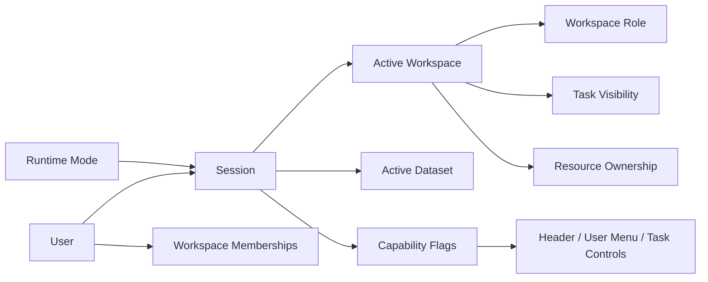

---
aliases:
  - "Identity Workspace Model"
  - "身分與工作空間模型"
tags:
  - diataxis/reference
  - audience/team
  - sot/true
  - topic/app-reference
status: draft
owner: docs-team
audience: team
scope: runtime mode、user / session / workspace / role / active workspace / active dataset / task visibility 與 active-context switching 的 app 共享模型
version: v0.4.0
last_updated: 2026-03-16
updated_by: codex
---

# Identity & Workspace Model

本文件定義 App shared model 中的最小 runtime mode、identity 與 workspace 語意。

!!! info "App-level ownership"
    這份文件回答的是 App collaboration model。
    它同時服務 shared header、shared task execution、backend session surface 與 resource visibility。

!!! warning "Session owns active context"
    `Session` 是 active workspace、active dataset、user summary 與 capability exposure 的 canonical owner。
    frontend local state 可以 cache UI state，但不得重新定義身份與權限 truth。

## Runtime Mode Terms

| Term | Minimal meaning |
|---|---|
| `Runtime Mode` | 同一個 App 目前以 `local` 或 `online` 方式運行 |
| `Local Session` | local mode 下由 backend 直接提供的 implicit single-user session |
| `Online Session` | online mode 下由 auth / membership 建立的 session |

## Core Terms

| Term | Minimal meaning |
|---|---|
| `User` | 一個可被識別、可被授權的操作者 |
| `Session` | 綁定 `runtime mode`、`user`、`active workspace`、`active dataset` 與 `capabilities` 的有效上下文 |
| `Workspace` | task visibility、dataset context、resource ownership 與 collaboration 的共享邊界；local mode 固定為 `Local Space` |
| `Workspace Role` | `owner`、`member`、`viewer` 等 workspace-scoped role |
| `Active Workspace` | session 目前正在操作的單一 workspace |
| `Active Dataset` | 目前 workflow 預設作用的 dataset context |
| `Design Scope` | active dataset 內的 page-local analytical boundary，不是第二個 global context |
| `Task Visibility` | 哪些 persisted tasks 對哪些 session / workspace 可見 |

## Authority Rules

=== "Session"

    | Rule | Meaning |
    |---|---|
    | One runtime mode per session | 同一時間 session 只屬於一個 active mode |
    | One active workspace per session | 同一時間 session 只綁定一個 active workspace |
    | Session owns dataset context | active dataset 不是 page-local state |
    | Session exposes capability summary | pages 不應自行推斷 permission |
    | Mode switch invalidates old session | local / online 不能共用同一份 session cache |

=== "Mode-specific workspace model"

    | Rule | Meaning |
    |---|---|
    | Local mode uses one implicit workspace | 使用固定的 `Local Space`，維持 shell-compatible context，但不進入 multi-membership collaboration model |
    | Online mode may join multiple workspaces | membership 可以是多個，但仍只有一個 active workspace |
    | Same shell shape across modes | Header 仍看得到 workspace / dataset context，但 authority semantics 依 mode 改變 |

=== "Workspace"

    | Rule | Meaning |
    |---|---|
    | Resources belong to one workspace | dataset / schema / task / result 只掛一個 `workspace_id` |
    | Role is workspace-scoped | 同一 user 在不同 workspace 可有不同 role |
    | Visibility is backend-enforced | task visibility 不能只靠前端過濾 |
    | Cross-workspace sharing is explicit | 跨 workspace 應用 export/import 或 publish/copy with lineage，不做多重掛載 |

## Active Context Ordering

| Context | Owner | Priority |
|---|---|---|
| `Runtime Mode` | app session | 最高 |
| `Active Workspace` | session | 最高 |
| `Active Dataset` | session | 次高 |
| selected `Design Scope` | page + backend browse/read model | 受前兩者約束 |
| `Attached Task` | page + persisted task state | 受前兩者約束 |
| page-local filters / selections | page-local UI state | 最低 |

!!! warning "Runtime Mode Rebinds Everything Below It"
    一旦 `Runtime Mode` 切換，`Active Workspace`、`Active Dataset`、task visibility、attached task validity 與 capability summary 都必須重新驗證。

## Relationship Model

## Mode Switch Sequence

| Step | Required behavior |
|---|---|
| 1. User picks mode | 從 app-level mode switcher 選 `local` 或 `online` |
| 2. Frontend checks unsafe local state | dirty draft、attached task 或 destructive context 先要求確認 |
| 3. Old session is invalidated | 舊 mode 的 user summary、workspace、dataset、task cache 失效 |
| 4. Backend establishes new mode session | local mode 建立 `Local Space` session；online mode 建立或要求新的 auth session，不保留先前 remote login |
| 5. Shell context is rebuilt | Header、task execution、page context 改用新 mode 的 session envelope |

## Workspace Switch Sequence

| Step | Required behavior |
|---|---|
| 1. User picks workspace | 只能從 membership list 中選擇 |
| 2. Frontend checks unsafe local state | 若目前頁存在 dirty draft 或 destructive context change，先顯示確認 |
| 3. Backend mutates session | active workspace 變更為新值 |
| 4. Session rebinds active dataset | 依 dataset activation 規則決定 `preserved`、`rebound` 或 `cleared` |
| 5. Task visibility refreshes | Header task execution summary 改為新 workspace 中可見的 tasks |
| 6. Attached task is revalidated | 若 task 不再可見，必須解除附著並提示 |
| 7. Pages consume new shell context | Dashboard / Raw Data / Simulation Workbench / Analysis Workbench 看到同一組新 context |

## Active Dataset Activation

| Rule | Meaning |
|---|---|
| Dataset activation is session mutation | 不是 page-local state |
| Dataset must be visible in active workspace | 不允許指向其他 workspace 的 dataset |
| Activation may be explicit or resolved | 來自 user 主動切換，或 workspace switch 後的 rebinding |

## Dataset Resolution Order

workspace switch 之後，session 應按以下順序決定新的 `Active Dataset`：

1. 使用者在 target workspace 的 last active dataset，且目前仍可見。
2. workspace 明確設定的 default dataset。
3. target workspace 中最近更新且可見的 dataset。
4. 若沒有任何可用 dataset，active dataset 設為 `null`，由 Header 要求使用者手動選擇。

## Switch Outcomes

| Outcome | Meaning |
|---|---|
| `mode_switched` | session 已切到另一種 runtime mode |
| `preserved` | 原本 active dataset 在新 context 中仍有效 |
| `rebound` | 系統依 resolution order 指到另一筆 dataset |
| `cleared` | 無可用 dataset，等待手動選取 |
| `detached_task` | 既有 attached task 因 workspace / visibility 變更而失效 |

## Related

* [Runtime Modes](runtime-modes.md)
* [Resource Ownership & Visibility](resource-ownership-and-visibility.md)
* [Authentication & Authorization](authentication-and-authorization.md)
* [Backend / Session & Workspace](../backend/session-workspace.md)
* [Frontend / Header](../frontend/shared-shell/header.md)
