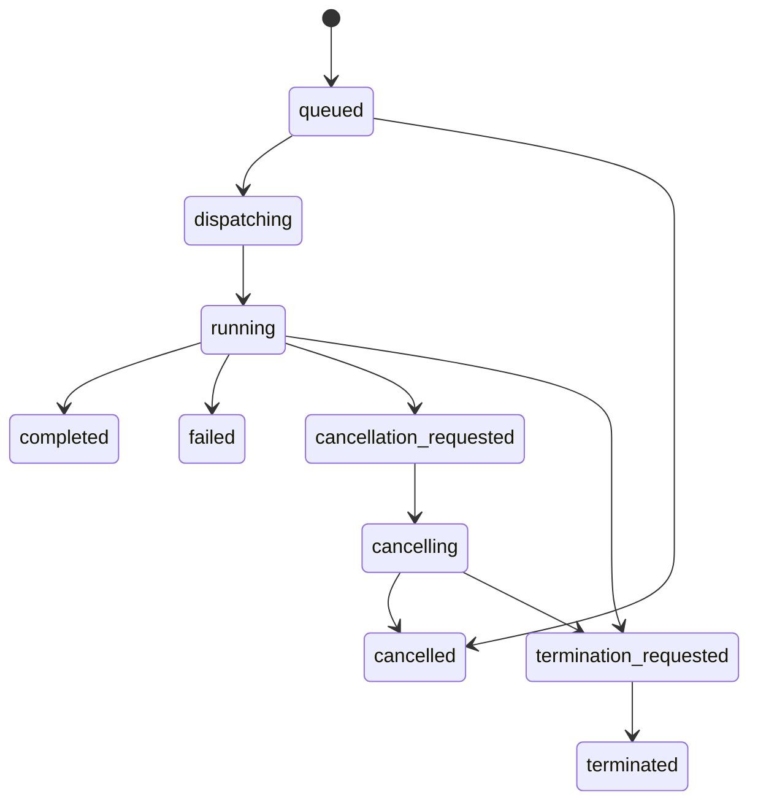
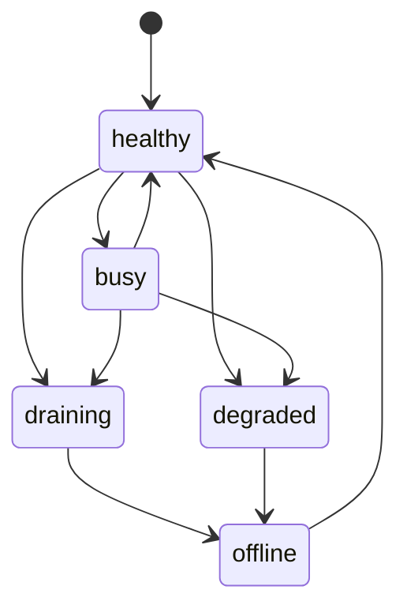

---
aliases:
  - Task Runtime and Processors
  - Worker Runtime
  - 任務執行時與處理器
tags:
  - diataxis/reference
  - audience/team
  - sot/true
  - topic/app-reference
status: draft
owner: docs-team
audience: team
scope: worker / processor health、task state machine、cancel / terminate / retry runtime contract
version: v0.5.0
last_updated: 2026-03-21
updated_by: codex
---

# Task Runtime & Processors

本頁定義 app shared task runtime、worker / processor status summary，以及 cancel / terminate / retry 的 shared contract。

!!! info "Header Pairing"
    Header 中的 task queue 必須能直接看到 worker / processor 狀態摘要。

!!! warning "Graceful Cancel 與 Force Terminate 必須分開"
    `Cancel` 與 `Terminate` 不是同一個動作。

!!! important "Local Runtime Topology Is Part Of The Contract"
    local runtime topology =
    - app process: `uv run sc-app`
    - simulation lane worker: `uv run sc-worker-simulation`
    - characterization lane worker: `uv run sc-worker-characterization`

    queue backend =
    - `RQ`
    - Redis via `SC_RQ_REDIS_URL` / `SC_REDIS_URL`

    lane mapping =
    - `simulation` + `post_processing` -> simulation lane
    - `characterization` -> characterization lane

!!! info "Runtime contract is not folder placement"
    本頁定義的是 runtime ownership 與 process topology，不是 current file placement。
    若 current implementation 仍有 `src/worker/` residue，那也不代表 `src/worker/` 是 canonical runtime home。

## Local Runtime Topology

| Process | Runtime role |
|---|---|
| `uv run sc-app` | app / API / queue read model / task detail / result surface；不是 heavy solver host |
| `uv run sc-worker-simulation` | consume simulation-lane queued tasks；負責 `simulation` 與 `post_processing` |
| `uv run sc-worker-characterization` | consume characterization-lane queued tasks；負責 `characterization` |

### Queue Backend Contract

| Concern | Contract |
|---|---|
| Queue implementation | `RQ` |
| Redis URL | `SC_RQ_REDIS_URL`（preferred） / `SC_REDIS_URL`（fallback alias） |
| Simulation lane queue | `SC_SIMULATION_QUEUE_NAME` |
| Characterization lane queue | `SC_CHARACTERIZATION_QUEUE_NAME` |

!!! warning "Not allowed as canonical local runtime"
    - app process 不得作為 active local runtime path 的 heavy solver host
    - submit path 不得以 in-process `Thread(...)` 直接執行 solver work 取代 lane queue
    - in-process background execution 若暫時存在，只能明確標記為 temporary fallback / test-only wiring，不能被視為正式 local runtime

## Processor Summary Contract

| Field | Meaning |
|---|---|
| `lane` | worker lane identity；`simulation` lane 承接 `simulation` + `post_processing`，`characterization` lane 承接 `characterization` |
| `healthy_processors` | 可接任務且 heartbeat 正常的 processors 數量 |
| `busy_processors` | 目前正在執行 task 的 processors 數量 |
| `degraded_processors` | heartbeat 仍有回應但狀態不穩定的 processors 數量 |
| `draining_processors` | 不再接新任務、等待現有任務結束的 processors 數量 |
| `offline_processors` | heartbeat 超時或已下線的 processors 數量 |

## Processor Heartbeat Contract

| Field | Meaning |
|---|---|
| `processor_id` | 單一 processor / worker identity |
| `lane` | 該 processor 服務的 worker lane；不是 page stage 名稱 |
| `state` | `healthy`, `busy`, `degraded`, `draining`, `offline` |
| `current_task_id` | 若正在執行 task，指出目前 task |
| `last_heartbeat_at` | 最近一次 heartbeat 時間 |
| `runtime_metadata` | redaction-safe 的 capacity / version / host summary |

## Heartbeat Threshold And Offline Rules

| Rule | Contract |
|---|---|
| Shared offline threshold | `last_heartbeat_at` 超過 90 秒未更新即視為 `offline` |
| Shared summary rule | backend queue summary、detail processor view、frontend worker summary 都必須用同一個 90 秒 threshold |
| No separate time-only degraded threshold | `degraded` 是 runtime-reported anomaly state，不是另一個獨立的 timeout bucket |
| Degraded still expires to offline | 若 processor 已是 `degraded`，且 `last_heartbeat_at` 再超過 90 秒未更新，仍必須轉成 `offline` |
| Busy / healthy / draining all expire the same way | 任何非 terminal processor state，只要 heartbeat 超過 90 秒未更新，都不得繼續顯示成 live processor |

!!! tip "Two time windows, two meanings"
    `90s` 是 processor heartbeat/offline threshold。
    stale task reconcile 則使用較長的 task-staleness timeout，兩者不可混成同一個概念。

## Task Runtime State Machine

## Control Escalation Rules

| Action | Expected behavior |
|---|---|
| `cancel` | processor 應進入 graceful stop path，先嘗試結束目前 work unit |
| `terminate` | processor 應立即中止 work unit，不再保證 partial output 可用 |
| cancel-to-terminate escalation | 若 task 長時間停在 `cancellation_requested` / `cancelling`，`owner` 或 `admin` 可升級到 `terminate` |
| retry | 只建立新 task；不得覆寫舊 task 的 terminal record |

## Control Request Delivery

| Rule | Meaning |
|---|---|
| Control request is persisted first | `cancel` / `terminate` 先寫入 persisted control state，再由 processor 消費 |
| Processor must ack via task state | worker 不回傳 UI-only signal，而是以 persisted task transition 表示已接收 |
| Queue row reflects request immediately | Header queue 應先看到 control-request state，再等待 terminal state |
| Runtime may reject stale control | 若 task 已 terminal，runtime 應回傳穩定 rejection reason |

## Processor Lifecycle

| Processor state | Meaning |
|---|---|
| `healthy` | heartbeat 正常，可接新 task |
| `busy` | 正在執行 task |
| `degraded` | heartbeat 尚可，但 runtime 狀態異常 |
| `draining` | 不再接新 task，等待現有 task 結束 |
| `offline` | heartbeat 超時或已下線 |

## Processor State Transitions

## Runtime Delivery Rules

| Rule | Meaning |
|---|---|
| Queue summary follows persisted task state | Header 與 task detail 必須能從 persisted state 重建 |
| Processor summary is lane-scoped | summary 需按 lane 聚合，而不是只給全域總數 |
| Processor summary reflects real worker processes | local mode 下的 summary 必須對應獨立 worker processes，而不是 app-local thread 假象 |
| Cancel and terminate are auditable | 兩者都必須進 audit trail |
| Terminal states stay immutable | `completed` / `failed` / `cancelled` / `terminated` 不可被覆寫成其他 terminal state |

## Startup Reconcile Contract

| Concern | Contract |
|---|---|
| Shared stale-task timeout | `SC_WORKER_STALE_TIMEOUT_SECONDS`；預設 300 秒 |
| App startup | `sc-app` 啟動時必須先重建 persisted queue read model、processor summary 與 attached-task recoverability；不得因 app restart 自行終止 task |
| Worker startup | 每條 worker lane 啟動時必須先做 startup reconcile，再開始 consume 新 queue jobs |
| Reconcile source of truth | reconcile 只可用 persisted task + persisted dispatch + persisted heartbeat 做判定；queue backend 只能提供輔助訊號 |

### App Startup Responsibilities

| Situation | Required behavior |
|---|---|
| persisted `queued` task without dispatch failure | 保持 `queued`；重新進入 queue read model |
| persisted `queued` task with last dispatch outcome = enqueue failed | detail 應標示 `reconcile.required = true`，等待 dispatch recovery |
| persisted `dispatching` task，且超過 stale timeout 仍無 claim/start ack | 標示 `reconcile.required = true`；不得自動腦補成 `running` 或 `completed` |
| persisted `running` task，heartbeat 超過 stale timeout | 啟動 reconcile path；不得繼續當成 live-running task |
| persisted terminal task | 直接採信 terminal state；queue backend residual job 不得推翻 persisted result |

### Worker Startup Responsibilities

| Situation | Required behavior |
|---|---|
| lane worker boot | 先跑 startup reconcile，再開始 consume 該 lane queue |
| stale `running` task | 若 heartbeat 超過 stale timeout，worker/runtime 應將其收斂為 `failed`，並附帶 `stale_task_timeout` 類型的 stable error metadata |
| stale `dispatching` task | worker/runtime 不得直接宣告成功；必須先把它標成 reconcile-needed 或重新 claim 後再產生新的 running ack |
| requeue under same task | 只能增加 dispatch attempt metadata，不得更換 public `task_id` |

## Persisted Truth Wins Over Queue Backend

| Conflict | Winner | Required resolution |
|---|---|---|
| Redis/RQ 顯示 job 仍存在，但 persisted task 已 terminal | persisted task | queue backend 視為 stale runtime residue；backend 應清理或忽略 queue metadata |
| queue backend 顯示 job running，但 persisted task 仍是 `queued` / `dispatching` | persisted task | 先進 reconcile；不得直接用 queue backend 狀態覆寫 detail |
| queue backend job 消失，但 persisted task 仍是 `running` | persisted task + reconcile timeout | 先依 heartbeat/stale timeout 判定；超時後才進 reconcile failure |
| worker summary 與 persisted task active set 不一致 | persisted task + persisted heartbeats | worker summary 必須重算，不得反向改 task truth |

## Stale Runtime Resolution

| Persisted state at inspection time | Runtime condition | Required resolution |
|---|---|---|
| `queued` | 尚未有 dispatch failure metadata | 保持 `queued` |
| `queued` | 最近一次 enqueue 失敗 | 保持 `queued`，並標示 `reconcile.required = true` |
| `dispatching` | claim/start ack 未出現，且已超過 stale timeout | 標示 `reconcile.required = true` |
| `running` | heartbeat 超過 stale timeout | 收斂為 `failed`，error code family 應落在 stale/reconcile timeout |
| terminal | queue backend 仍殘留 job | persisted terminal state 繼續有效；queue residue 走清理流程 |

## Reconcile-required Vocabulary

| Field | Meaning |
|---|---|
| `reconcile.required` | 這筆 task 目前需要 runtime/dispatch reconcile |
| `reconcile.reason` | stable reason code，例如 `dispatch_stale`、`enqueue_failed`、`runtime_conflict` |
| `reconcile.recorded_at` | 最近一次標記 reconcile-required 的時間 |

!!! warning "Reconcile-required is not a second status authority"
    `reconcile.required` 只能描述 runtime conflict / recovery requirement。
    它不能取代 `task detail.status`，也不能讓 queue row 自行主導 page workflow。

## Runtime Continuity By Mode

| Situation | Required behavior |
|---|---|
| switch from online to local | remote tasks 繼續在 server runtime 執行；app 只解除 online queue / attached-task context |
| switch from local to online | local tasks 不搬移到 server；online queue 重新從 server authority 載入 |
| closing `sc-app` only in local mode | 若 local workers 仍在，task 應繼續執行；重開 app 後可透過 queue recovery / reattach 重新觀察 |
| stopping the whole local runtime stack | 若 `sc-app` 與 local workers 一起停止，local tasks 才可能終止或進入 reconcile-required state |
| app close in online mode | remote tasks 由 server runtime 繼續管理；重開 app 後再透過 queue recovery 重新觀察 |

## Related

* [Authentication & Authorization](authentication-and-authorization.md)
* [Audit Logging](audit-logging.md)
* [Backend / Tasks & Execution](../backend/tasks-execution.md)
* [Frontend / Task Management](../frontend/shared-workflow/task-management.md)
