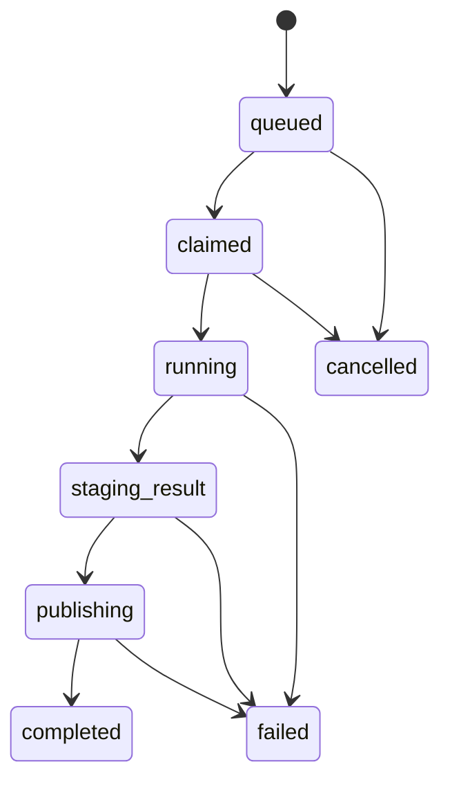

---
aliases:
  - Task Runtime and Processors
  - Runner Runtime
  - 任務執行時與處理器
tags:
  - diataxis/reference
  - audience/team
  - sot/true
  - topic/app-reference
status: stable
owner: docs-team
audience: team
scope: shared task runtime semantics for Python Backend and Julia Runner
version: v1.0.0
last_updated: 2026-05-28
updated_by: codex
---

# Task Runtime & Processors

The active local runtime is three processes:

```text
Next.js frontend
Python Backend
Julia Runner
```

There is no separate local queue service. The runner claims tasks through the backend runner API.

## Runtime Roles

| Process | Role |
|---|---|
| Frontend | submit tasks, monitor status, browse results |
| Python Backend | task lifecycle, metadata, staging preparation, TraceStore publication |
| Julia Runner | claim task, compute, write staging Zarr, report manifest |

## Task State Machine



## Runner Liveness

| Signal | Owner |
|---|---|
| `runner_id` | Julia Runner |
| `heartbeat_at` | Backend task row updated by runner heartbeat |
| progress payload | Runner reports small JSON only |
| cancellation polling | Runner reads backend cancellation state between work units |

## Control Rules

| Rule | Meaning |
|---|---|
| cancel is persisted first | backend records cancellation state before runner observes it |
| runner polls between sweep points | no synchronous interrupt contract is required initially |
| terminal state is immutable | completed/failed/cancelled must not be rewritten into another terminal state |
| retry creates a new task | retries preserve lineage instead of replacing the old task |

## Related

* [Backend / Tasks & Execution](../backend/tasks-execution.md)
* [Julia Runner Compute Plane](../../architecture/julia-runner-compute-plane.md)
