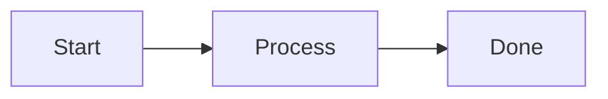
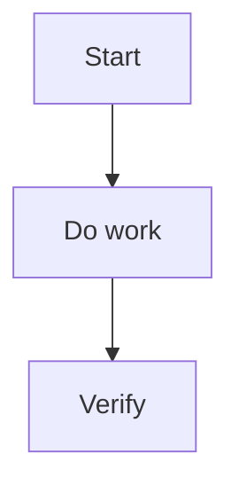

---
aliases:
 - "Documentation Style"
 - "File style"
 - "Micro Style"
 - "Writing & Visual Elements"
tags:
 - diataxis/reference
 - audience/team
 - sot/true
 - topic/documentation
status: stable
owner: docs-team
audience: team
scope: "Micro Style / Writing & Visual Elements: Tone, paragraph writing and use of visual elements (Astro + Starlight)"
version: v0.7.0
last_updated: 2026-06-12
updated_by: codex
---

import { Aside, TabItem, Tabs } from '@astrojs/starlight/components';

# Micro Style / Writing & Visual Elements

This document defines the micro-level of `Documentation Style`, responsible for the formal specification of tone, paragraph writing, and visual elements. The source Markdown / MDX is based on `docs/` and converted to a format that can be rendered by Astro + Starlight by Starlight staging transformer.

<Aside type="note" title="Corresponding Macro Style">

If you want to deal with the information layering of the entire page, the page map of overview/index, or how to avoid repeated sidebar text, please read [Macro Style / Information Layout](information-layout.mdx) instead.
This page only deals with writing, tone, and use of visual elements.

</Aside>

---

## Language and Tone

| Projects | Specifications |
|------|------|
| Primary language | English |
| Proper nouns | Preserve official names, package identifiers, physics notation, file paths, citations, and established technical terms |
| Sentences/Paragraphs | Short sentences, short paragraphs; one key point in each paragraph |
| Tone | Adjusted according to Diataxis: Tutorial, How-to, Reference neutral, Explanation |

<Aside type="tip" title="Writing principles">

- The title directly reflects the purpose of the content
- Prioritize the use of columns and tables; avoid stacking long paragraphs
- Use Starlight `Aside` for important reminders and do not repeat them in the main text.

</Aside>

---

## Visual elements (suggested order: Tables -> Asides -> Tabs -> Mermaid)

### Asides

When semantic emphasis is needed, change the file to `.mdx` and use the official `Aside` component:

```mdx
import { Aside } from '@astrojs/starlight/components';

<Aside type="tip" title="Title (optional)">

The content maintains the normal Markdown writing method.

</Aside>

```

<Aside type="caution" title="Note on grammar">

Do not use GitHub-style `> [!NOTE]`, and do not use MkDocs-style admonition or tab syntax. The official visual element writing method of editable docs source is Starlight official MDX component syntax.

</Aside>

<Aside type="note" title="Usage principles">

Asides are semantic emphasis tools, not replacements for regular paragraphs.
Only use it when the content really needs to be quickly identified by readers as "recommendations/risks/examples/validation status/minor details".

</Aside>

#### Which one should be used in any situation?

| Type | Applicable situation | The tone you want to convey |
|------|----------|--------------|
| `<Aside type="tip">` | Recommended practices, better paths, best practices | You'd better do this |
| `<Aside type="note">` | Neutral background, supplementary understanding, contextual explanation, examples | This helps understanding |
| `<Aside type="caution">` | Risks, Limitations, Misunderstood Boundaries | It’s easy to make mistakes here |
| `<Aside type="danger">` | Prohibitions that would violate data, contracts, or security | This can't be done |
| `<details>` | Minor supplements, advanced details, edge cases | This is useful, but not a first-round must read |

#### Selection judgment

- `tip`
Used when clearly recommending readers to adopt a certain writing method or structure to avoid subsequent document confusion.
- `info`
Used when adding context but not posing a risk or hard limit.
- `warning`
Used when omitting it may lead to incorrect writing, misinterpretation of the contract, or causing readers to take incorrect actions.
- `note`
Used to supplement background, specific commands, payloads, screen structure examples, verification results or correct status.
- `danger`
Used when ignoring a prohibition would have devastating consequences.
- `<details>`
Use when further explanation is worth retaining but should not interrupt the main flow of reading.

<Aside type="tip" title="simple judgment method">

If you can't make up your mind, ask yourself:
1. If this paragraph is ignored, will it cause errors? If so, use `warning` first.
2. Does this paragraph recommend readers to take a better approach? If so, use `tip`.
3. Is this paragraph just to help understand the background? If so, use `info`.
4. Does this paragraph demonstrate a specific method? If so, use `example`.
5. Does this paragraph describe the correct completion state? If so, use `success` / `check`.
6. Is this paragraph just a minor supplement? If so, use `<details>`.

</Aside>

<Aside type="caution" title="avoid overuse">

If almost every section of a whole page is included in Aside, the reading rhythm will be worse.
General descriptions, normal paragraphs, and general clauses should be maintained in the main text.

</Aside>

### Collapsible Details

Use native `<details>` for collapsible content, and only include minor supplements, source code, long tables, or advanced edge cases; do not use it to replace warning / danger semantics.

````mdx
<details class="docs-disclosure docs-disclosure--note">
<summary>Collapsible title</summary>

```python
print("optional source")
```

</details>

````
---

### Tabs

Use official `Tabs` / `TabItem` to distinguish situations at the same level (for example: different languages/different OSs):

````mdx
import { TabItem, Tabs } from '@astrojs/starlight/components';

<Tabs>
<TabItem label="Python">

```python
print("Hello")
```

</TabItem>

<TabItem label="Julia">

```julia
println("Hello")
```

</TabItem>

</Tabs>

````

---

### Mermaid

- Usage: flow charts, architecture diagrams, sequence diagrams
- Recommendation: nodes < 10 to maintain readability
- Direction: Priority `TD` or `LR`

````markdown

````

---

### Code block

Blocks of code must be marked with a language:

```python
def hello() -> None:
  print("Hello")
```

---

## How-to file suggestion template

````markdown
# title

1–2 sentences of description (state clearly “what problem you want to solve”)

---

## Development process



---

## Steps

### 1. Step 1
### 2. Step 2

---

## Necessary checks

| Inspection items | Instructions | Necessity |
|---|---|---|
| Docs build | `./scripts/build_docs_sites.sh` | ✅ |

---

## refer to

- [Relevant specification link]
````

---

## Agent Rule
```markdown
## Micro Style / Writing & Visual Elements
- **Language**: English-only editable docs source
- **Tone**: Tutorial guiding / How-to imperative / Reference neutral / Explanation reasoning
- **Terms**: preserve official names, package identifiers, physics notation, file paths, citations, and established technical terms
- **Pairing**: macro-level page layout belongs to `information-layout.md`
- **Visual components**: use official Starlight MDX components imported from `@astrojs/starlight/components`; convert pages that need them to `.mdx`
- **Asides**: use `<Aside type="note|tip|caution|danger">` by semantic intent, not decorative emphasis
- **Collapsible details**: use native `<details class="docs-disclosure docs-disclosure--TYPE">` only for optional material such as source code, long tables, or advanced notes; do not use it for semantic warnings
- **Tabs**: use official `<Tabs>` and `<TabItem>` for variants (OS/language/context)
- **Forbidden editable-source syntax**: do not use MkDocs-style admonitions, collapsible admonitions, tab blocks, or card grids in `docs/`
- **Mermaid**: prefer `TD`/`LR`, keep nodes < 10
- **Code blocks**: always specify language
```
