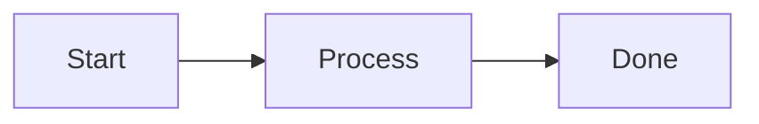
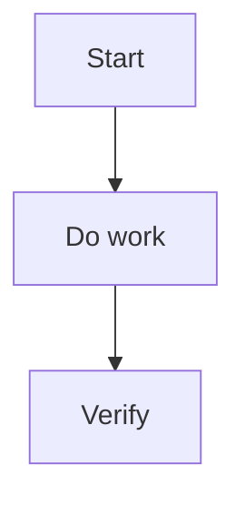

---
aliases:
  - "Documentation Style"
  - "文件風格"
  - "Micro Style"
  - "Writing & Visual Elements"
tags:
  - diataxis/reference
  - audience/team
  - sot/true
  - topic/documentation
status: stable
owner: docs-team
audience: team
scope: "Micro Style / Writing & Visual Elements：語氣、段落寫法與視覺元素使用（Astro + Starlight）"
version: v0.7.0
last_updated: 2026-06-12
updated_by: codex
---

import { Aside, TabItem, Tabs } from '@astrojs/starlight/components';

# Micro Style / Writing & Visual Elements

本文件定義 `Documentation Style` 的微觀層，負責語氣、段落寫法與視覺元素的正式規範。來源 Markdown / MDX 以 `docs/` 為準，並由 Starlight staging transformer 轉成 Astro + Starlight 可渲染的格式。

<Aside type="note" title="對應的 Macro Style">

如果你要處理的是整頁的資訊分層、overview/index 的頁面地圖、或如何避免正文重複 sidebar，請改看 [Macro Style / Information Layout](information-layout.mdx)。
本頁只處理寫法、語氣與視覺元件的使用方式。

</Aside>

---

## 語言與語氣

| 項目 | 規範 |
|------|------|
| 主要語言 | 繁體中文（zh-TW） |
| 專有名詞 | 優先保留英文或中英並列（例如：`SQUID`、導納 (Admittance)） |
| 句子/段落 | 短句、短段落；每段一個重點 |
| 語氣 | 依 Diataxis 調整：Tutorial 引導、How-to 指令式、Reference 中立、Explanation 解釋式 |

<Aside type="tip" title="寫作原則">

- 標題直接反映內容目的
- 優先用條列與表格；避免長段落堆疊
- 重要提醒用 Starlight `Aside`，不在正文重複

</Aside>

---

## 視覺元素（建議順序：表格 → Asides → Tabs → Mermaid）

### Asides

需要語意強調時，將文件改成 `.mdx`，並使用官方 `Aside` 元件：

```mdx
import { Aside } from '@astrojs/starlight/components';

<Aside type="tip" title="標題（可選）">

內容維持一般 Markdown 寫法。

</Aside>

```

<Aside type="caution" title="語法注意">

不要使用 GitHub 風格 `> [!NOTE]`，也不要使用 MkDocs 風格 admonition 或 tab 語法。editable docs source 的正式視覺元素寫法是 Starlight 官方 MDX component syntax。

</Aside>

<Aside type="note" title="使用原則">

Asides 是語意強調工具，不是一般段落的替代品。
只有在內容真的需要被讀者快速辨識成「建議 / 風險 / 範例 / 驗證狀態 / 次要細節」時才使用。

</Aside>

#### 什麼情況該用哪一種

| 類型 | 適用情境 | 想傳達的語氣 |
|------|----------|--------------|
| `<Aside type="tip">` | 推薦做法、較佳路徑、最佳實務 | 你最好這樣做 |
| `<Aside type="note">` | 中性背景、補充理解、上下文說明、範例 | 這有助於理解 |
| `<Aside type="caution">` | 風險、限制、容易誤解的邊界 | 這裡很容易出錯 |
| `<Aside type="danger">` | 會破壞資料、契約或安全性的禁止事項 | 這不能做 |
| `<details>` | 次要補充、進階細節、邊界情境 | 這有用，但不是第一輪必讀 |

#### 選用判斷

- `tip`
  用在明確推薦讀者採取某種寫法或結構，能避免後續文件變亂時。
- `info`
  用在補充背景，但不構成風險或硬限制時。
- `warning`
  用在若忽略就可能寫錯、誤解契約、或讓讀者採取錯誤實作時。
- `note`
  用在補充背景、具體命令、payload、畫面結構示例、驗證結果或正確狀態時。
- `danger`
  用在忽略後會造成破壞性後果的禁止事項時。
- `<details>`
  用在值得保留、但不應打斷主閱讀流的進階說明時。

<Aside type="tip" title="簡單判斷法">

如果你拿不定主意，先問自己：
1. 這段如果忽略，會不會導致錯誤？若會，優先用 `warning`。
2. 這段是不是推薦讀者採取較好的方法？若是，用 `tip`。
3. 這段只是幫助理解背景？若是，用 `info`。
4. 這段是在示範具體做法？若是，用 `example`。
5. 這段是在描述正確完成狀態？若是，用 `success` / `check`。
6. 這段只是次要補充？若是，用 `<details>`。

</Aside>

<Aside type="caution" title="避免過度使用">

如果一整頁幾乎每個小節都包進 Aside，閱讀節奏反而會更差。
一般說明、正常段落、普通條列，應維持在正文中完成。

</Aside>

### Collapsible Details

可摺疊內容使用原生 `<details>`，只放次要補充、原始碼、長表格或進階邊界案例；不要拿它取代 warning / danger 語意。

````mdx
<details class="docs-disclosure docs-disclosure--note">
<summary>可摺疊標題</summary>

```python
print("optional source")
```

</details>

````
---

### Tabs

使用官方 `Tabs` / `TabItem` 區分同層級情境（例如：不同語言 / 不同 OS）：

````mdx
import { TabItem, Tabs } from '@astrojs/starlight/components';

<Tabs>
<TabItem label="Python">

```python
print("Hello")
```

</TabItem>

<TabItem label="Julia">

```julia
println("Hello")
```

</TabItem>

</Tabs>

````

---

### Mermaid

- 用途：流程圖、架構圖、序列圖
- 建議：節點 < 10，保持可讀性
- 方向：優先 `TD` 或 `LR`

````markdown

````

---

### 程式碼區塊

程式碼區塊必須標註語言：

```python
def hello() -> None:
    print("Hello")
```

---

## How-to 文件建議模板

````markdown
# 標題

1–2 句說明（說清楚「要解決什麼問題」）

---

## 開發流程



---

## 步驟

### 1. 步驟一
### 2. 步驟二

---

## 必要檢查

| 檢查項目 | 指令 | 必要性 |
|---|---|---|
| Docs build | `./scripts/build_docs_sites.sh` | ✅ |

---

## 參考

- [相關規範連結]
````

---

## Agent Rule
```markdown
## Micro Style / Writing & Visual Elements
- **Language**: zh-TW primary
- **Tone**: Tutorial guiding / How-to imperative / Reference neutral / Explanation reasoning
- **Terms**: keep technical terms in English or bilingual
- **Pairing**: macro-level page layout belongs to `information-layout.md`
- **Visual components**: use official Starlight MDX components imported from `@astrojs/starlight/components`; convert pages that need them to `.mdx`
- **Asides**: use `<Aside type="note|tip|caution|danger">` by semantic intent, not decorative emphasis
- **Collapsible details**: use native `<details class="docs-disclosure docs-disclosure--TYPE">` only for optional material such as source code, long tables, or advanced notes; do not use it for semantic warnings
- **Tabs**: use official `<Tabs>` and `<TabItem>` for variants (OS/language/context)
- **Forbidden editable-source syntax**: do not use MkDocs-style admonitions, collapsible admonitions, tab blocks, or card grids in `docs/`
- **Mermaid**: prefer `TD`/`LR`, keep nodes < 10
- **Code blocks**: always specify language
```
