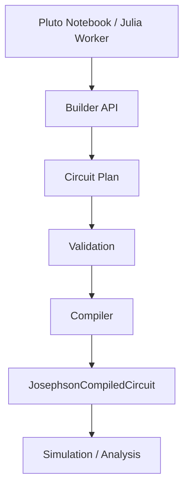

---
aliases:
  - Julia Core Authoring
  - Julia Core
tags:
  - diataxis/reference
  - audience/contributor
  - sot/true
  - topic/julia-core
status: stable
owner: docs-team
audience: contributor
scope: Julia Core authoring architecture overview for Pluto direct research and Julia Worker execution.
version: v1.0.0
last_updated: 2026-05-28
updated_by: codex
icon: lucide/cpu
---

# Julia Core

Julia Core is the scientific authoring and simulation core. It is shared by Pluto notebooks and the Julia Worker / Runner, so research exploration and product execution use the same component, plan, compiler, simulation, and analysis concepts.

Julia Core does not depend on the Python Backend, FastAPI task state, Next.js UI state, Electron process state, or task queue state.

## Pipeline

```text
Pluto Notebook / Julia Worker
        |
        v
User-Friendly Builder API
        |
        v
Circuit Plan
        |
        v
Validation
        |
        v
Compiler
        |
        v
JosephsonCompiledCircuit
        |
        v
Simulation / Analysis
```

Pluto and the Worker are different callers of the same Core pipeline. Pluto uses it for interactive design, sliders, plots, and inspection. The Worker uses it for deterministic task input, build, compile, simulate, and staged output.

!!! warning "Boundary"
    The Julia Core authoring path is not a Backend task submission path. Backend task lifecycle, metadata, publication, and TraceStore ownership stay in Python Backend contracts.

## Authoring Contract



The Circuit Plan is the semantic source of truth before simulation. Reusable components, endpoint relations, line taps, spans, couplings, shunts, parameters, and provenance are stored in the plan. The compiler lowers the complete plan into a JosephsonCircuits.jl target.

## Page Map

<div class="grid cards" markdown>

- __[Authoring Model](authoring-model.md)__

    ---

    Read the main source-of-truth for component, plan, compiler, and netlist ownership.

- __[Circuit Plan](circuit-plan.md)__

    ---

    See what the plan stores and why it is not a JosephsonCircuits.jl netlist.

- __[Components and Composition](components-and-composition.md)__

    ---

    Define reusable primitive and composite components, public pins, private nodes, and namespace rules.

- __[Endpoints](endpoints.md)__

    ---

    Use Endpoint as the top-level attachment abstraction for pins, line taps, spans, ground, external nodes, and loops.

- __[Relations and Couplings](relations-and-couplings.md)__

    ---

    Specify node connections, capacitive couplings, shunts, inductive couplings, and distributed windows as plan-level intents.

- __[Compiler](compiler.md)__

    ---

    Follow the target-specific lowering pipeline from Circuit Plan to JosephsonCompiledCircuit.

- __[Compiled Circuit](compiled-circuit.md)__

    ---

    Treat compiler output as netlist plus maps, warnings, provenance, and metadata.

- __[Validation](validation.md)__

    ---

    Split authoring validation, compile validation, and physics sanity validation.

- __[Worker-Safe API](worker-safe-api.md)__

    ---

    Keep Pluto and Julia Worker on the same Core API path without duplicating construction or compiler logic.

</div>

## Ownership

| Surface | Owns |
| --- | --- |
| Julia Core | circuit authoring, Circuit Plan concepts, compiler concepts, simulation helpers, analysis helpers |
| Pluto Notebook | direct research use of Julia Core, interactive inspection, local research plots |
| Julia Worker / Runner | deterministic execution of Julia Core work and staged numeric output |
| Python Backend | task lifecycle, metadata, publication, TraceStore, platform result APIs |
| Application / Electron | product workflow UI and local process supervision |

Large numeric arrays should move through local filesystem packages such as Zarr, not HTTP JSON.
