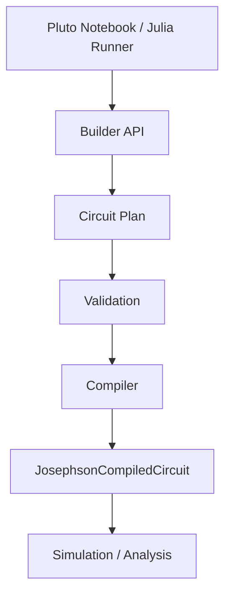

---
aliases:
 - Julia Core Authoring
 - Julia Core
tags:
 - diataxis/reference
 - audience/contributor
 - sot/true
 - topic/julia-core
status: stable
owner: docs-team
audience: contributor
scope: Julia Core authoring architecture overview for Pluto direct research and Julia Runner execution.
version: v1.6.0
last_updated: 2026-05-30
updated_by: codex
---

import { Aside, CardGrid, LinkCard } from '@astrojs/starlight/components';

# Julia Core

Julia Core is the scientific authoring and simulation core. It is shared by Pluto notebooks and the Julia Runner, so research exploration and product execution use the same component, plan, compiler, simulation, and analysis concepts.

Julia Core does not depend on the Python Backend, FastAPI task state, Next.js UI state, Electron process state, or task queue state.

## Pipeline

```text
Pluto Notebook / Julia Runner
    |
    v
User-Friendly Builder API
    |
    v
Circuit Plan
    |
    v
Validation
    |
    v
Compiler
    |
    v
JosephsonCompiledCircuit
    |
    v
Simulation / Analysis
```

Pluto and the Runner are different callers of the same Core pipeline. Pluto uses it for interactive design, sliders, plots, and inspection. The Runner uses it for deterministic task input, build, compile, simulate, and staged output.

<Aside type="caution" title="Boundary">

The Julia Core authoring path is not a persisted task submission path. Task lifecycle, metadata, publication, and canonical data ownership stay outside Julia Core.

</Aside>

## Docs-First Implementation Rule

This Julia Core Authoring reference is the source of truth for the next implementation.

If existing Julia names, exports, or helpers conflict with this reference, change the implementation to match these docs. Existing names such as `CircuitDraft` and `finalize_to_josephson_netlist` are transitional implementation details. They may be renamed, removed, or replaced by `CircuitPlan` and `compile_to_josephson`.

Do not preserve outdated APIs as alternate support layers unless a new source-of-truth decision explicitly requires that exception.

## Julia Core Kernel vs Component Libraries

Julia Core is the authoring and simulation kernel. It defines the contracts for components, endpoints, Circuit Plans, relations, validation, compiler lowering, compiled circuits, and simulation / sweep execution.

Julia Core owns generic transmission-line / CPW modeling contracts such as `RLGCSpec`, ladder generation, coupling helpers, and the canonical reusable generators needed to express the notebook learning path without reimplementing Core conventions.

Julia Core does not own a closed catalog of every lab-specific physical component family.

Concrete components such as lab-specific SQUID arrays, SNAILs, process-specific Purcell filters, and device-family variants should live in user-space, lab-space, or project-space component libraries. Transmission-line-derived components such as readout CPW lines, quarter-wave resonators, and half-wave resonators should be built as semantic generators over the Core transmission-line model when they need Core coupling or ladder behavior.

Component libraries depend on Julia Core. Julia Core must not depend on component libraries.

## Authoring Contract



The Circuit Plan is the semantic source of truth before simulation. Reusable components, endpoint relations, line taps, spans, couplings, shunts, parameters, and provenance are stored in the plan. The compiler lowers the complete plan into a JosephsonCircuits.jl target.

## Page Map

<CardGrid>
 <LinkCard title="Authoring Model" href="authoring-model/" description="Read the main source-of-truth for component, plan, compiler, and netlist ownership." />
 <LinkCard title="Circuit Plan" href="circuit-plan/" description="See what the plan stores and why it is not a JosephsonCircuits.jl netlist." />
 <LinkCard title="Components and Composition" href="components-and-composition/" description="Define reusable primitive and composite components, public pins, private nodes, and namespace rules." />
 <LinkCard title="Component Libraries" href="component-libraries/" description="Separate the Julia Core Kernel from user-space, lab-space, and project-space component libraries." />
 <LinkCard title="Endpoints" href="endpoints/" description="Use Endpoint as the top-level attachment abstraction for pins, line taps, spans, ground, external nodes, and loops." />
 <LinkCard title="Relations and Couplings" href="relations-and-couplings/" description="Specify node connections, capacitive couplings, shunts, inductive couplings, and distributed windows as plan-level intents." />
 <LinkCard title="Coupling Models" href="coupling-models/" description="Distinguish point capacitive coupling, branch mutual inductance, MTL coupled windows, and physical model generators." />
 <LinkCard title="Transmission Line Ladder" href="transmission-line-ladder/" description="Define CPW / line head-tail orientation, section indexing, LC ladder generation, and open/short terminations." />
 <LinkCard title="Macro Authoring DSL" href="macro-authoring-dsl/" description="Capture human authoring syntax while expanding into the canonical CircuitPlan and HBIntent APIs." />
 <LinkCard title="Engineering Graph" href="engineering-graph/" description="Preserve component-level engineering semantics for Pluto visualization, debugging, and schematic export." />
 <LinkCard title="Compiler" href="compiler/" description="Follow the target-specific lowering pipeline from Circuit Plan to JosephsonCompiledCircuit." />
 <LinkCard title="Compiled Circuit" href="compiled-circuit/" description="Treat compiler output as netlist plus maps, warnings, provenance, and metadata." />
 <LinkCard title="HB Simulation Intent" href="hb-simulation-intent/" description="Declare external ports, pump axes, source slots, observables, and HB intent before Runner execution binds runtime values." />
 <LinkCard title="JosephsonCircuits hbsolve Controls" href="josephsoncircuits-hbsolve-controls/" description="Classify first-class HB controls, whitelisted optional kwargs, unsupported product Runner controls, and source current semantics." />
 <LinkCard title="Parameter Sweeps" href="parameter-sweeps/" description="Define structural, numeric, and hybrid sweeps, compile policies, topology keys, parallel execution, and optional fixed-topology numeric acceleration." />
 <LinkCard title="Validation" href="validation/" description="Split authoring validation, compile validation, and physics sanity validation." />
 <LinkCard title="Debugging and Diagnostics" href="debugging-and-diagnostics/" description="Define machine-readable diagnostic reports, topology-key explanations, debug bundles, and the AI agent debug path." />
 <LinkCard title="Runner-Safe API" href="runner-safe-api/" description="Keep Pluto and Julia Runner on the same Core API path without duplicating construction or compiler logic." />
</CardGrid>

## Ownership

| Surface | Owns |
| --- | --- |
| Julia Core Kernel | component authoring contract, Circuit Plan concepts, endpoint model, compiler concepts, parameter sweep execution interfaces, simulation helpers, analysis helpers |
| Component Libraries | concrete reusable components, component-specific parameters, reusable plan builders, component-specific validation helpers |
| Pluto Notebook | direct research use of Julia Core, interactive inspection, local research plots |
| Julia Runner | deterministic execution of Julia Core work and staged numeric output |
| Publication layer | task lifecycle, metadata, publication, and result APIs |
| Packaged product layer | workflow UI and local process supervision |

Large numeric arrays should move through local filesystem packages such as Zarr, not HTTP JSON.
