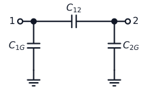
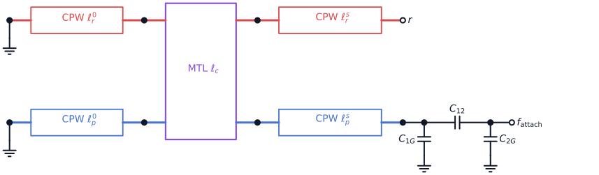
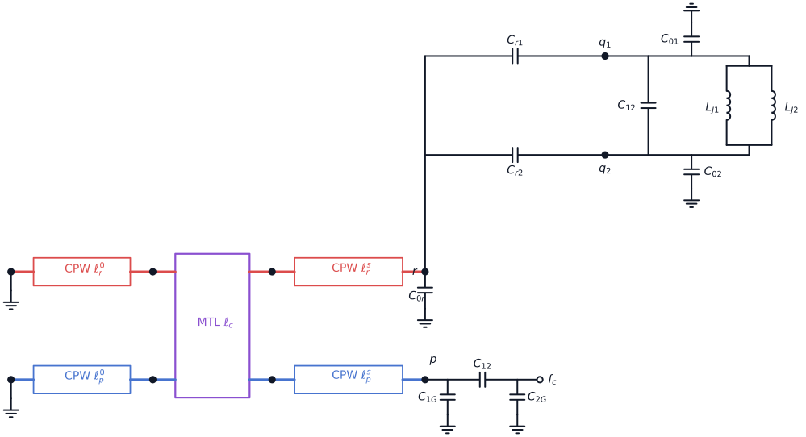
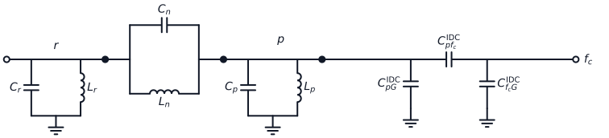
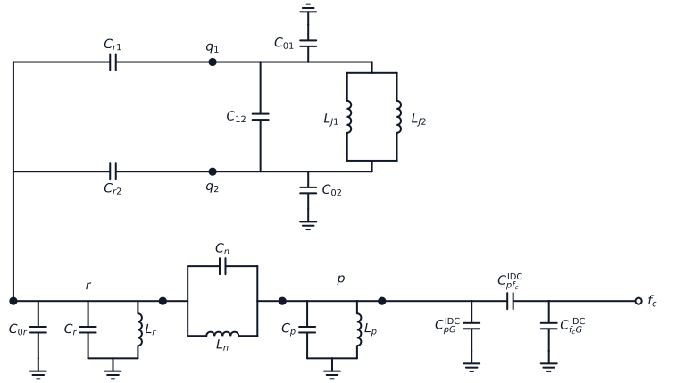

---
aliases:
  - Intrinsic Interferometric Purcell Components
tags:
  - diataxis/reference
  - audience/contributor
  - topic/julia-core
status: stable
owner: docs-team
audience: contributor
scope: V1.4 reusable distributed/lumped intrinsic-filter components, bus-aware composition, and export-owned physical-node labels.
version: v1.4.0
last_updated: 2026-07-28
updated_by: codex
---

# Intrinsic Interferometric Purcell Components

The accepted V1.4 contract separates five reusable Plan-level components
and applies one shared bus-aware composition and physical-node-label contract
to every public Schemdraw reusable component. The filter variants contain no
feedline or external port. They expose the filter-resonator IDC attachment so
an enclosing circuit can add its own feedline.

## V1 interfaces

| Component | Plan endpoints | Owned topology |
| --- | --- | --- |
| `InterdigitatedCapacitor` | `terminal_1`, `terminal_2` | `C1g`, `C2g`, and mutual `C12` |
| `IntrinsicInterferometricPurcellFilter` | `readout_attachment`, `feedline_attachment` | Two grounded-head/open-tail quarter-wave resonators, one finite MTL window, one complete IDC, and filter-owned `C0r` |
| `IntrinsicInterferometricPurcellFilterWithQubit` | `island_1`, `island_2`, `feedline_attachment` | The filter, including its `C0r`, plus a linearized floating qubit |
| `IntrinsicInterferometricPurcellFilterEquivalent` | `readout_attachment`, `feedline_attachment` | Grounded `Cr || Lr` and `Cp || Lp`, the `Cn || Ln` readout--filter bridge, one complete IDC, and equivalent-filter-owned `C0r` |
| `IntrinsicInterferometricPurcellFilterEquivalentWithQubit` | `island_1`, `island_2`, `feedline_attachment` | The response-matched equivalent, including its `C0r`, plus a linearized floating qubit |

Julia Core owns electrical topology and exported schematic intent. The Python
Schemdraw library owns only the visual classes and renderer mapping. Committed
`schematic_export.json` fixtures are generated from the Julia examples; the
diagram scripts must not reconstruct circuit semantics manually.

## Bus-aware circuit-diagram contract

The visual layer keeps four concepts separate:

| Concept | Meaning | Python metadata |
| --- | --- | --- |
| Physical node | Anchors that are electrically identical | `physical_nodes` |
| Bus | One component-owned continuous conductor path on one physical node | `buses: dict[str, BusSpec]` |
| Public terminal | The only child anchor that a parent may use for an inter-block connection | `public_terminals: dict[str, TerminalSpec]` |
| Block | A child-owned drawing region containing its elements, internal buses, labels, and ground symbols | Native Schemdraw bounding box plus parent-required clearance |

`ports` remains a compatibility projection from a public interface name to a
physical node. It does not identify a unique drawing anchor: for example, the
grounded LC signal node has distinct left and right public terminals.
`TerminalSpec` therefore names its physical node, exact anchor, and outward
facing direction. Native glyph bounds enforce hard block clearance; label
clearance is checked on the rendered target size because font extents do not
scale reliably with `unit_length`.

Connection markers are resolved by the component that owns the current
composition level:

| Marker | Meaning |
| --- | --- |
| Filled dot | A direct child--parent or peer-component connection at the current composition level, or a current-level multi-branch junction |
| Open dot | A public terminal still exposed by the outermost rendered component |
| No marker | A private anchor, ordinary element endpoint, or two-segment internal continuation |

Children declare public terminals and component-owned marker points but do not
decide whether a public terminal is ultimately connected or exposed. The
enclosing composer resolves that state and emits at most one marker per
coordinate. Marker projection stops at that composition depth: nested
children retain their metadata but do not leak their implementation-level dots
into the enclosing system diagram. If a connected child terminal is promoted
at the same coordinate as an exposed parent terminal, the open outer terminal
takes precedence.
Marker intents from different electrical nodes at one coordinate fail instead
of being merged.
Ground symbols do not receive a dot. Geometric crossings and coincident
coordinates never create connectivity without an explicit declared
connection; a non-connected crossing remains unmarked.

A parent owns the wire or connector between sibling blocks. It resolves each
child endpoint through `public_terminals`; it must not use a child's private
bus tap merely because that anchor is available through Schemdraw. Sibling
glyph bounds must not overlap. Current compositions use explicit orthogonal
lanes and native bounding-box clearance checks; generic automatic routing and
inference of electrical connectivity from touching strokes are excluded.

The proving set now covers all 22 public Schemdraw reusable components across
the lumped, port, coupler, pi-section, legacy transmission-line-system, and
intrinsic-filter families. Every public component declares `physical_nodes`,
`ports`, `public_terminals`, `buses`, `node_markers`, and
`physical_node_labels`, and passes the same metadata validation. Components
may legitimately declare an empty mapping when that concept is absent; they
must not omit the contract field or draw a private connection marker instead.

### Physical-node-label pipeline

`SchematicLayoutIntent.node_labels` is the only cross-language source of
physical-node labels. A reusable electrical builder owns endpoint identity and
topology, but it does not choose the final visible node name or location:
nested composition can change whether a node is exposed, connected, or best
represented on a bus. The current-level Julia schematic Composer chooses the
selected final nodes, visible text, and placement intent. The current-level
Python visual Composer owns the concrete geometry.

Each exported label uses the existing `SchematicNodeLabel` fields:

| Field | Contract |
| --- | --- |
| `id` | Final physical-node role in the current visual Composer |
| `target` | Julia Core electrical endpoint represented by that role |
| `label` | Visible label text |
| `hints.placement` | `bus_middle`, `marker`, or `terminal` |
| `hints.placement_target` | Exact current-level bus, marker, or public-terminal id |
| `hints.loc` / `hints.offset` | Explicit visual side and optional offset |

For each migrated top-level component,
`render_hints.schemdraw.node_bindings` explicitly maps every final
physical-node role to its serialized Julia electrical endpoint. Its keys and
values are unique, and every `node_labels` record must match the binding
selected by its `id` and `target`. The renderer does not infer this mapping
from suffixes, coordinates, or visible text.

Every selected label role must resolve to one current-level physical node.
`bus_middle` targets one explicitly named ordered bus and uses its arc-length
midpoint; it never selects the first bus implicitly. `marker` targets one
declared `NodeMarkerSpec`. `terminal` targets one declared `TerminalSpec`,
independent of whether the terminal is ultimately rendered open or connected.
At most one primary label is emitted for a selected final physical node, but
internal nodes do not need labels.

A bus is an ideal-conductor path. A physical node may contain multiple buses,
and two child buses merge only through an explicit Composer connection.
Touching coordinates, crossings, or equal strings do not merge nodes.
Distributed CPW and MTL spans remain distributed elements even though their
metal is continuous; their physical-node labels may target declared boundary
terminals or markers, not the middle of the distributed span. Ground labels,
off-page aliases, and repeated net labels are excluded from this V1.4.

Physical-node labels and connection markers render independently.
`show_nodes` controls optional filled current-level connection and junction
markers. An exposed public-terminal marker is governed by that component's
terminal-exposure option and remains independent of physical-node labels.
`show_labels` controls physical-node and element-label visibility. Terminal
labels are reserved for a distinct terminal or port identity such as `P1`;
`r`, `p`, `q1`, `q2`, and `f_c` belong to `node_labels` and must not be
duplicated in Schemdraw-specific label dictionaries.

The Python renderer fails on missing or extra node bindings, duplicate
final-node roles or serialized endpoints, a label/binding mismatch, unknown
placement modes, missing placement targets, a placement target owned by
another physical node, or a zero-length selected bus. Exports without this
V1.4 binding and placement hints remain outside the migrated
physical-node-label path; the renderer does not guess a fallback location.

## Reusable lumped projection semantics

The accepted Schemdraw V1.4 uses one reusable `InductiveBranch` for
each parallel-LC inductive arm:

| Declared branch kind | Visual component |
| --- | --- |
| `linear` | One ordinary inductor |
| `linearized_josephson` | Two parallel ordinary inductors representing the small-signal `LJ1` and `LJ2` branches |
| `josephson` | One Josephson-junction symbol |
| `squid` | One bounded two-terminal SQUID loop containing two parallel Josephson-junction symbols |

The two-branch loop owns its internal pair of buses. The midpoint of each
internal bus reaches the loop public terminal through a distinct lead. An
enclosing parallel LC connects its capacitor only to those public terminals;
it does not merge the capacitor buses directly into the loop's internal
buses.

For export-backed `CircuitPlan` diagrams, the visual kind follows the
executable relation kind:

| Julia relation | JosephsonCircuits row | Visual kind |
| --- | --- | --- |
| `SeriesInductor` / `ShuntInductor` | `L_...` | ordinary inductor |
| Two parallel `SeriesInductor` relations representing linearized junction inductances | two `L_...` rows | `linearized_josephson` loop with two ordinary inductors |
| `JosephsonJunction` | `Lj1_...` | Josephson-junction symbol |
| Two parallel `JosephsonJunction` relations | two `Lj1_...` rows | `squid` loop with two Josephson-junction symbols |

The current executable reusable plans contain one nonlinear
`JosephsonJunction` in the reflective JPA. No current reusable plan contains
an executable two-junction dc SQUID.

`GroundedLCResonator` exposes fixed left and right endpoints on its continuous
upper line. Both endpoints, the capacitor tap, and the inductive-arm tap are
aliases of one signal node; the lower bus is ground. Its optional `C0` branch
is drawn separately from the resonant capacitor but remains inside the same
readout-resonator block on the same signal and ground nodes. A floating
parallel-LC projection instead exposes two distinct outer stub endpoints, with
its capacitor and selected `InductiveBranch` connected in parallel between
the inner buses. Nested branch markers remain hidden in a system composition.

`InterdigitatedCapacitor` likewise owns equal-length left and right terminal
stubs. An exposed port marker belongs at the outer stub endpoint, not at the
inner three-capacitor junction.

The `LinearizedFloatingQubit` projection groups `LJ1` and `LJ2` inside one
two-branch loop and places that loop in parallel with `C12`. Its Julia builder
owns two `SeriesInductor` relations, so the diagram uses two ordinary inductor
glyphs and requires the explicit `linearized_josephson` render kind. It must
not draw Josephson-junction glyphs for those linear relations, infer a branch
kind from a label, or change topology when labels or node dots are hidden. A
missing or mismatched kind fails instead of falling back. Unsupported branch
kinds also fail explicitly.

Each composite reserves non-overlapping regions for its reusable circuit
blocks. Inter-block routing may touch a child only at a public terminal; an
external capacitor, conductor, or label must not enter another child's
interior. The owning composite derives explicit routing lanes and fails when
their required clearance is non-positive.

The linearized loop does not claim nonlinear Josephson behavior. The separate
`squid` visual kind remains available for a plan that actually owns two
`JosephsonJunction` relations, but this V1.4 does not add executable
dc-SQUID lowering, external-flux dependence, junction asymmetry, or loop
inductance.

## Interdigitated capacitor

The equivalent keeps all three positive capacitor branches. It is not reduced
to one scalar coupling capacitance.

<picture>
  <source media="(prefers-color-scheme: dark)" srcset="../../assets/circuit_draw/reusable_components/interdigitated_capacitor/diagram.dark.svg" />
  
</picture>

## Intrinsic interferometric Purcell filter

The readout and filter QWRs share a finite MTL coupling window. The filter open
tail terminates at IDC terminal 1; IDC terminal 2 is the exposed
`feedline_attachment`. The filter also owns `C0r` from `readout_attachment` to
ground. `C0r = 0` is the default and omits the physical branch; a positive
finite value emits exactly one shunt-capacitor branch. No feedline is drawn or
compiled inside this component.

<picture>
  <source media="(prefers-color-scheme: dark)" srcset="../../assets/circuit_draw/reusable_components/intrinsic_interferometric_purcell_filter/diagram.dark.svg" />
  
</picture>

## Filter with qubit

The second composite reuses the filter and adds the linearized floating-qubit
branches at `readout_attachment`. It reuses the filter-owned `C0r` and never
stamps another branch. Its optional `c0r_f` keyword remains only as a
compatibility assertion: when supplied, it must exactly match the value used
to build the filter.

<picture>
  <source media="(prefers-color-scheme: dark)" srcset="../../assets/circuit_draw/reusable_components/intrinsic_interferometric_purcell_filter_with_qubit/diagram.dark.svg" />
  
</picture>

## Response-matched equivalent

The Node-2 equivalent replaces the distributed resonator pair and MTL window
with six positive finite elements:

```text
r -- (Cr || Lr) -- ground
p -- (Cp || Lp) -- ground
r -- (Cn || Ln) -- p
```

The filter node `p` connects to the exposed feedline attachment `f_c` through
the complete IDC branches
`C_pG^IDC`, `C_f_cG^IDC`, and `C_pf_c^IDC`. These three branches are distinct
from the legacy scalar `Cext`; none may be silently dropped.

<picture>
  <source media="(prefers-color-scheme: dark)" srcset="../../assets/circuit_draw/reusable_components/intrinsic_interferometric_purcell_filter_equivalent/diagram.dark.svg" />
  
</picture>

## Response-matched equivalent with qubit

The Full-QRP visual composition reuses the same equivalent-filter-owned `C0r`;
the visual builder delegates that branch to the readout
`GroundedLCResonator`, which renders `C0r` separately from `Cr` inside one
block. The composition then adds the existing linearized floating-qubit
branches at `r`.

<picture>
  <source media="(prefers-color-scheme: dark)" srcset="../../assets/circuit_draw/reusable_components/intrinsic_interferometric_purcell_filter_equivalent_with_qubit/diagram.dark.svg" />
  
</picture>

## Failure behavior and limits

- Empty IDs, repeated public endpoints, invalid line/window geometry, and
  non-positive IDC branches fail in Julia Core.
- Intrinsic-filter construction rejects any MTL orientation other than
  `same_direction`.
- Negative or non-finite filter `C0r` fails before topology is added.
- The filter-with-qubit builder rejects a filter from another `CircuitPlan`.
- A filter-with-qubit `c0r_f` compatibility assertion that differs from the
  filter-owned value fails with a migration-oriented validation error.
- Equivalent construction rejects non-positive `Cr`, `Lr`, `Cp`, `Lp`, `Cn`,
  `Ln`, or IDC branches, and rejects negative or non-finite `C0r`.
- The equivalent-with-qubit builder rejects an equivalent filter from another
  `CircuitPlan`.
- Schemdraw rejects an unsupported parallel-LC inductive branch kind instead
  of falling back to a linear-inductor glyph.
- These classes do not own a feedline, port resistance, simulation intent,
  layout geometry, electromagnetic extraction, or nonlinear qubit dynamics.
- The reusable SQUID is a declared visual device projection only; executable
  dc-SQUID and external-flux semantics remain excluded.
- Existing D3 numerical workflows still accept scalar `Cext`; the new
  equivalent component does not silently reinterpret those historical inputs.
  A fresh three-branch IDC extraction and redesign run remain required.
- The example element values generate inspectable fixtures only; they are not
  promoted D3 Slot parameters.
- Durable tests freeze the accepted bus, marker, physical-node-label, and
  Junction-to-relation semantics.

## CircuitPlan composition boundary

The Composer already extends to a `CircuitPlan` when the plan selects one
known top-level reusable component. `CircuitPlan` owns the
`EngineeringGraph` and `SchematicLayoutIntent`;
`schematic_export_data(plan)` serializes that topology and layout intent; the
Python renderer resolves the exported `component_type`, node bindings, and
label-placement hints into one current-level visual composition. The
export-backed examples use this path rather than bypassing Julia Core.

Arbitrary plan-wide automatic composition is not part of this V1.4.
`EngineeringGraph` connectivity alone does not determine block placement,
orientation, routing lanes, or which child terminal is promoted as an outer
port. A future generic plan Composer therefore requires an explicit typed
contract for component instances, placements, public-terminal bindings, and
parent-owned connections. It must then union physical nodes through those
declared bindings and resolve markers and labels once at the outer composition
level. It must not infer connectivity from touching strokes or reuse a private
child anchor. Defining that generic placement-and-binding contract is a
separate semantic scope.

## Schemdraw pipeline findings

The eight export-backed diagrams in this V1 use the complete path:

```text
Julia builder
-> schematic_export.json
-> load_schematic_export()
-> component-type mapping
-> reusable Schemdraw component
-> light/dark SVG
```

V1.4 renders the distributed pair as five visual transmission-line
components: four plain CPW tiles plus one finite two-track MTL tile. The
electrical projection therefore contains six through-spans. The Julia export
records two tracks, four plain segments, and one coupled span; the renderer
records the branches emitted by the Schemdraw helpers. Stabilization combines
relation/type assertions with committed-output checks for terminal exposure,
conditional `C0r`, and light/dark rendering.

The pipeline is usable but not yet self-sealing:

- Four older transmission-line diagrams still construct their top-level
  Python component directly instead of consuming a Julia `CircuitPlan`
  export. Their components now obey the same bus, terminal, marker, and label
  contract, but Python remains the source of their example topology.
- The renderer currently consumes `render_hints.schemdraw`; exported
  components, relations, terminals, tracks, segments, and coupled spans remain
  independent audit evidence rather than automatic drawing input.
- Manifest validation checks that `core_export_fixture` exists, but does not
  prove it is fresh or consumed by `draw.py`.
- The Python loader does not yet reject an unsupported export schema version,
  and Julia/Python component-type names can drift without a shared gate.

Future pipeline hardening is a separate scope: make visual-Netlist comparison,
schema/component-type validation, export freshness, and fixture consumption
required gates, and migrate the four bypass diagrams. Generic graph auto-layout
remains excluded until its layout semantics are defined separately.

## Semantic status

- Scope: Distributed/lumped and response-matched equivalent intrinsic-filter
  components, their floating-qubit compositions, complete three-branch IDC
  ownership, fixed parallel-LC attachment anchors, declared
  linear/linearized-Josephson/single-junction/SQUID visual branches, and
  export-backed Schemdraw projections, including the
  bus/public-terminal/block composition contract.
- Prior state: `CONVERGING` V1.4.
- Current state: `STABILIZED` V1.4.
- State changed: 2026-07-28.
- Human acceptance: “Okay！那就 Commit，這個版本我可以接受。”
- Accepted Junction contract: every Junction glyph in an export-backed diagram
  corresponds to an executable `JosephsonJunction`/JosephsonCircuits `Lj` row;
  linearized branches remain ordinary `L` rows and inductor glyphs.
- Test policy: `stabilization_tests_authorized`.
- Validation evidence: Julia Core package tests, 34 scoped Python tests, Ruff,
  export freshness, manifest validation, and committed-render checks.
- Unresolved decisions: none within V1.4; pipeline hardening and generic
  plan-wide auto-layout remain excluded scopes.
