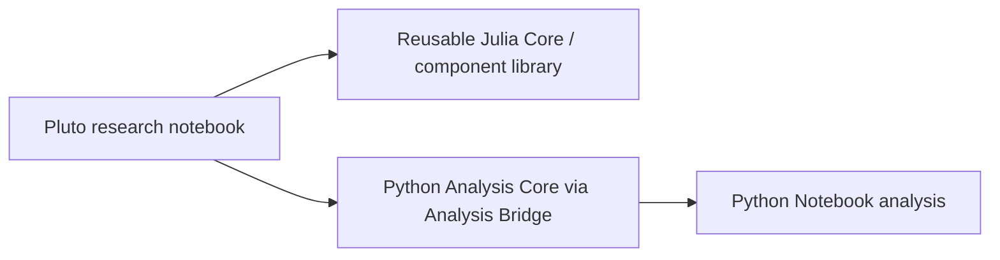

---
aliases:
  - Prototype Path
  - Notebook Prototype Path
tags:
  - audience/team
status: stable
owner: docs-team
audience: team
scope: Notebook-first prototype path from Pluto research into reusable Julia Core, Python Analysis Core, and Python Notebook research assets.
version: v3.1.0
last_updated: 2026-06-12
updated_by: codex
sidebar:
  label: Prototype Path
  order: 40
---

# Prototype Path

Use this page to decide where a working notebook idea belongs next. Start with Pluto when you are exploring circuit construction, simulation, sweeps, and figures. Move only reusable research pieces into Julia Core, Python Analysis Core, or Python Notebook helpers.

## Lanes

| Lane | Use it when | Owns |
| --- | --- | --- |
| Pluto Notebook | You need direct interactive research, circuit inspection, sliders, plots, or sweep sketches. | Research execution over Julia Core |
| Julia Core | The notebook has reusable circuit authoring, component, plan, compiler, sweep, or result-extraction logic. | Reusable scientific authoring kernel |
| Python Analysis Core | The reusable algorithm is Python-owned fitting, matrix analysis, preprocessing, or result schema logic. | `superconducting_circuits_analysis` package |
| Python Notebook | You need Python-native file inspection, data cleanup, fitting experiments, or report-oriented analysis. | Local analysis notebook and reusable helper candidates |

## Promotion Rule

Do not skip ownership boundaries just because the notebook version works:

- A reusable circuit/system authoring idea goes to Julia Core or a component library.
- A reusable fitting or matrix algorithm goes to Python Analysis Core.
- A Python-native inspection or report workflow can live in Python Notebook until repeated logic should become package code.

## Large Data Rule

Large arrays should stay in files or array stores that notebooks can read directly. Keep notebook outputs reproducible by recording source paths, units, axes, and transformation steps near the analysis that uses them.

## Related

- [Notebook Interface](../reference/notebooks/index.md)
- [Python Core](../reference/core/python-core.mdx)
- [Julia Core Reference](../reference/julia-core/index.mdx)
