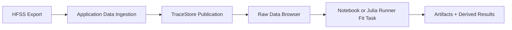

---
aliases:
  - "End-to-End SQUID Fitting"
  - "完整流程教學：SQUID 擬合"
tags:
  - diataxis/tutorial
  - audience/user
  - sot/true
  - topic/analysis
status: stable
owner: team
audience: user
scope: "從 HFSS 數據到 SQUID fitting task 的完整流程"
version: v2.0.0
last_updated: 2026-05-28
updated_by: codex
---

# End-to-End SQUID Fitting

This tutorial shows the current end-to-end route:
ingest HFSS data through the Application Interface, inspect traces through backend-backed browsers, then run fitting either in a notebook or as a Julia Runner task when that task kind is implemented.

## Workflow



## 1. Prepare HFSS Data

Export the data you need from HFSS:

- Admittance files for Im(Y) resonance extraction
- Scattering files for S-parameter phase or magnitude inspection
- enough frequency range to cover the expected modes

Keep the exported files in a local import directory, for example:

```text
data/import/hfss/LJPAL658_v1/
```

## 2. Ingest Data

Open the Application Interface and use `Data Ingestion`.
The backend validates the uploaded files, records metadata, and writes numeric arrays to the official TraceStore.

Use `Raw Data` to verify:

- dataset identity
- design scope
- trace family
- axes and units
- preview slices

## 3. Choose Fitting Mode

Use a notebook when you are still exploring model assumptions.
Use a Julia Runner task when the analysis should be tracked, reproducible, and published as artifacts.

!!! warning "Initial runner scope"
    The first Runner implementation supports smoke and parameter-sweep tasks.
    LC-SQUID fitting is a reserved compute-plane task kind and should be added behind the Runner manifest/TraceStore contract.

## 4. Publish Results

Runner-produced fitting artifacts must go through the Python Backend publisher.
The backend validates manifests, stores artifacts under `data/artifacts/`, and records provenance.

## Related

- [SQUID Fitting](../how-to/fit-model/squid.md)
- [Application Interface](../reference/app/application-interface.md)
- [Notebook Interface](../reference/notebooks/index.md)
- [Julia Runner Compute Plane](../reference/architecture/julia-runner-compute-plane.md)
