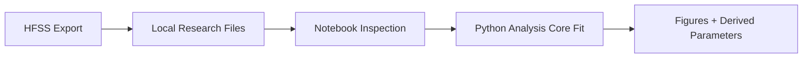

---
aliases:
  - "End-to-End SQUID Fitting"
  - "完整流程教學：SQUID 擬合"
tags:
  - diataxis/tutorial
  - audience/user
  - sot/true
  - topic/analysis
status: stable
owner: team
audience: user
scope: "從 HFSS 匯出數據到 notebook SQUID fitting 的完整研究流程"
version: v2.0.0
last_updated: 2026-05-28
updated_by: codex
sidebar:
  label: End-to-End SQUID Fitting
  order: 40
---

import { Aside } from '@astrojs/starlight/components';

# End-to-End SQUID Fitting

This tutorial shows the research route from HFSS export files to a notebook fitting result. Use it when the goal is to validate physics assumptions, fitting windows, and reusable Python Analysis Core behavior.

## Workflow



## 1. Prepare HFSS Data

Export the data you need from HFSS:

- Admittance files for Im(Y) resonance extraction
- Scattering files for S-parameter phase or magnitude inspection
- enough frequency range to cover the expected modes

Keep the exported files in a local import directory, for example:

```text
data/import/hfss/LJPAL658_v1/
```

## 2. Inspect Data

Load the files in a Pluto or Python notebook. Keep source paths, units, and axis conventions next to the analysis cells.

Verify:

- trace family
- axes and units
- frequency span and resonance coverage
- representation: real/imaginary, magnitude/phase, or complex values

## 3. Choose Fitting Mode

Use a notebook when you are still exploring model assumptions. Move repeated fitting logic into Python Analysis Core once the model shape is stable.

<Aside type="note" title="Fitting execution boundary">

LC-SQUID fitting belongs to either direct research execution in Pluto or reusable Python Analysis Core code.
Keep notebook-only glue out of package code; keep reusable fitting functions covered by package tests.

</Aside>

## 4. Record Results

Record the source files, fitting configuration, resulting parameters, and figure generation code. If a result becomes reusable across studies, move the computation into Python Analysis Core and keep the notebook as the evidence surface.

## Related

- [SQUID Fitting](squid-fitting.mdx)
- [Notebook Interface](../../reference/notebooks/index.md)
- [Python Core](../../reference/core/python-core.mdx)
