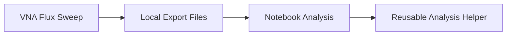

---
aliases:
 - Flux Analysis Workflow
 - Magnetic Flux Analysis Workflow
tags:
 - audience/team
status: stable
owner: docs-team
audience: team
scope: Review workflow for externally supplied flux or bias sweeps; no flux-tunable SQUID model is implemented
version: v0.3.0
last_updated: 2026-07-10
updated_by: codex
sidebar:
 label: Flux Dependence Analysis
 order: 50
---

# Flux Dependence Analysis

Flux analysis visualizes how measured or simulated resonance changes with an
externally supplied flux or bias-current axis. Use notebooks for exploratory
maps, axis validation, resonance picking, and report figures.

## Canonical Knowledge

- [Fluxoid and Flux Quantization](https://github.com/arfiligol/SCQ_Design/blob/main/docs/knowledge/superconductivity/fluxoid-and-flux-quantization.qmd)
- [DC-SQUID Flux Tunability](https://github.com/arfiligol/SCQ_Design/blob/main/docs/knowledge/josephson-physics/dc-squid-flux-tunability.qmd)
- [Josephson Current, Phase, Energy, and Inductance](https://github.com/arfiligol/SCQ_Design/blob/main/docs/knowledge/josephson-physics/josephson-current-phase-energy-and-inductance.qmd)

## Workflow

## Model Boundary

Do not infer a junction or SQUID inductance from flux using an unreviewed scalar
formula in this workflow. The current Python surrogate accepts `L_jun` as each
junction's supplied small-signal inductance and uses two identical junctions in
parallel, `L_sq = L_jun / 2`. It does not implement a flux-to-inductance map or
a full flux-tunable DC-SQUID model.

Any conversion from bias current to applied flux, or from flux to Josephson
parameters, must state its calibration, units, periodic branch, symmetry, loop-
inductance, and operating-phase assumptions and link the canonical nodes above.

## Usage

1. Keep the VNA export and source metadata together.
2. Verify axes, units, and flux/bias coordinate naming.
3. Use a Python notebook to inspect magnitude and phase maps.
4. Promote repeated extraction logic into Python Analysis Core.

## Result Shape

Tracked analysis should record:

- input trace references
- flux/bias axis metadata
- phase wrapping or unwrapping settings
- extracted resonance points
- plots or summary tables as evidence

## Related

- [Notebook Interface](../../reference/notebooks/index.md)
- [Python Core](../../reference/core/python-core.mdx)
- [SQUID Fitting](squid-fitting.mdx)
