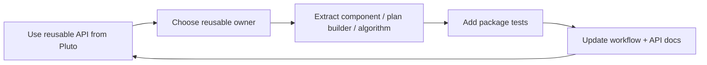

---
aliases:
 - Promote Pluto Prototype
 - Notebook Prototype Promotion
tags:
 - audience/team
status: stable
owner: docs-team
audience: team
scope: Workflow for turning a working Pluto notebook idea into reusable Julia Core, component-library, Python Analysis Core, or notebook helper code.
version: v3.1.0
last_updated: 2026-06-13
updated_by: codex
sidebar:
 label: Promote Pluto Prototype
 order: 20
---

# Promote Pluto Prototype To Reusable Core

Use this workflow after a Pluto notebook already proves a research idea. The goal is to move repeated construction, algorithms, or helper semantics into a reusable owner without turning the notebook into a hidden package.

## Promotion Map

| If the notebook contains | Promote it to |
| --- | --- |
| repeated circuit construction | a component library or reusable Julia Core plan builder |
| repeated plan composition | a named builder that returns a `CircuitPlan` with clear parameter semantics |
| repeated solver or sweep setup | Julia Core helper, sweep API, or test fixture |
| repeated fitting or matrix analysis | Python Analysis Core |
| repeated local inspection/report code | Python notebook helper first, then package code when reuse is stable |

## Workflow



1. Identify the repeated idea in the notebook.
2. Choose the smallest reusable owner: component library, Julia Core helper, Python Analysis Core, or notebook helper.
3. Extract an explicit API with parameter names, units, and physics semantics.
4. Add tests at the owner layer before rewriting the notebook around the new helper.
5. Update docs so the notebook points to the reusable owner instead of explaining private cell logic.
6. Keep downstream productized usage in its own documentation lane.

## Circuit Reuse Rule

Reusable circuit design should converge toward:

```text
Component Library
  -> reusable plan builder
  -> CircuitPlan
  -> schematic/export intent
  -> simulation
```

Notebook-only construction is acceptable while exploring. Once the same structure appears in a second notebook, test, or report, move it behind a named builder.

## Data Rule

Large arrays should stay in files or array stores that notebooks can read directly. Keep notebook outputs reproducible by recording source paths, units, axes, and transformation steps near the analysis that uses them.

## Related

- [Reusable Circuit Design](../../start/reusable-circuit-design.md)
- [Circuit Authoring Model](../../concepts/circuit-authoring-model/index.md)
- [Python Core](../../reference/core/python-core.mdx)
- [Julia Core Reference](../../reference/julia-core/index.mdx)
