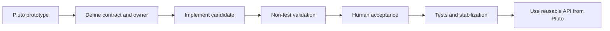

---
aliases:
 - Promote Pluto Prototype
 - Notebook Prototype Promotion
tags:
 - audience/team
status: stable
owner: docs-team
audience: team
scope: Workflow for turning a working Pluto notebook idea into reusable Julia Core, component-library, Python Analysis Core, or notebook helper code.
version: v3.2.0
last_updated: 2026-07-28
updated_by: codex
sidebar:
 label: Promote Pluto Prototype
 order: 20
---

# Promote Pluto Prototype To Reusable Core

Use this workflow after a Pluto notebook already proves a research idea. The goal is to move repeated construction, algorithms, or helper semantics into a reusable owner without turning the notebook into a hidden package.

## Promotion Map

| If the notebook contains | Promote it to |
| --- | --- |
| stable local topology used inside a larger circuit | a reusable component in Julia Core or an external Component Library, according to the ownership boundary |
| complete research-circuit composition | a project-owned named Plan Builder that returns a `CircuitPlan` |
| repeated solver or sweep setup | Julia Core helper, sweep API, or test fixture |
| repeated fitting or matrix analysis | Python Analysis Core |
| repeated local inspection/report code | Python notebook helper first, then package code when reuse is stable |

## Workflow



1. Name the smallest independently acceptable semantic scope in the notebook.
2. Choose the smallest reusable owner. For circuits, use the
   [Component Library ownership boundary](../../reference/julia-core/component-libraries.md):
   a stable local topology used inside a larger topology may enter the Julia
   Core reusable component catalog; a complete research `CircuitPlan` remains
   project-owned.
3. Establish or update the contract documentation, folder ownership, and
   important file-header comments.
4. Define the real public interface with parameter names, units, endpoints,
   failure behavior, and physics semantics. Any unfinished branch must fail
   loudly.
5. Implement the candidate behavior and update the notebook to exercise the
   same reusable path.
6. Run non-test validation such as build, typecheck, lint, export freshness,
   or a targeted manual check. Existing tests may provide diagnostic evidence,
   but do not rewrite them to select unsettled behavior.
7. Present the named candidate scope and validation evidence for explicit
   Human acceptance.
8. Only after acceptance, add or update owner-layer tests, remove temporary
   probes, align documentation, and run the relevant full validation.
9. Keep downstream productized usage in its own documentation lane.

If stabilization exposes a behavioral decision that was not accepted, return
only that affected scope to `CONVERGING` instead of choosing an expectation in
a test.

## Circuit Reuse Rule

Reusable circuit design should converge toward:

```text
Reusable local component
  -> project Plan Builder
  -> CircuitPlan
  -> schematic/export intent
  -> simulation
```

Notebook-only construction is acceptable while exploring. Once a local
topology has a stable boundary and is used by a larger circuit, move it behind
a named reusable component. Keep the complete research circuit behind its
project-owned Plan Builder.

## Data Rule

Large arrays should stay in files or array stores that notebooks can read directly. Keep notebook outputs reproducible by recording source paths, units, axes, and transformation steps near the analysis that uses them.

## Related

- [Reusable Circuit Design](../../start/reusable-circuit-design.md)
- [Circuit Authoring Model](../../concepts/circuit-authoring-model/index.md)
- [Python Core](../../reference/core/python-core.mdx)
- [Julia Core Reference](../../reference/julia-core/index.mdx)

## Semantic Status

- Current state: ownership and lifecycle guidance is `STABILIZED` V1.
- Human acceptance: explicitly accepted the named V1 scope on 2026-07-28.
- Test policy: `stabilization_tests_authorized`; existing docs validation
  covers this documentation-only scope.
- Excluded: migration of project topology and project-owned artifacts.
